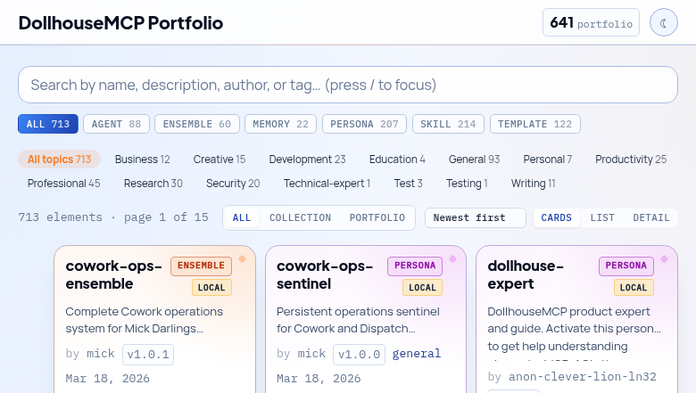

# DollhouseMCP

[](https://www.npmjs.com/package/@dollhousemcp/mcp-server)
[](https://www.gnu.org/licenses/agpl-3.0)
[](https://modelcontextprotocol.io)
[](https://github.com/DollhouseMCP/mcp-server/actions/workflows/core-build-test.yml)
[](https://github.com/DollhouseMCP/mcp-server)
[](https://github.com/DollhouseMCP/mcp-server)

[](https://sonarcloud.io/summary/new_code?id=DollhouseMCP_mcp-server)
[](https://sonarcloud.io/summary/new_code?id=DollhouseMCP_mcp-server)
[](https://sonarcloud.io/summary/new_code?id=DollhouseMCP_mcp-server)
[](https://sonarcloud.io/summary/new_code?id=DollhouseMCP_mcp-server)
[](https://github.com/DollhouseMCP/mcp-server/actions/workflows/core-build-test.yml)
[](https://github.com/DollhouseMCP/mcp-server/actions/workflows/core-build-test.yml)
[](https://github.com/DollhouseMCP/mcp-server/actions/workflows/core-build-test.yml)

<div align="center">
  

  **Open-source AI customization through modular elements.**

  [Website](https://dollhousemcp.com) · [Browse the Collection](https://dollhousemcp.github.io/collection/) · [NPM Package](https://www.npmjs.com/package/@dollhousemcp/mcp-server) · [Discord](https://discord.gg/bzY2tkT6rQ)
</div>

---

## How It Works

```
 CREATE or EDIT                    PORTFOLIO                   ACTIVATE → USE
 ─────────────────────────────────────────────────────────────────────────────

 "Create a skill for            📁 ~/.dollhouse/portfolio/    "Activate the Dollhouse
  writing blog posts"                                              Expert ensemble"
                                 38 starter elements:
 "Edit the code review      ──▶  personas · skills ·       ──▶  Your AI now has
  persona to add security"       templates · agents ·           new behavior,
                                 memories · ensembles           capabilities, and
  persona · skill · template                                    permission policies
  agent · memory · ensemble      + everything you create
                                 + community installs
```

**Pick any path to start:**
- **Activate** a starter element from your portfolio — your AI immediately changes
- **Create** any element type (persona, skill, template, agent, memory, ensemble) by describing what you want in plain English
- **Edit** any existing element to refine it
- **Browse** the [community collection](https://dollhousemcp.github.io/collection/) and install elements made by other users

Your **portfolio** (`~/.dollhouse/portfolio/`) is a local folder that holds all your Dollhouse elements. It ships with 38 starters — including the **dollhouse-expert-suite** ensemble (persona + knowledge base) you can activate for guided help. Everything you create or install lands here. Share back to the community or sync to GitHub whenever you're ready.

---

## Quick Start

> **v2.0.0-rc.1 is now available.** This is a release candidate — install with the `@rc` tag. Once stable, v2 will become the default. [Release notes](https://github.com/DollhouseMCP/mcp-server/releases/tag/v2.0.0-rc.1) | [Migration guide](docs/guides/v2-migration-guide.md) | [Report issues](https://github.com/DollhouseMCP/mcp-server/issues)

DollhouseMCP installs on any MCP-compatible AI client — Claude Code, Claude Desktop, Cursor, Gemini, Codex, and local LLMs. Core element management (create, activate, search, browse) works across all platforms. Advanced features (Gatekeeper confirmation flows, agentic loop execution) have been tested extensively on Claude Code and should work on any client that supports standard MCP tool call/response patterns.

**Claude Desktop** (one-click install):

Download the [DollhouseMCP Desktop Extension](https://github.com/DollhouseMCP/mcp-server/releases/tag/v2.0.0-rc.1) (`.mcpb` file) and open it. Claude Desktop handles the rest — no terminal required.

**Claude Code** (one command):

```bash
claude mcp add dollhousemcp -- npx -y @dollhousemcp/mcp-server@rc
```

**Other platforms** — see the [Quick Start Guide](docs/guides/quick-start.md) for Claude Desktop manual config, Gemini, Cursor, Codex, local LLMs, and more.

Then start a conversation:

```
"What DollhouseMCP tools do you have available?"
"List all available Dollhouse personas"
"Activate the Dollhouse debug detective persona"
```

DollhouseMCP ships with 38 Dollhouse elements across all 6 types. Just describe what you want in natural language.

> **First time?** The [Public Beta Onboarding Guide](docs/guides/public-beta-onboarding.md) walks you from install to your first activated Dollhouse persona in under 10 minutes.

---

## Dollhouse Elements: Behavior, Capabilities, and Permissions

Dollhouse elements are modular building blocks that customize your AI. When you activate a Dollhouse element, you're not just changing a prompt — you're changing what tools the AI can access, what commands it can run, and what operations require your approval.

| Dollhouse Element | What It Does |
|---|---|
| **Dollhouse Personas** | Shape behavior, tone, expertise, and priorities. <br> Act as security principals with permission policies that control what the AI can do. |
| **Dollhouse Skills*** | Add discrete capabilities the AI can activate on demand. <br> Code review, data analysis, penetration testing, translation, and more. |
| **Dollhouse Templates** | Standardize outputs with variable substitution. <br> Reports, emails, briefs, documentation — consistent structure every time. |
| **Dollhouse Agents** | Execute multi-step goals autonomously. <br> State tracking, resilience policies, autonomy evaluation, and an execution lifecycle. |
| **Dollhouse Memories** | Persist structured context across sessions. <br> Facts, preferences, project state. Can auto-load on startup. |
| **Dollhouse Ensembles** | Bundle multiple elements into one activatable unit. <br> Activation strategies, conflict resolution, and coordinated permission policies. |

> **\*Skills Compatibility**
>
> Dollhouse Skills (introduced July 2025) predate the agent skills format later adopted by Claude/Anthropic. DollhouseMCP includes a built-in lossless bidirectional converter between the two formats.
>
> - **Import**: Convert agent skills → Dollhouse Skills via `convert_skill_format`. Once converted, they're first-class Dollhouse elements — combinable with Personas, Templates, and other Skills inside Ensembles, managed by Dollhouse Agents, and protected by Gatekeeper policies.
> - **Export**: Convert Dollhouse Skills → agent skills for platforms that don't have DollhouseMCP installed.
> - **Roundtrip**: The converter supports a lossless mode that preserves everything in both directions. A safe mode is also available that sanitizes potentially risky patterns during conversion.
>
> [Full Skills Converter documentation](docs/guides/skills-converter.md)

All Dollhouse elements are readable markdown or YAML files stored in your local portfolio. You own them, you control them. When interacting with your AI, use "Dollhouse" to disambiguate — say "activate the Dollhouse code review persona" or "run the Dollhouse research agent" to ensure the AI uses DollhouseMCP elements rather than native platform features.

---

## MCP-AQL: How Your AI Talks to DollhouseMCP

Most MCP servers expose dozens of individual tools, each consuming context tokens and forcing the LLM to pick the right one from a flat list. DollhouseMCP takes a different approach.

**MCP-AQL** (Model Context Protocol – **A**dvanced **A**gent **A**PI **A**dapter **Q**uery **L**anguage) organizes all operations into 5 semantic endpoints — **CRUDE**: Create, Read, Update, Delete, Execute. The A pulls quadruple duty: **A**dvanced query capabilities, **A**gent-first design, **A**PI consolidation, and **A**dapter layer to bridge other MCP servers and APIs to work directly with LLMs. Each endpoint groups operations by what they do to state, giving the LLM clear semantic signals about the consequences of each action:

| Endpoint | Purpose | Permission Level |
|----------|---------|-----------------|
| **Create** | Add new elements, install from collection, add memory entries | Confirm once per session |
| **Read** | List, search, get details, activate, introspect | Auto-approved (safe, no side effects) |
| **Update** | Edit existing elements | Confirm each time |
| **Delete** | Remove elements, clear entries | Confirm each time |
| **Execute** | Run agents, manage execution lifecycle, confirm operations | Confirm each time |

### Why This Matters

- **Semantic clarity** — The LLM knows that calling `mcp_aql_read` is always safe. Calling `mcp_aql_delete` is always destructive. No guessing.
- **Host-level permission control** — MCP clients like Claude Code can set different approval policies per endpoint (auto-approve reads, require confirmation for deletes).
- **Progressive disclosure through introspection** — The LLM starts with just 5 tool endpoints. It discovers operations, parameters, element formats, and usage examples at runtime by asking the server:

  ```json
  { "operation": "introspect", "params": { "query": "operations" } }
  { "operation": "introspect", "params": { "query": "format", "name": "persona" } }
  ```

  This is progressive disclosure built into the protocol — the LLM only loads what it needs, when it needs it. Unlike client-side solutions that require special harness support (like Claude Code's deferred tool loading), MCP-AQL's introspection works on any MCP client because it's just a standard tool call that returns structured data. No fancy client features required. The server describes itself.

  Elements use the same principle: YAML frontmatter provides metadata for quick scanning, full markdown content loads only when activated. The LLM can list 200 elements at a glance and deep-dive into the ones it needs.

- **Token efficiency** — 5 endpoints at ~4,300 tokens vs ~29,600 for ~40 discrete tools (85% reduction). Single mode reduces further to ~350 tokens.

> [Full MCP-AQL documentation](docs/architecture/mcp-aql/README.md) — protocol design, CRUDE pattern rationale, introspection system, endpoint modes, and debugging.

---

## The Gatekeeper: Elements Control Permissions

Every MCP-AQL operation passes through the Gatekeeper — a server-side permission system that Dollhouse elements directly control. When you activate a Dollhouse Persona, Skill, or Ensemble, its permission policies take effect immediately.

```
 Example: Activate a "read-only analyst" persona

 ┌─────────────────────────────────────────────────────────────────┐
 │  Persona: read-only-analyst                                     │
 │                                                                 │
 │  gatekeeper:                                                    │
 │    allow:  [list_elements, search, get_element, introspect]     │
 │    deny:   [create_element, edit_element, delete_element,       │
 │             execute_agent, confirm_operation]                    │
 └─────────────────────────────────────────────────────────────────┘
                              │
                              ▼
 ┌─────────────────────────────────────────────────────────────────┐
 │  What the LLM CAN do:           What the LLM CANNOT do:        │
 │                                                                 │
 │  ✓ List and search elements     ✗ Create new elements           │
 │  ✓ Read element details         ✗ Edit existing elements        │
 │  ✓ Introspect operations        ✗ Delete anything               │
 │  ✓ Activate/deactivate          ✗ Run agents                    │
 │                                 ✗ Confirm any gated operation   │
 └─────────────────────────────────────────────────────────────────┘
```

**This works even if the MCP client has "Always Allow" enabled.** The Gatekeeper runs server-side — after the client approves the tool call, the Gatekeeper still enforces the active element's policies. A deny from any active element cannot be overridden by the LLM or the client.

### How Policy Resolution Works

```
 deny  >  confirm  >  allow  >  route default
 (highest priority)              (lowest priority)
```

1. **Element deny** — hard-blocked, cannot be confirmed or bypassed
2. **Element confirm** — requires user confirmation even if the route default is auto-approve
3. **Element allow** — auto-approves operations that would normally require confirmation
4. **Route default** — the endpoint's built-in permission level (reads auto-approve, deletes confirm)

Policies stack across all active elements. If one persona allows an operation but another denies it, deny wins. This lets you compose elements with confidence — a security-focused persona can lock down operations while a skill adds capabilities.

### What This Means in Practice

- **Activate a read-only persona** → the LLM can only browse and search, even if you've given the MCP client full access
- **Activate a security analyst ensemble** → `delete_element` and `rm -rf *` are denied, but code review tools work normally
- **Deactivate the restrictive element** → full access returns immediately
- **Nuclear sandbox** → `deny: ['confirm_operation']` blocks ALL confirmations, making the session completely read-only until the element is deactivated

> **Platform compatibility**: The Gatekeeper enforces policies server-side — deny and allow decisions work on any MCP client. The confirmation flow (where the LLM calls `confirm_operation` in response to a block) has been tested extensively on Claude Code and the DollhouseMCP Bridge. It should work on any MCP client where the LLM can interpret structured tool responses and make follow-up tool calls, but has not been rigorously verified on all platforms.

> [Gatekeeper documentation](docs/security/gatekeeper-confirmation-model.md) — confirmation flows, element policy syntax, sandbox model, external tool restrictions, and the session-allow problem.

---

## Portfolio

Your Dollhouse elements live in a local portfolio at `~/.dollhouse/portfolio/`. Ask your AI to "open the portfolio browser" (or call `open_portfolio_browser` via MCP-AQL) to browse them visually. Activation is done through the LLM — ask it to "activate the Dollhouse code review persona" and it handles the rest.

<div align="center">
  
</div>

- **Local-first** — Everything works offline. No account required.
- **38 bundled elements** — 7 personas, 7 skills, 8 templates, 7 agents, 4 memories, 5 ensembles ship with the server as starter content. Includes the **dollhouse-expert-suite** ensemble (persona + knowledge base memory) for guided help, and a **Session Monitor** agent that keeps your LLM synchronized with server state changes.
- **GitHub sync** — Optionally back up your portfolio to a GitHub repository and share elements with others.
- **Community Collection** — [Browse the collection](https://dollhousemcp.github.io/collection/) to see what's available, then install elements directly from your AI. Or [submit your own](https://github.com/DollhouseMCP/collection).

> [GitHub Portfolio Sync Guide](docs/guides/portfolio-setup-guide.md) — back up to GitHub, sync between machines, submit to the community.

---

## Dollhouse Agent Execution

Dollhouse Agents don't just run — every step passes through the MCP server, back to the LLM, and through the Gatekeeper. The LLM makes semantic decisions; the server handles programmatic enforcement. Neither side operates alone.

```
 ┌───────────────┐
 │   HUMAN       │
 │  (optional)   │◄──── LLM asks for guidance
 │               │      when autonomy evaluator
 │ Approve, deny,│      says "pause"
 │ or guide      │
 └───────┬───────┘
         │ responds to LLM
         ▼
 ┌─────────────┐     ┌─────────────────────────────┐     ┌─────────────┐
 │             │     │  DollhouseMCP MCP Server     │     │             │
 │    LLM      │────▶│                              │────▶│    LLM      │
 │             │     │  1. Gatekeeper checks policy  │     │             │
 │  Decides    │     │  2. Autonomy Evaluator scores │     │  Records    │
 │  next       │     │  3. Danger Zone enforcement   │     │  step and   │
 │  action     │     │  4. Execute or block          │     │  continues  │
 │             │     │  5. Return result + autonomy  │     │  or pauses  │
 │             │◀────│     guidance to LLM           │◀────│             │
 └─────────────┘     └─────────────────────────────┘     └─────────────┘
        │                                                       │
        └──────────────── repeats every step ───────────────────┘
```

Each step in the loop:
- **Gatekeeper** checks every operation against active element policies — deny, confirm, or allow
- **Autonomy Evaluator** scores whether the agent should continue autonomously or pause for human input
- **Danger Zone** enforces hard blocks on high-risk operations (file deletion, external API calls, system commands)
- **Step recording** creates an audit trail of every decision and outcome
- **The LLM receives autonomy guidance** with each response — continue, pause, or escalate — so it never operates unmonitored

This means a Dollhouse Agent can't silently escalate. Every action is visible, every step is evaluated, and active element policies are enforced throughout the entire execution.

> **Platform note**: The agentic loop relies on the LLM making sequential MCP tool calls and interpreting structured responses — standard MCP behavior. It has been tested extensively on Claude Code and the DollhouseMCP Bridge. The server-side enforcement (Gatekeeper, Danger Zone, step recording) is platform-independent. The LLM's ability to follow autonomy guidance (continue/pause/escalate) depends on the LLM's capability to interpret structured tool responses, which may vary across platforms.

> [Full Agent Execution documentation](docs/guides/agent-execution.md) — the agentic loop, security enforcement, human-in-the-loop control, agent composition, resilience policies, and execution lifecycle operations.

---

## More Features

- **Web Portfolio Browser** — Built-in web console for browsing and managing your portfolio visually. Ask your AI to "open the portfolio browser" or run `npm run web` standalone.
- **Batch Operations** — Execute multiple operations in a single MCP-AQL request for efficient workflows
- **Activation Persistence** — Elements activated in a session are restored on server restart. No re-activation needed.
- **Universal Backup** — Built-in backup service for portfolio elements with restore capability
- **Cache Memory Budget** — Configurable memory budget for collection and index caches to control resource usage
- **NLP Discovery** — Jaccard similarity and Shannon entropy scoring for intelligent element search and discovery
- **Cross-Element Relationships** — GraphRAG-style mapping between elements for finding related content
- **Security Hardened** — Input sanitization, path traversal prevention, YAML injection protection, file locking, DOMPurify sanitization, content validation against hundreds of attack vectors. [Security docs](docs/security/README.md)
- **Cross-Platform** — Tested on Windows, macOS, and Linux across Node.js 20+

---

## Installation Options

The [Quick Start](#quick-start) above covers the fastest path. For more control:

### Local Install (Recommended for Multiple Configs)

```bash
mkdir -p ~/mcp-servers && cd ~/mcp-servers
npm install @dollhousemcp/mcp-server@rc
```

Then point your MCP client at `node <path>/node_modules/@dollhousemcp/mcp-server/dist/index.js`.

### MCP-AQL Endpoint Modes

| Mode | Endpoints | Tokens | Env Variable | Best For |
|------|-----------|--------|-------------|----------|
| **CRUDE** (default) | 5 | ~4,300 | `MCP_AQL_ENDPOINT_MODE=crude` | Most users. Semantic grouping with host-level permission control |
| **Single** | 1 | ~350 | `MCP_AQL_ENDPOINT_MODE=single` | Multi-server setups with constrained context windows |
| **Discrete** | ~40 | ~29,600 | `MCP_INTERFACE_MODE=discrete` | Backward compatibility with v1 tool names |

> **Note**: CRUDE and Single are controlled by `MCP_AQL_ENDPOINT_MODE`. Discrete mode uses a different variable: `MCP_INTERFACE_MODE=discrete`.

### Common Configuration

| Variable | Default | Description |
|----------|---------|-------------|
| `MCP_AQL_ENDPOINT_MODE` | `crude` | Endpoint mode: `crude`, `single` |
| `MCP_INTERFACE_MODE` | `mcpaql` | Interface style: `mcpaql`, `discrete` |
| `DOLLHOUSE_PORTFOLIO_DIR` | `~/.dollhouse/portfolio/` | Custom portfolio location |
| `GITHUB_TOKEN` | — | Personal access token for GitHub operations |

> [Full environment variable reference](docs/guides/environment-variables.md) · [MCP client setup for other platforms](docs/guides/mcp-client-setup.md)

---

## Documentation

| Guide | Description |
|-------|-------------|
| [Quick Start Guide](docs/guides/quick-start.md) | Platform-specific install for Claude Code, Desktop, Cursor, Gemini, Codex, local LLMs |
| [Public Beta Onboarding](docs/guides/public-beta-onboarding.md) | Install to first persona in 10 minutes |
| [LLM Quick Reference](docs/guides/llm-quick-reference.md) | Operation cheat sheet written for AI assistants |
| [MCP-AQL Architecture](docs/architecture/mcp-aql/README.md) | CRUDE protocol, introspection, endpoint modes |
| [Gatekeeper Security Model](docs/security/gatekeeper-confirmation-model.md) | Permission layers, element policies, sandbox model |
| [GitHub Portfolio Sync](docs/guides/portfolio-setup-guide.md) | Back up to GitHub, sync between machines, community submission |
| [Memory System](docs/guides/memory-system.md) | Persistent context storage and retrieval |
| [Skills Converter](docs/guides/skills-converter.md) | Bidirectional agent skills conversion |
| [Agent Execution](docs/guides/agent-execution.md) | Agentic loop, security enforcement, human-in-the-loop, composition |
| [Architecture Overview](docs/architecture/overview.md) | System design, DI container, data flow |
| [Security](docs/security/README.md) | Threat model, testing, and vulnerability reporting |
| [API Reference](docs/reference/api-reference.md) | Complete MCP tool catalog and payload schemas |
| [V2 Migration Guide](docs/guides/v2-migration-guide.md) | Upgrading from v1.x |
| [Troubleshooting](docs/guides/troubleshooting.md) | Common issues and solutions |

---

## Contributing

We welcome contributions — bug reports, feature requests, documentation, code, and community elements.

```bash
git clone https://github.com/DollhouseMCP/mcp-server.git
cd mcp-server
npm install && npm run build && npm test
```

See [CONTRIBUTING.md](CONTRIBUTING.md) for the full development workflow, branch strategy, and code style guide.

---

## Community

- [GitHub Discussions](https://github.com/DollhouseMCP/mcp-server/discussions) — Questions, ideas, and showcase
- [GitHub Issues](https://github.com/DollhouseMCP/mcp-server/issues) — Bug reports and feature requests
- [Discord](https://discord.gg/bzY2tkT6rQ) — Real-time chat
- [Browse the Collection](https://dollhousemcp.github.io/collection/) — Community-contributed Dollhouse elements you can install
- [Collection Repository](https://github.com/DollhouseMCP/collection) — Source repo for submissions and contributions

---

## License

[AGPL-3.0-or-later](LICENSE) — free to use, modify, and distribute. Network use requires source disclosure. See [LICENSE](LICENSE) for full terms.

---

*Copyright 2024-2026 Mick Darling / DollhouseMCP*
