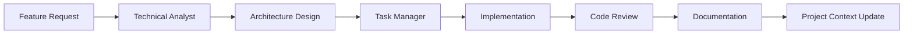
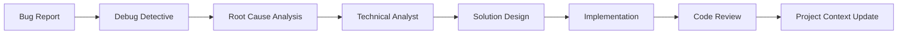
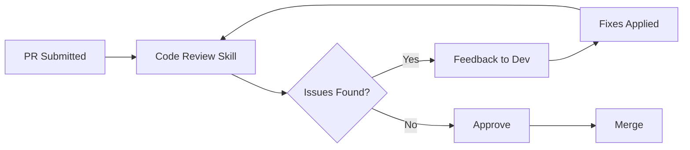

# Development Team Ensemble

A comprehensive ensemble that combines multiple specialized elements to function as a complete software development team. This ensemble provides architecture design, implementation, debugging, documentation, and project management capabilities.

## Ensemble Composition

### Core Team Members

#### 1. Technical Analyst (Persona) - Lead Architect
- **Role**: Primary technical decision maker
- **Responsibilities**: 
  - System architecture design
  - Technology selection
  - Technical feasibility analysis
  - Performance optimization strategies
- **Activation**: Always active as the technical lead

#### 2. Code Review (Skill) - Quality Gatekeeper
- **Role**: Ensures code quality and security
- **Responsibilities**:
  - Security vulnerability detection
  - Code quality assessment
  - Best practices enforcement
  - Performance analysis
- **Activation**: On-demand for code reviews

#### 3. Debug Detective (Persona) - Problem Solver
- **Role**: Handles complex debugging scenarios
- **Responsibilities**:
  - Root cause analysis
  - Bug reproduction and isolation
  - Solution implementation
  - Edge case identification
- **Activation**: Conditional when errors are detected

#### 4. Task Manager (Agent) - Project Coordinator
- **Role**: Manages workflow and priorities
- **Responsibilities**:
  - Task prioritization and assignment
  - Progress tracking
  - Deadline management
  - Resource allocation
- **Activation**: Always active for coordination

#### 5. Project Context (Memory) - Knowledge Base
- **Role**: Maintains institutional knowledge
- **Responsibilities**:
  - Store architectural decisions
  - Track technical debt
  - Remember team preferences
  - Maintain API documentation
- **Activation**: Always active as foundation

#### 6. Code Documentation (Template) - Documentation Standard
- **Role**: Ensures consistent documentation
- **Responsibilities**:
  - API documentation templates
  - README structures
  - Code comment standards
  - Architecture diagrams
- **Activation**: On-demand for documentation

## Workflow Patterns

### 1. New Feature Development


### 2. Bug Investigation


### 3. Code Review Process


## Communication Patterns

### Sequential Activation Example
```
User: "Design a REST API for user management"

1. Technical Analyst activates:
   - Analyzes requirements
   - Designs API structure
   - Selects authentication method

2. Task Manager activates:
   - Breaks down into tasks
   - Estimates effort
   - Creates implementation plan

3. Code Documentation activates:
   - Generates API documentation template
   - Creates endpoint specifications

4. Project Context updates:
   - Stores API design decisions
   - Records technology choices
```

### Conditional Activation Example
```
User: "The API returns 500 errors intermittently"

1. Debug Detective activates (error detected):
   - Analyzes error patterns
   - Identifies race condition

2. Technical Analyst consults:
   - Reviews architecture
   - Proposes solution

3. Code Review activates:
   - Reviews fix implementation
   - Checks for side effects

4. Project Context updates:
   - Records issue and solution
   - Updates known issues list
```

## Context Sharing

### Selective Sharing Model
- **Always Shared**: Project name, tech stack, team members
- **Conditionally Shared**: Current task, recent errors, performance metrics
- **Never Shared**: Sensitive credentials, personal information

### Information Flow
```yaml
shared_context:
  project:
    name: "E-commerce Platform"
    stack: ["Node.js", "React", "PostgreSQL"]
    phase: "Development"
    
  current_focus:
    feature: "Payment Integration"
    sprint: "Sprint 14"
    blockers: ["Payment gateway API access"]
    
  technical_decisions:
    - decision: "Use Stripe for payments"
      rationale: "Best documentation and SDK"
      date: "2025-07-20"
```

## Performance Characteristics

### Resource Usage
- **Memory**: ~200-300MB typical usage
- **CPU**: Burst usage during analysis
- **Response Time**: 2-5 seconds for complex queries

### Optimization Strategies
1. **Lazy Loading**: Skills and templates load on-demand
2. **Context Caching**: Recent decisions cached in memory
3. **Priority Execution**: High-priority elements get resources first

## Configuration Options

### Customization
```yaml
ensemble_config:
  development_team:
    activation_strategy: "sequential"  # or "priority", "conditional"
    conflict_resolution: "priority"    # or "merge", "last-write"
    
    element_overrides:
      code_review:
        strictness: "high"
        focus_areas: ["security", "performance"]
        
      task_manager:
        methodology: "scrum"  # or "kanban", "waterfall"
        sprint_length: 14
        
      debug_detective:
        verbosity: "detailed"
        include_stack_traces: true
```

### Team Preferences
```yaml
team_preferences:
  code_style: "airbnb"
  documentation_level: "comprehensive"
  test_coverage_minimum: 80
  pr_review_required: true
  deployment_strategy: "blue-green"
```

## Integration Benefits

### Synergies
1. **Architect + Debugger**: Better problem understanding
2. **Code Review + Documentation**: Comprehensive quality
3. **Task Manager + Memory**: Historical velocity tracking
4. **All Elements + Context**: Informed decision making

### Collective Intelligence
The ensemble provides more than the sum of its parts:
- Architectural decisions informed by debugging experiences
- Documentation that reflects actual implementation
- Task estimates based on historical performance
- Code reviews that consider project context