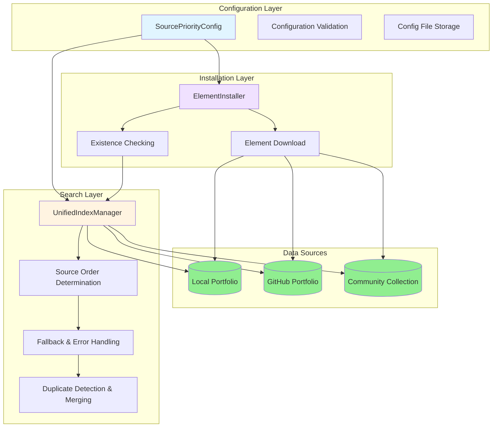
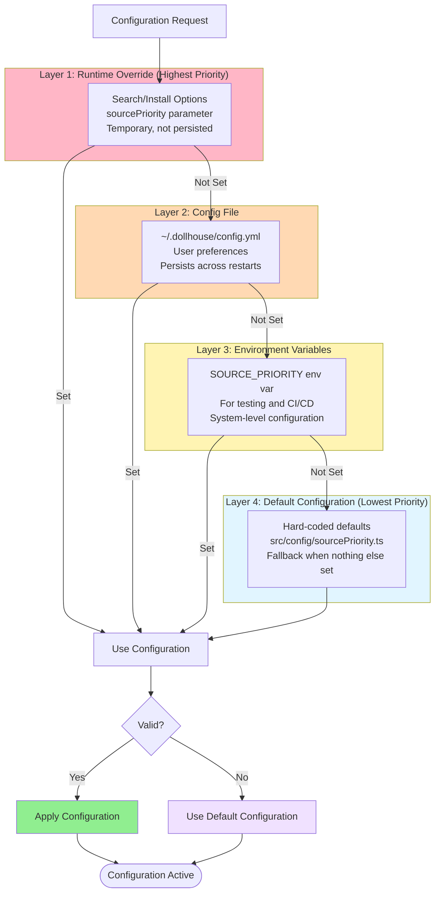

# DollhouseMCP Developer Guide

## Table of Contents
- [Element Source Priority System](#element-source-priority-system)
  - [Architecture Overview](#architecture-overview)
  - [Adding a New Source](#adding-a-new-source)
  - [Configuration System Design](#configuration-system-design)
  - [Testing Strategies](#testing-strategies)
  - [Performance Considerations](#performance-considerations)
  - [Extension Points](#extension-points)

---

## Element Source Priority System

### Architecture Overview

The element source priority system provides deterministic, configurable ordering for element discovery across multiple sources. The system consists of three main components working together:

#### Visual: Component Architecture



**Component Interactions:**
- Configuration layer provides settings to search and installation layers
- UnifiedIndexManager uses configuration to determine source order
- ElementInstaller queries UnifiedIndexManager to check for existing elements
- All layers interact with the three data sources (local, GitHub, collection)

#### 1. Configuration Layer (`src/config/sourcePriority.ts`)

**Purpose**: Centralized configuration for source priority behavior.

**Key components:**
- `ElementSource` enum - Defines available sources (local, github, collection)
- `SourcePriorityConfig` interface - Configuration schema
- `getSourcePriorityConfig()` - Configuration retrieval with fallback chain
- `validateSourcePriority()` - Configuration validation
- `saveSourcePriorityConfig()` - Persisting configuration

**Design decisions:**
- Enum for type safety and IDE autocomplete
- Validation at configuration time, not runtime
- Immutable default configuration
- Layered configuration (defaults → env vars → config file → runtime)

**Example:**
```typescript
import { ElementSource, getSourcePriorityConfig } from './config/sourcePriority.js';

// Get current configuration
const config = getSourcePriorityConfig();
console.log(config.priority); // [ElementSource.LOCAL, ElementSource.GITHUB, ElementSource.COLLECTION]
```

#### 2. Search Layer (`src/portfolio/UnifiedIndexManager.ts`)

**Purpose**: Implements search logic that respects source priority.

**Key methods:**
- `search(options: UnifiedSearchOptions)` - Main search entry point
- `searchWithFallback()` - Sequential search with error handling
- `determineSourceOrder()` - Computes final source order
- `mergeDuplicates()` - Handles duplicate detection

**Search flow:**
```
1. Parse search options (includeLocal, includeGitHub, includeCollection)
2. Determine source order (default priority, custom priority, or preferred source)
3. For each source in order:
   a. Search source
   b. If results found and stopOnFirst, return results
   c. If error and fallbackOnError, continue to next source
   d. Otherwise, continue to next source
4. Merge and deduplicate results
5. Return unified results
```

**Example:**
```typescript
import { UnifiedIndexManager } from './portfolio/UnifiedIndexManager.js';

const unifiedIndex = UnifiedIndexManager.getInstance();

// Search with custom priority
const results = await unifiedIndex.search({
  query: 'creative-writer',
  includeLocal: true,
  includeGitHub: true,
  includeCollection: false,
  sourcePriority: [ElementSource.GITHUB, ElementSource.LOCAL],  // Custom order
  stopOnFirst: false  // Get results from all sources
});
```

#### 3. Installation Layer (`src/collection/ElementInstaller.ts`)

**Purpose**: Respects source priority when installing elements.

**Key methods:**
- `installElement()` - Main installation entry point
- `checkExistingElement()` - Checks for duplicates using source priority
- `installFromPreferredSource()` - Forces installation from specific source

**Installation flow:**
```
1. Check for existing element (using source priority order)
2. If exists and not force, return error
3. Determine installation source (preferred source or first available)
4. Download element from source
5. Validate element
6. Save to local portfolio
7. Update indexes
```

**Example:**
```typescript
import { ElementInstaller } from './collection/ElementInstaller.js';

const installer = ElementInstaller.getInstance();

// Install with preferred source
await installer.installElement({
  name: 'creative-writer',
  elementType: 'personas',
  preferredSource: ElementSource.COLLECTION,  // Force collection source
  force: true  // Overwrite if exists
});
```

### Adding a New Source

To add a new element source (e.g., a custom registry or enterprise repository):

#### Step 1: Update ElementSource enum

**File**: `src/config/sourcePriority.ts`

```typescript
export enum ElementSource {
  LOCAL = 'local',
  GITHUB = 'github',
  COLLECTION = 'collection',
  ENTERPRISE = 'enterprise'  // NEW SOURCE
}
```

#### Step 2: Add display name

**File**: `src/config/sourcePriority.ts`

```typescript
export function getSourceDisplayName(source: ElementSource): string {
  const names: Record<ElementSource, string> = {
    [ElementSource.LOCAL]: 'Local Portfolio',
    [ElementSource.GITHUB]: 'GitHub Portfolio',
    [ElementSource.COLLECTION]: 'Community Collection',
    [ElementSource.ENTERPRISE]: 'Enterprise Registry'  // NEW
  };

  const displayName = names[source];
  if (displayName === undefined) {
    throw new Error(`Invalid element source: ${source}`);
  }

  return displayName;
}
```

#### Step 3: Create indexer for new source

**File**: `src/portfolio/EnterpriseIndexer.ts`

```typescript
import { IndexEntry } from './PortfolioIndexManager.js';
import { ElementType } from './types.js';

export class EnterpriseIndexer {
  async buildIndex(): Promise<Map<ElementType, IndexEntry[]>> {
    // Implement indexing logic for enterprise source
    const index = new Map<ElementType, IndexEntry[]>();

    // Example: Fetch elements from enterprise API
    const elements = await this.fetchEnterpriseElements();

    // Organize by type
    for (const element of elements) {
      const entries = index.get(element.type) || [];
      entries.push({
        name: element.name,
        path: element.path,
        type: element.type,
        version: element.version,
        description: element.description,
        tags: element.tags
      });
      index.set(element.type, entries);
    }

    return index;
  }

  async search(query: string, elementType?: ElementType): Promise<IndexEntry[]> {
    // Implement search logic
    const index = await this.buildIndex();
    const results: IndexEntry[] = [];

    // Search logic here

    return results;
  }

  private async fetchEnterpriseElements(): Promise<any[]> {
    // Implement API call to enterprise registry
    return [];
  }
}
```

#### Step 4: Integrate into UnifiedIndexManager

**File**: `src/portfolio/UnifiedIndexManager.ts`

```typescript
import { EnterpriseIndexer } from './EnterpriseIndexer.js';

export class UnifiedIndexManager {
  private enterpriseIndexer: EnterpriseIndexer;

  constructor() {
    // Initialize enterprise indexer
    this.enterpriseIndexer = new EnterpriseIndexer();
  }

  private async searchWithFallback(
    query: string,
    options: UnifiedSearchOptions
  ): Promise<UnifiedSearchResult[]> {
    // Add enterprise source handling
    const sourceOrder = this.determineSourceOrder(options);

    for (const source of sourceOrder) {
      switch (source) {
        case ElementSource.LOCAL:
          results = await this.searchLocal(query, options);
          break;
        case ElementSource.GITHUB:
          results = await this.searchGitHub(query, options);
          break;
        case ElementSource.COLLECTION:
          results = await this.searchCollection(query, options);
          break;
        case ElementSource.ENTERPRISE:  // NEW
          results = await this.searchEnterprise(query, options);
          break;
      }

      // Handle results...
    }
  }

  private async searchEnterprise(
    query: string,
    options: UnifiedSearchOptions
  ): Promise<UnifiedSearchResult[]> {
    const entries = await this.enterpriseIndexer.search(query, options.elementType);

    return entries.map(entry => ({
      entry,
      source: 'enterprise' as const,
      score: this.calculateRelevanceScore(entry, query)
    }));
  }
}
```

#### Step 5: Add search option

**File**: `src/portfolio/UnifiedIndexManager.ts`

```typescript
export interface UnifiedSearchOptions {
  query: string;
  includeLocal?: boolean;
  includeGitHub?: boolean;
  includeCollection?: boolean;
  includeEnterprise?: boolean;  // NEW OPTION
  // ... other options
}
```

#### Step 6: Update tests

**File**: `test/__tests__/integration/source-priority.test.ts`

```typescript
describe('Enterprise Source Priority', () => {
  it('should search enterprise source when included', async () => {
    const results = await unifiedIndex.search({
      query: 'test-element',
      includeLocal: false,
      includeGitHub: false,
      includeCollection: false,
      includeEnterprise: true
    });

    expect(results.results.length).toBeGreaterThan(0);
    expect(results.results[0].source).toBe('enterprise');
  });

  it('should respect enterprise in custom priority order', async () => {
    const results = await unifiedIndex.search({
      query: 'test-element',
      sourcePriority: [ElementSource.ENTERPRISE, ElementSource.LOCAL]
    });

    // Enterprise should be checked first
    expect(results.results[0].source).toBe('enterprise');
  });
});
```

#### Step 7: Update documentation

- Add to USER_GUIDE.md
- Add to API_REFERENCE.md
- Update migration guide if breaking changes

### Configuration System Design

The source priority configuration uses a **layered approach** with clear precedence:

#### Visual: Configuration Priority Layers



**Priority Rules:**
- Higher layers override lower layers
- First valid configuration wins
- Invalid configurations fall back to defaults
- Runtime overrides are temporary (per-operation)
- All other layers persist until changed

#### Configuration Layers (highest to lowest priority)

1. **Runtime Override**
   - Search options passed directly to search/install methods
   - Highest priority
   - Temporary, not persisted
   - Example: `search({ sourcePriority: [...] })`

2. **Config File**
   - Stored in `~/.dollhouse/config.yml`
   - User's persistent preferences
   - Survives restarts
   - Example: `source_priority.priority: [local, github, collection]`

3. **Environment Variables**
   - For testing and CI/CD
   - Set with `SOURCE_PRIORITY` env var
   - Example: `export SOURCE_PRIORITY='{"priority":["local"]}'`

4. **Default Configuration**
   - Hard-coded in `src/config/sourcePriority.ts`
   - Fallback when no other configuration exists
   - Never changes without code update

#### Configuration Loading Logic

```typescript
export function getSourcePriorityConfig(): SourcePriorityConfig {
  // 1. Check environment variable (for testing)
  if (process.env.SOURCE_PRIORITY) {
    try {
      const envConfig = JSON.parse(process.env.SOURCE_PRIORITY);
      const validation = validateSourcePriority(envConfig);
      if (validation.isValid) {
        return envConfig;
      }
    } catch (error) {
      logger.warn('Invalid SOURCE_PRIORITY environment variable');
    }
  }

  // 2. Check config file (user preferences)
  // Note: Requires async support, not yet implemented
  // const configManager = ConfigManager.getInstance();
  // const userConfig = await configManager.getSetting('source_priority');
  // if (userConfig) return userConfig;

  // 3. Return default configuration
  return DEFAULT_SOURCE_PRIORITY;
}
```

#### Configuration Validation

All configuration is validated before use:

```typescript
export function validateSourcePriority(config: SourcePriorityConfig): ValidationResult {
  const errors: string[] = [];

  // Check for empty priority list
  if (!config.priority || config.priority.length === 0) {
    errors.push('Priority list cannot be empty');
  }

  // Check for duplicate sources
  const uniqueSources = new Set(config.priority);
  if (uniqueSources.size !== config.priority.length) {
    errors.push('Duplicate sources in priority list');
  }

  // Check for unknown sources
  const validSources = Object.values(ElementSource);
  for (const source of config.priority) {
    if (!validSources.includes(source)) {
      errors.push(`Unknown source: ${source}`);
    }
  }

  return {
    isValid: errors.length === 0,
    errors
  };
}
```

### Testing Strategies

#### Unit Tests

Test individual components in isolation:

```typescript
// Test configuration validation
describe('validateSourcePriority', () => {
  it('should accept valid configuration', () => {
    const config = {
      priority: [ElementSource.LOCAL, ElementSource.GITHUB],
      stopOnFirst: true,
      checkAllForUpdates: false,
      fallbackOnError: true
    };

    const result = validateSourcePriority(config);
    expect(result.isValid).toBe(true);
    expect(result.errors).toHaveLength(0);
  });

  it('should reject duplicate sources', () => {
    const config = {
      priority: [ElementSource.LOCAL, ElementSource.LOCAL],
      stopOnFirst: true,
      checkAllForUpdates: false,
      fallbackOnError: true
    };

    const result = validateSourcePriority(config);
    expect(result.isValid).toBe(false);
    expect(result.errors).toContain('Duplicate sources in priority list');
  });
});
```

#### Integration Tests

Test end-to-end workflows:

```typescript
describe('Source Priority Integration', () => {
  it('should find element from highest priority source', async () => {
    // Setup: Create element in local and GitHub
    await createLocalElement('test-element');
    await createGitHubElement('test-element');

    // Search with default priority (local first)
    const results = await unifiedIndex.search({
      query: 'test-element',
      includeLocal: true,
      includeGitHub: true
    });

    // Should find from local (higher priority)
    expect(results.results[0].source).toBe('local');
  });

  it('should respect custom priority order', async () => {
    // Setup: Create element in local and GitHub
    await createLocalElement('test-element');
    await createGitHubElement('test-element');

    // Search with custom priority (GitHub first)
    const results = await unifiedIndex.search({
      query: 'test-element',
      sourcePriority: [ElementSource.GITHUB, ElementSource.LOCAL]
    });

    // Should find from GitHub (higher priority in custom order)
    expect(results.results[0].source).toBe('github');
  });
});
```

#### Performance Tests

Test search performance with different configurations:

```typescript
describe('Source Priority Performance', () => {
  it('should be faster with stopOnFirst enabled', async () => {
    // Benchmark with stopOnFirst: true
    const start1 = Date.now();
    await unifiedIndex.search({
      query: 'test-element',
      stopOnFirst: true
    });
    const time1 = Date.now() - start1;

    // Benchmark with stopOnFirst: false
    const start2 = Date.now();
    await unifiedIndex.search({
      query: 'test-element',
      stopOnFirst: false
    });
    const time2 = Date.now() - start2;

    // Early termination should be faster
    expect(time1).toBeLessThan(time2);
  });
});
```

#### Regression Tests

Ensure backward compatibility:

```typescript
describe('Source Priority Backward Compatibility', () => {
  it('should maintain default behavior for existing code', async () => {
    // Old code without source priority options
    const results = await unifiedIndex.search({
      query: 'test-element'
    });

    // Should use default priority (local → github → collection)
    // Should stop on first match
    expect(results.results.length).toBeGreaterThan(0);
  });
});
```

### Performance Considerations

#### Sequential vs. Parallel Search

**Sequential search** (current implementation):
- **Pros**:
  - Early termination possible (stopOnFirst)
  - Better cache locality
  - Lower resource usage
  - Predictable latency
- **Cons**:
  - Slower when element is in last source
  - Network latency blocks subsequent sources

**Parallel search** (future enhancement):
- **Pros**:
  - Lower total latency
  - Finds element faster when in later source
- **Cons**:
  - Higher resource usage
  - More complex deduplication
  - No early termination benefit
  - Harder to maintain priority order

**Recommendation**: Sequential is better for most use cases. Consider parallel only for specific scenarios:
- When searching multiple sources is always required (`includeAll: true`)
- When update checking is enabled (`checkAllForUpdates: true`)
- When source latency varies significantly

#### Optimization Tips

1. **Enable early termination** (default):
   ```typescript
   stopOnFirst: true  // Stop at first match
   ```

2. **Cache source availability**:
   ```typescript
   // Check if source is reachable before searching
   if (await this.isSourceAvailable(source)) {
     results = await this.searchSource(source, query);
   }
   ```

3. **Implement smart source selection**:
   ```typescript
   // If element type is typically in collection, search collection first
   if (elementType === 'templates' && options.preferTemplatesFromCollection) {
     sourcePriority = [ElementSource.COLLECTION, ...defaultPriority];
   }
   ```

4. **Use result streaming for large result sets**:
   ```typescript
   const results = await unifiedIndex.search({
     query: '*',
     streamResults: true,
     maxResults: 100
   });
   ```

5. **Batch index updates**:
   ```typescript
   // Rebuild indexes for all types at once
   await unifiedIndex.rebuildAllIndexes();
   ```

#### Performance Metrics

Monitor these metrics to identify bottlenecks:

```typescript
import { PerformanceMonitor } from './utils/PerformanceMonitor.js';

const monitor = PerformanceMonitor.getInstance();

// Track search performance
const metrics = monitor.getMetrics('search');
console.log(`Average search time: ${metrics.avgDuration}ms`);
console.log(`Cache hit rate: ${metrics.cacheHitRate}%`);

// Track source performance
const sourceMetrics = monitor.getMetrics('source:local');
console.log(`Local source avg latency: ${sourceMetrics.avgDuration}ms`);
```

### Extension Points

The source priority system provides several extension points:

#### 1. Custom Source Types

Add new sources by extending `ElementSource` enum and implementing corresponding search logic.

#### 2. Custom Priority Strategies

Implement custom logic for determining source order:

```typescript
export interface PriorityStrategy {
  determineOrder(
    defaultOrder: ElementSource[],
    context: SearchContext
  ): ElementSource[];
}

class ElementTypePriorityStrategy implements PriorityStrategy {
  determineOrder(defaultOrder: ElementSource[], context: SearchContext): ElementSource[] {
    // Prioritize collection for templates
    if (context.elementType === 'templates') {
      return [ElementSource.COLLECTION, ...defaultOrder.filter(s => s !== ElementSource.COLLECTION)];
    }
    return defaultOrder;
  }
}
```

#### 3. Custom Fallback Behavior

Implement custom error handling and fallback logic:

```typescript
export interface FallbackStrategy {
  handleSourceError(
    source: ElementSource,
    error: Error,
    remainingSources: ElementSource[]
  ): Promise<boolean>;  // Return true to continue, false to stop
}
```

#### 4. Custom Result Merging

Implement custom logic for merging and deduplicating results:

```typescript
export interface ResultMerger {
  merge(
    results: Map<ElementSource, SearchResult[]>
  ): SearchResult[];
}
```

---

## Related Documentation

- [User Guide](USER_GUIDE.md) - User-facing documentation
- [API Reference](API_REFERENCE.md) - Complete API documentation
- [Testing Guide](testing/ROUNDTRIP_TESTING_GUIDE.md) - Testing best practices
- [Contributing Guide](../CONTRIBUTING.md) - Contribution guidelines

---

*Last updated: 2025-11-06*
*Version: 1.10.0*
