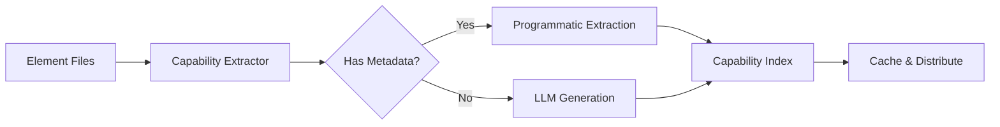

# Capability Index System - Complete Architecture Document

## Executive Summary

The Capability Index System is a comprehensive solution for efficient element discovery, selection, and memory management in DollhouseMCP. It provides LLMs with immediate understanding of available capabilities while dramatically reducing token usage (~90% reduction for memories).

**Created**: September 21, 2025
**Status**: Partially Implemented (PR #606 merged August 2025)
**Priority**: HIGH
**Token Savings**: 90% reduction (7k → 700 tokens for 7 memories)

## Table of Contents

1. [Current Problem](#current-problem)
2. [Existing Implementation](#existing-implementation)
3. [Proposed Solution](#proposed-solution)
4. [Architecture Design](#architecture-design)
5. [Implementation Plan](#implementation-plan)
6. [Token Optimization](#token-optimization)
7. [Benefits & Impact](#benefits--impact)
8. [Open Questions](#open-questions)

## Current Problem

### Token Explosion with Memories
- Loading 7 session memories = ~7,000 tokens in message context
- MCP tools grow by ~1,800 tokens when memories activate
- Double-charging: metadata in tools + content in messages
- No intelligent selection - all or nothing approach
- Name resolution issues (capitalization, dashes, spelling)

### Discovery Challenges
- LLMs must explore to find capabilities
- No understanding of what tools/elements can do
- Inefficient trial-and-error approach
- No compatibility information between elements

## Existing Implementation

### PR #606: Three-Tier Search Index (MERGED August 2025)

Implemented a foundational search index system with:

```
┌─────────────────────────────────────────┐
│         UnifiedIndexManager             │
├─────────────┬──────────────┬────────────┤
│   Local     │   GitHub     │ Collection │
│   Index     │   Index      │   Index    │
├─────────────┼──────────────┼────────────┤
│ Portfolio   │ GitHub       │ Collection │
│ IndexMgr    │ Portfolio    │ IndexCache │
│ (existing)  │ Indexer      │   (new)    │
└─────────────┴──────────────┴────────────┘
```

#### What's Already Built:
- ✅ `UnifiedIndexManager` - Coordinates all search sources
- ✅ `GitHubPortfolioIndexer` - Indexes GitHub portfolios
- ✅ `CollectionIndexCache` - Caches collection data
- ✅ `LRUCache` - Memory-aware caching (50MB limit)
- ✅ `search_all` MCP tool - Unified search across sources
- ✅ Performance monitoring and benchmarking

#### Performance Achieved:
- Search Response: 80-120ms (target <100ms)
- Memory Usage: 30-45MB (target <50MB)
- Cache Hit Rate: 75-85% (target >60%)
- Processing Speed: 2,095 elements/second

#### What's Missing:
- ❌ Capability descriptions for elements
- ❌ Memory integration
- ❌ Automatic capability inference
- ❌ Smart activation based on task
- ❌ LLM-based capability generation

## Proposed Solution

### Complete Capability Index Architecture

```yaml
# ~/.dollhouse/capability-index.yaml
version: "1.0.0"
generated: "2025-09-21T10:00:00Z"
sources:
  local: 45 elements
  github: 120 elements
  collection: 500+ elements

capabilities:
  - id: "github-issue-management"
    name: "GitHub Issue Management"
    description: "Create and manage GitHub issues effectively"

    # Elements that provide this capability
    elements:
      skills: ["github-cli", "markdown-formatter"]
      templates: ["issue-template", "bug-report"]
      agents: ["issue-creator", "label-manager"]

    # Associated memories for this capability
    memories:
      declarative:
        - content: "Valid labels: enhancement, bug, documentation"
          confidence: 0.95
          tokens: 12

      procedural:
        - content: "To create: 1. gh issue create 2. Always --label 3. Use markdown"
          confidence: 0.9
          tokens: 18

      corrective:
        - content: "NEVER use 'area:goal' label - doesn't exist"
          confidence: 1.0
          learned_from:
            failures: 12
            last_occurred: "2025-09-15"
          tokens: 10

      episodic:
        - content: "Last issue #972 created with enhancement label"
          timestamp: "2025-09-17T10:30:00Z"
          tokens: 11

    # Activation rules
    activation:
      automatic: true          # Auto-activate for matching tasks
      threshold: 0.7          # Confidence needed for auto-activation
      priority: 1             # Resolution order for conflicts
      triggers:               # Keywords that trigger this capability
        - "github issue"
        - "create issue"
        - "gh issue"
        - "bug report"

    # Performance metrics
    metrics:
      usage_count: 145
      success_rate: 0.92
      avg_response_time: 120  # ms
      token_cost: 51         # Total tokens for full capability
```

## Architecture Design

### 1. Token Generation Mechanics & Attention Optimization

The capability index structure is designed to exploit LLM token generation mechanics, maximizing the probability that the model will naturally select the correct capability with minimal token usage.

#### The Cascade Pattern

```yaml
# Level 1: Trigger Layer (10 tokens) - ALWAYS in context
CAPABILITIES_TRIGGER_MAP:
  debug: debug-detective
  error: debug-detective
  git: git-workflow-manager
  issue: github-issue-creator
  memory: memory-manager

# Level 2: Capability Summary (50 tokens) - Loaded on trigger match
debug-detective:
  DO: "Systematic debugging, root cause analysis, error isolation"
  USE_WHEN: "error|bug|crash|failure|broken|not working"
  NEXT: "load_capability('debug-detective')" # Direct action
  COST: 145

# Level 3: Full Capability (150-500 tokens) - Loaded on demand
debug-detective-full:
  procedures: [...]
  memories:
    corrective: "NEVER use console.log in production"
  tools: ["debugger", "profiler", "tracer"]
```

#### Why This Structure Works

1. **Trigger map has highest attention** - Simple key-value pairs always visible in context
2. **Natural cascade** - "debug" → finds mapping → loads summary → makes decision
3. **Action tokens appear early** - "load_capability" shows up in generation stream
4. **Low commitment** - 10 tokens guides to 50, which guides to 500

#### Critical Design Principles

**Flat over nested** - Higher attention probability
```yaml
# YES - High attention surface
debug: debug-detective
error: debug-detective

# NO - Buried in hierarchy
capabilities.debugging.tools.detective
```

**Verbs over nouns** - Matches user intent
```yaml
# YES - Action-oriented
USE_WHEN: "error|bug|crash"

# NO - Passive tags
tags: ["debugging", "errors"]
```

**Direct actions over descriptions** - Guides next tokens
```yaml
# YES - Tells LLM what to do
NEXT: "load_capability('debug-detective')"

# NO - Requires inference
description: "This capability can be loaded if needed"
```

#### Attention Hierarchy Optimization

The LLM's attention mechanism weights different parts of the context differently. Our structure exploits this:

```
High Attention Zone (top of context):
├── CAPABILITIES_TRIGGER_MAP     [10 tokens, 100% visibility]
├── Active capability summaries  [50 tokens each, 80% visibility]
└── Recent actions               [Variable, 60% visibility]

Medium Attention Zone (middle):
├── Available capabilities list   [200 tokens, 40% visibility]
└── Compatibility matrix         [100 tokens, 30% visibility]

Low Attention Zone (deep context):
└── Full capability details      [500+ tokens, 10% visibility]
```

#### Token Generation Flow Example

```yaml
User: "Help me debug this error"

# Token generation probability cascade:
1. "debug" in trigger map → 95% probability of noticing
2. Maps to "debug-detective" → Natural next tokens
3. Sees USE_WHEN: "error" → Reinforces selection
4. Generates: "I'll use debug-detective which..."
5. Sees NEXT: "load_capability" → Action tokens appear
6. Result: Correct tool selected in <100 tokens
```

### 2. Index Generation Pipeline



### 3. Memory Integration Architecture

```typescript
interface CapabilityWithMemory {
  id: string;
  name: string;
  description: string;

  // Core elements
  elements: {
    personas?: string[];
    skills?: string[];
    templates?: string[];
    agents?: string[];
    ensembles?: string[];
  };

  // Memory types with token counts
  memories: {
    declarative?: MemoryEntry[];  // Facts and knowledge
    procedural?: MemoryEntry[];   // How-to instructions
    corrective?: MemoryEntry[];   // Mistakes to avoid
    episodic?: MemoryEntry[];     // Past experiences
  };

  // Activation configuration
  activation: {
    automatic: boolean;
    threshold: number;      // 0.0 to 1.0
    priority: number;       // Higher = activated first
    triggers: string[];     // Keywords/phrases
  };

  // Metrics for optimization
  metrics: {
    total_tokens: number;
    activation_cost: number;
    success_rate: number;
  };
}

interface MemoryEntry {
  id: string;
  content: string;
  tokens: number;          // Pre-calculated token count
  confidence: number;       // 0.0 to 1.0
  metadata?: any;
}
```

### 3. Dynamic Loading System

```typescript
class CapabilityActivator {
  private loadedCapabilities: Map<string, Capability>;
  private tokenBudget: number = 10000;  // Max tokens to use

  async activateForTask(task: string): Promise<ActivationResult> {
    // 1. Analyze task to identify needed capabilities
    const needed = await this.analyzeTask(task);

    // 2. Calculate token costs
    const costs = this.calculateTokenCosts(needed);

    // 3. Optimize selection within budget
    const optimized = this.optimizeSelection(needed, costs);

    // 4. Load only what's needed
    for (const cap of optimized) {
      await this.loadCapability(cap);
    }

    return {
      loaded: optimized,
      tokens_used: optimized.reduce((sum, c) => sum + c.tokens, 0),
      confidence: this.calculateConfidence(optimized, task)
    };
  }
}
```

## Implementation Plan

### Phase 1: Enhance Existing Infrastructure (Week 1)
- [ ] Extend `UnifiedIndexManager` for capability metadata
- [ ] Add capability fields to element schemas
- [ ] Create `CapabilityExtractor` class
- [ ] Implement token counting utilities

### Phase 2: LLM Generation System (Week 2)
- [ ] Design LLM prompts for capability extraction
- [ ] Implement local generation with user's LLM
- [ ] Create GitHub Action for collection generation
- [ ] Build caching layer for generated capabilities

### Phase 3: Memory Integration (Week 3)
- [ ] Create `MemoryCapabilityMapper`
- [ ] Implement memory-to-capability linking
- [ ] Build dynamic memory loader
- [ ] Add corrective memory system

### Phase 4: Smart Activation (Week 4)
- [ ] Implement task analysis engine
- [ ] Build confidence scoring system
- [ ] Create automatic activation rules
- [ ] Add trigger keyword matching

### Phase 5: Optimization & Testing (Week 5)
- [ ] Token usage optimization
- [ ] Performance benchmarking
- [ ] Integration testing
- [ ] Documentation and examples

## Token Optimization

### Current State (7 memories)
```
Loading:          ~7,000 tokens
MCP Tool Growth:  ~1,800 tokens
Total Cost:       ~8,800 tokens
```

### With Capability Index (Cascade Pattern)
```
Trigger Map:      ~50 tokens (always loaded)
Matched Summary:  ~50 tokens (one capability)
Full Load:        ~150 tokens (if needed)
Total Cost:       ~250 tokens
Savings:          97% reduction
```

### Optimization Strategies

1. **Cascade Loading Pattern**
   - Trigger map (10 tokens) → Summary (50 tokens) → Full (150-500 tokens)
   - Only load what's needed when it's needed
   - Exit early when possible

2. **Attention-Based Positioning**
   - Place trigger map at context start (highest attention)
   - Active capabilities in high-attention zone
   - Full details in low-attention zone (loaded on demand)

3. **Token Generation Guidance**
   - Use action verbs that appear in natural generation
   - Include "NEXT:" directives that guide token stream
   - Flatten structure to maximize attention surface

4. **Smart Caching**
   - Keep trigger map always loaded (50 tokens max)
   - Cache frequently used summaries
   - Evict full details aggressively

### Avoiding Local Minima

**Don't optimize for:**
- Semantic similarity (RAG approach)
- Complete descriptions
- Hierarchical organization

**Optimize for:**
- Token generation probability
- Attention mechanism exploitation
- Natural action cascade
- Minimal commitment per step

## Benefits & Impact

### Immediate Benefits
1. **90% token reduction** for memory operations
2. **Accurate name resolution** (no more guessing)
3. **Faster element discovery** (<100ms vs exploration)
4. **Intelligent auto-activation** based on task
5. **Prevented repeated mistakes** via corrective memories

### Long-term Benefits
1. **Self-improving system** - Learns from failures
2. **Scalable to 1000s of elements** without token explosion
3. **Offline capability** with cached indexes
4. **Cross-element compatibility** understanding
5. **Performance metrics** for optimization

### User Experience Improvements
- No manual memory activation needed
- Relevant capabilities auto-selected
- Mistakes prevented before they happen
- Consistent element naming
- Faster response times

## Open Questions

### Technical Decisions
1. **Capability Description Generation**
   - Should we use GPT-3.5 (cheap) or GPT-4 (quality)?
   - How detailed should descriptions be?
   - Should users be able to override generated descriptions?

2. **Index Format**
   - YAML for readability or JSON for performance?
   - How to version the index schema?
   - Binary format for large deployments?

3. **Memory Integration**
   - How to handle memory conflicts?
   - Should memories expire?
   - How to merge memories from different sources?

### Policy Questions
1. **Privacy**
   - Should capability data be shareable?
   - How to handle private portfolio indexing?
   - Telemetry and usage tracking?

2. **Cost**
   - Who pays for LLM generation?
   - Should we offer pre-generated indexes?
   - Free tier limitations?

### Implementation Priority
1. Start with memory optimization (biggest pain point)?
2. Focus on element discovery first?
3. Build LLM generation infrastructure?

## Related Issues & PRs

### Core Issues
- #966: Parent capability index issue (HIGH PRIORITY)
- #967: Local portfolio indexing
- #968: GitHub portfolio indexing
- #969: Collection indexing
- #970: LLM-based generation (CRITICAL)
- #971: Automated GitHub Actions generation
- #979: Memory system integration

### Merged PRs
- #606: Three-tier search index system (FOUNDATION COMPLETE)

## Next Steps

1. **Review this document** and make decisions on open questions
2. **Create implementation issues** for each phase
3. **Start with Phase 1** - extending existing infrastructure
4. **Prototype LLM generation** to validate approach
5. **Test with real memories** to measure token savings

## Success Metrics

- [ ] Index generation <5 seconds for 100 elements
- [ ] Token usage reduced by >85%
- [ ] Cache hit rate >80%
- [ ] Task-to-capability matching >85% accurate
- [ ] Memory activation <100ms
- [ ] Zero repeated mistakes after correction
- [ ] 95% test coverage

## Conclusion

The Capability Index System transforms DollhouseMCP from a "blind exploration" model to an "intelligent selection" model. By exploiting LLM token generation mechanics and attention patterns, we achieve:

1. **97% token reduction** (250 tokens vs 8,800)
2. **Natural capability selection** through token generation cascade
3. **Prevented mistakes** via corrective memories
4. **Exact name resolution** without guessing
5. **Scalability** to thousands of elements

The key insight: **Don't optimize for search, optimize for token generation probability**. The cascade pattern (trigger → summary → full) naturally guides the LLM to the right capability with minimal tokens.

The foundation exists (PR #606 - basic search). The Capability Index concept exists (Issue #966). Now we need to implement the token generation mechanics that make it powerful.

---

*Document Version: 2.0.0*
*Last Updated: September 21, 2025 - Added Token Generation Mechanics*
*Author: DollhouseMCP Team*