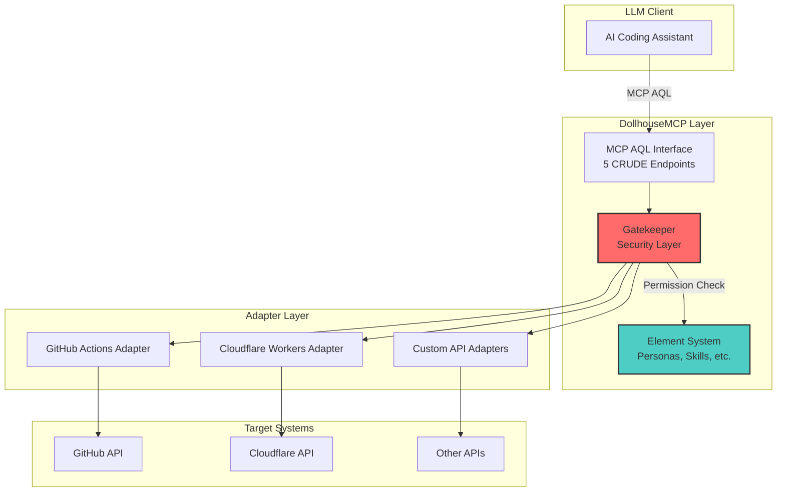
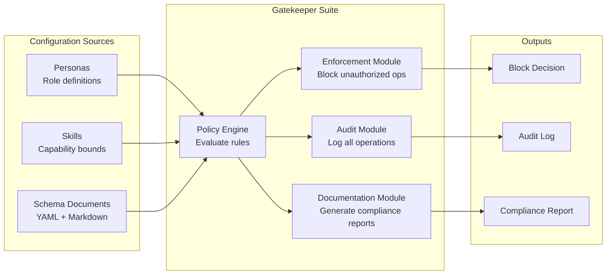
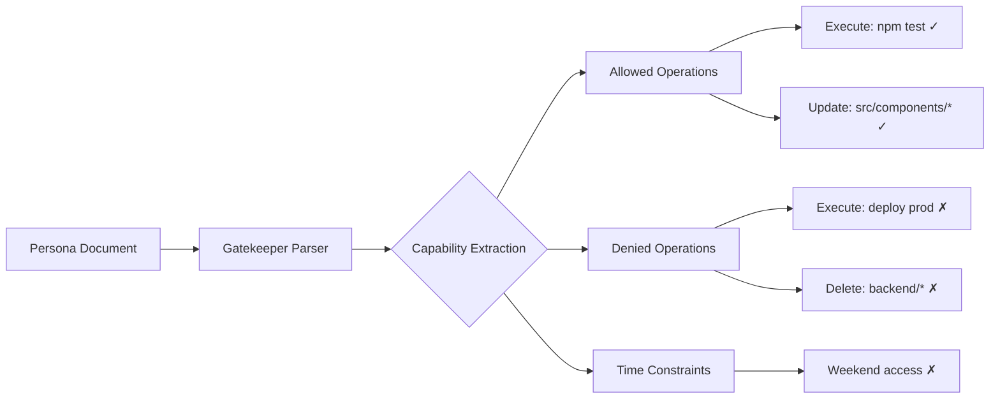
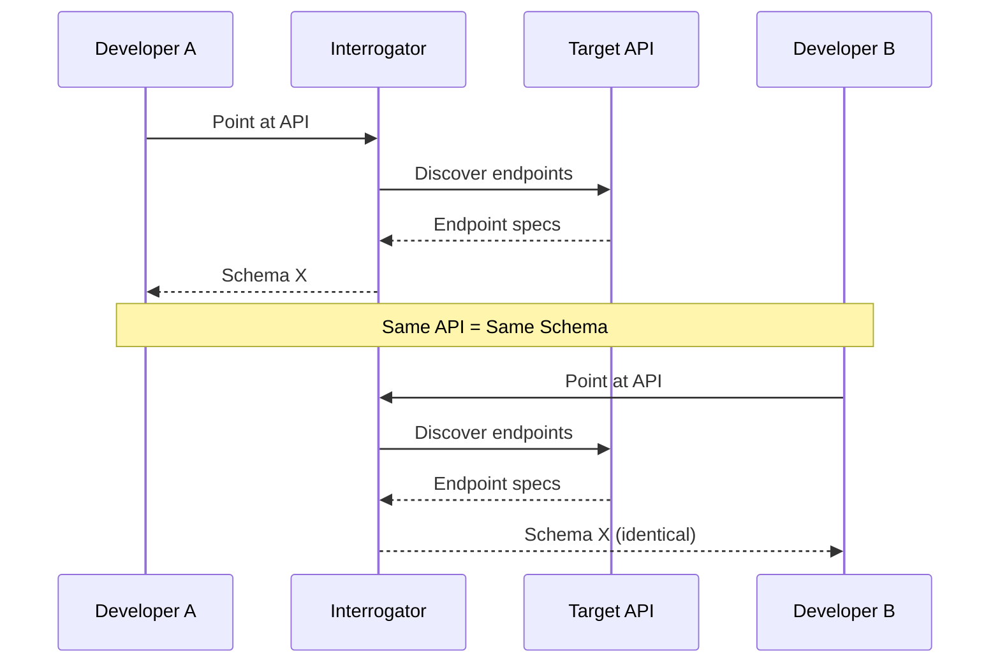
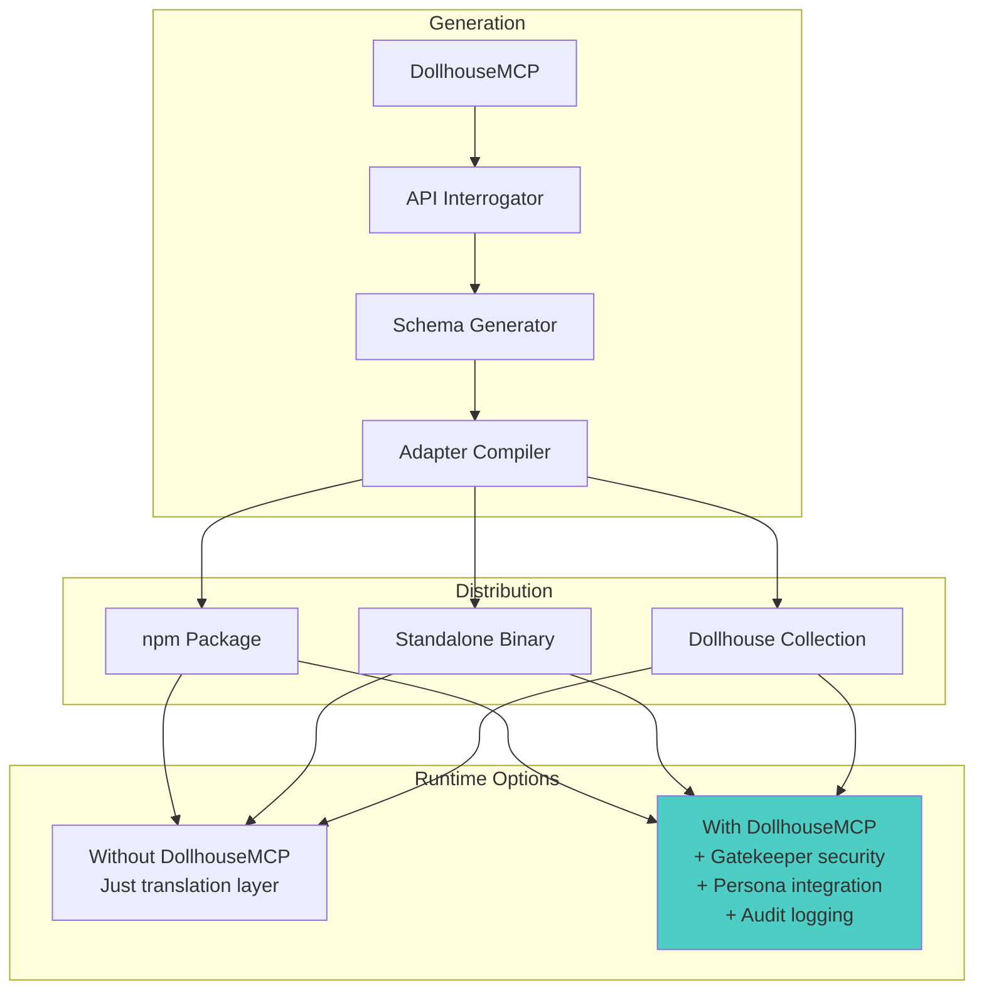

# Gatekeeper Architecture

**Document Type:** Technical Architecture
**Status:** Active
**Created:** 2026-01-01
**Updated:** 2026-01-03

---

## Overview

Gatekeeper is the security and governance layer for DollhouseMCP, providing element-derived permissions, audit logging, and enforcement for AI operations. This document describes the technical architecture of Gatekeeper, its integration with MCP-AQL, and the adapter system.

---

## System Architecture

### High-Level System Flow



### Gatekeeper Module Architecture



### Deployment Scenarios

```mermaid
flowchart TB
    subgraph "Scenario A: Adapter Only"
        A1[GitHub Actions Runner]
        A2[GitHub Actions Adapter<br/>Standalone]
        A3[GitHub API]
        A1 --> A2 --> A3
    end

    subgraph "Scenario B: With Gatekeeper"
        B1[GitHub Actions Runner]
        B2[Gatekeeper<br/>+ Enforcement<br/>+ Auditing]
        B3[Persona: ci-bot<br/>Limited Permissions]
        B4[GitHub Actions Adapter]
        B5[GitHub API]
        B1 --> B2
        B2 --> B3
        B3 --> B4 --> B5
    end

    subgraph "Scenario C: Full Enterprise"
        C1[Self-Hosted Runner]
        C2[DollhouseMCP Server<br/>HTTP Transport]
        C3[Full Gatekeeper Suite]
        C4[Multiple Adapters]
        C5[Multiple APIs]
        C1 --> C2 --> C3 --> C4 --> C5
    end
```



---

## Element-Based Permission Model

Instead of traditional RBAC, DollhouseMCP uses natural language personas:

```markdown
---
name: Junior Frontend Developer
type: persona
version: 1.0.0
---

# Junior Frontend Developer

A developer focused on React component development in the frontend codebase.

## Capabilities

- Create and modify React components in `src/components/`
- Run frontend tests with `npm test`
- View frontend application logs
- Create pull requests for review

## Boundaries

- Does not modify backend services or API routes
- Does not access production databases
- Does not deploy to production environments
- Cannot merge without senior review approval

## Work Hours

Available Monday-Friday, 9am-6pm local time
```

Gatekeeper reads this persona and programmatically derives permissions:



---

## Technical Features

### Token Efficiency

MCP-AQL adapters compress large API surfaces:

| API | Raw OpenAPI Spec | MCP AQL Adapter |
|-----|------------------|-----------------|
| GitHub Actions | ~25,000 tokens | ~1,200 tokens |
| Cloudflare Workers | ~15,000 tokens | ~1,100 tokens |
| Complex Enterprise API | ~50,000 tokens | ~2,000 tokens |

An LLM can load 10-20 adapters simultaneously while retaining context for actual work.

### Deterministic Schema Generation



Community maintains canonical adapters. Improvements flow back. No fragmentation.

### CRUDE Protocol

Five semantic operations covering all API interactions:

| Endpoint | Idempotent | Examples |
|----------|------------|----------|
| **C**reate | No | Create branch, open PR, spawn runner |
| **R**ead | Yes | Get status, list artifacts, check permissions |
| **U**pdate | Yes | Modify PR, update config, set state |
| **D**elete | Yes | Delete branch, remove artifact, cancel run |
| **E**xecute | No | Trigger workflow, deploy, run tests |

LLM understands intent without parsing REST conventions.

---

## Adapter Distribution Model

### Adapters are Standalone

Adapters generated by DollhouseMCP are **standalone and distributable**. They do not require DollhouseMCP to run.



### Three-Tier Capability Model

```
┌─────────────────────────────────────────────────────────────────┐
│                    TIER 3: Full DollhouseMCP                    │
│  ┌───────────────────────────────────────────────────────────┐  │
│  │ Element Management: Personas, Skills, Memories, Agents    │  │
│  │ Element-derived Gatekeeper rules (dynamic)                 │  │
│  │ DollhouseMCP reads elements → configures Gatekeeper       │  │
│  │ Full element integration and validation                   │  │
│  └───────────────────────────────────────────────────────────┘  │
├─────────────────────────────────────────────────────────────────┤
│               TIER 2: Adapter + Gatekeeper (Mode B)             │
│  ┌───────────────────────────────────────────────────────────┐  │
│  │ Gatekeeper subcomponents (standalone):                     │  │
│  │   • Audit Logging                                          │  │
│  │   • Enforcement (element-derived, read-only)               │  │
│  │   • Time-based restrictions                                │  │
│  │   • Rate limiting                                          │  │
│  │ CAN read elements and activate/deactivate permissions      │  │
│  │ CANNOT create/edit elements (read-only access)             │  │
│  └───────────────────────────────────────────────────────────┘  │
├─────────────────────────────────────────────────────────────────┤
│                      TIER 1: Adapter Only                       │
│  ┌───────────────────────────────────────────────────────────┐  │
│  │ Translation layer: MCP AQL ↔ Target API                    │  │
│  │ No security, no logging, just pass-through                 │  │
│  └───────────────────────────────────────────────────────────┘  │
└─────────────────────────────────────────────────────────────────┘
```

#### Tier Comparison

| Capability | Tier 1 (Adapter) | Tier 2 (Mode B) | Tier 3 (Mode A) |
|------------|------------------|-----------------|-----------------|
| API Translation | ✓ | ✓ | ✓ |
| Audit Logging | ✗ | ✓ | ✓ |
| Rule Enforcement | ✗ | ✓ | ✓ |
| Time-based Restrictions | ✗ | ✓ | ✓ |
| Rate Limiting | ✗ | ✓ | ✓ |
| Read Elements | ✗ | ✓ | ✓ |
| Element-derived Rules | ✗ | ✓ | ✓ |
| Create/Edit Elements | ✗ | ✗ | ✓ |
| Element Management Tools | ✗ | ✗ | ✓ |
| Multi-Adapter Orchestration | ✗ | ✗ | ✓ |
| Prompt Injection | ✗ | ✗ | ✓ |

---

## LLM as Relay for Cross-Adapter Communication

**Constraint:** MCP servers cannot communicate directly with other MCP servers. The MCP protocol is designed for LLM clients to talk to servers, not server-to-server communication.

**Solution:** Use the LLM as a relay. DollhouseMCP orchestrates permission configuration across multiple adapters by instructing the LLM to make sequential tool calls.

### Mode A: DollhouseMCP Orchestrated (Full Element Integration)

```
User: "activate element X"
         ↓
LLM → DollhouseMCP: [activate element X]
         ↓
DollhouseMCP → LLM: "Activated. Tell Adapter 1: set permissions [...]"
         ↓
LLM → Adapter 1: [set_permissions: {...}]
         ↓
Adapter 1 → LLM: "Done. Tell DollhouseMCP I'm configured."
         ↓
LLM → DollhouseMCP: [adapter_configured: adapter_1]
         ↓
DollhouseMCP → LLM: "Good. Now tell Adapter 2: set permissions [...]"
         ↓
... repeat until all adapters configured ...
         ↓
DollhouseMCP → LLM: "All adapters configured. Element X fully active."
```

**Why this works:**
- DollhouseMCP stays in the loop as orchestrator
- LLM is the relay but DollhouseMCP drives the sequence
- Each adapter acknowledges back through LLM to DollhouseMCP
- DollhouseMCP maintains awareness of full system state
- No server-to-server communication required

**Trust model:** We must trust the LLM to behave rationally—it's already the agent making all tool calls. Rules are expressed as clear, structured instructions that LLMs handle reliably.

### Mode B: Standalone Adapter + Gatekeeper (Element-Aware, Read-Only)

When DollhouseMCP is not present, adapters with Gatekeeper can still leverage elements:

```
┌─────────────────────────────────────────────────────────────┐
│           Standalone Adapter + Gatekeeper                   │
│  ┌───────────────────────────────────────────────────────┐  │
│  │ CAN:                                                   │  │
│  │   • Read element files (YAML front matter + Markdown)  │  │
│  │   • Parse permission rules from YAML                   │  │
│  │   • Activate element-derived permissions               │  │
│  │   • Deactivate element-derived permissions             │  │
│  │   • Enforce Gatekeeper rules locally                   │  │
│  ├───────────────────────────────────────────────────────┤  │
│  │ CANNOT:                                                │  │
│  │   • Create new elements                                │  │
│  │   • Edit existing elements                             │  │
│  │   • Manage element lifecycle                           │  │
│  │   • Inject prompts into LLM                            │  │
│  │   • Orchestrate across multiple adapters               │  │
│  └───────────────────────────────────────────────────────┘  │
│                                                             │
│  Elements are READ-ONLY from adapter's perspective.        │
│  User hand-edits elements if needed (human-readable).      │
└─────────────────────────────────────────────────────────────┘
```

### Capability Comparison by Mode

| Capability | Mode A (DollhouseMCP) | Mode B (Adapter + Gatekeeper) |
|------------|----------------------|-------------------------------|
| Read elements | ✓ | ✓ |
| Element-derived permissions | ✓ | ✓ |
| Activate/deactivate permissions | ✓ | ✓ |
| Enforce Gatekeeper rules | ✓ | ✓ |
| Create elements | ✓ | ✗ |
| Edit elements | ✓ | ✗ |
| Element management tools | ✓ | ✗ |
| Prompt injection (personas) | ✓ | ✗ |
| Skills/memories/agents running | ✓ | ✗ |
| Multi-adapter orchestration | ✓ | ✗ |
| Full element lifecycle | ✓ | ✗ |

### Multi-Adapter Scenarios

| Scenario | Mode B | Mode A | Notes |
|----------|--------|--------|-------|
| Single adapter | ✓ | ✓ | Fully automated |
| Multi-adapter, human orchestrates | ✓ | ✓ | Human is state manager |
| Multi-adapter, automated | ✗ | ✓ | Needs DollhouseMCP as state manager |

**Human as Orchestrator (Mode B with multiple adapters):**

Without DollhouseMCP, a human can act as the state manager for multi-adapter scenarios:

```
Human: "Activate element X permissions on GitHub adapter"
    ↓
LLM → GitHub Adapter: [activate_permissions: element X]
    ↓
GitHub Adapter → LLM: "Done."
    ↓
Human sees confirmation.
    ↓
Human: "Now activate element X on Gemini adapter"
    ↓
... repeat for each adapter ...
```

No infinite loops because the human controls the sequence.

**Why automated multi-adapter needs Mode A:**

Without a central state manager, adapter-to-adapter orchestration via LLM can loop:
- Adapter 1 tells LLM: "Now configure adapters 2, 3, 4"
- Adapter 2 tells LLM: "Now configure adapters 3, 4" (doesn't know 1 is done)
- Loops, redundancy, chaos

DollhouseMCP solves this by being the single source of truth for orchestration state.

---

## Key Distinctions

**Tier 1 (Adapter Only):**
- No security layer
- Elements pasted into LLM prompt are just text
- No programmatic enforcement

**Tier 2 (Mode B - Adapter + Gatekeeper):**
- Can READ element files (YAML front matter + Markdown)
- Can ACTIVATE element-derived permissions
- Can DEACTIVATE element-derived permissions
- CANNOT create, edit, or manage elements
- Elements are read-only; user hand-edits if needed

**Tier 3 (Mode A - Full DollhouseMCP):**
- Full element CRUD via tool calls
- Multi-adapter orchestration via LLM relay
- Prompt injection (personas, skills, etc.)
- Complete element lifecycle management

**Note:** Any element type can define Gatekeeper rules—personas, agents, skills, sandboxes, etc. The permissioning is in the YAML front matter. This is element-derived enforcement.

The core value differentiation: In Tier 2 and Tier 3, elements *mean something* to the security layer, not just to the LLM's behavior.

---

*Technical architecture extracted from planning session, 2026-01-01*
