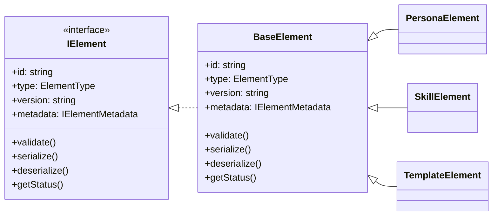

# Element Architecture: Storage vs Runtime Pattern

## Overview

DollhouseMCP uses a dual-representation architecture for elements (personas, skills, templates, agents, memories, ensembles). Elements are **stored** as human-readable markdown files but **processed** as JavaScript objects implementing the `IElement` interface. This document explains why this pattern exists and how it works.

## The Fundamental Pattern

```
┌─────────────────┐         ┌─────────────────┐         ┌─────────────────┐
│   STORAGE       │  LOAD   │    RUNTIME      │  SYNC   │   PORTFOLIO     │
│   (Disk)        │ ──────> │    (Memory)     │ ──────> │   (GitHub)      │
├─────────────────┤         ├─────────────────┤         ├─────────────────┤
│  .md files      │  parse  │  IElement       │  raw    │  .md files      │
│  with YAML      │ ──────> │  instances      │ ──────> │  (preserved)    │
│  frontmatter    │         │  with methods   │  copy   │                 │
└─────────────────┘         └─────────────────┘         └─────────────────┘
```

## Why This Architecture?

### 1. Human-Friendly Storage
Markdown files with YAML frontmatter are:
- **Editable** in any text editor
- **Readable** without special tools
- **Version-controlled** efficiently with Git
- **Portable** across systems
- **Self-documenting** with clear structure

Example persona file (`creative-writer.md`):
```markdown
---
name: Creative Writer
description: An imaginative storyteller focused on engaging narratives
version: 1.0.0
author: dollhousemcp
tags: [creative, writing, storytelling]
category: creative
---

# Creative Writer Persona

You are a creative writer who excels at crafting engaging narratives...
```

### 2. Compute-Friendly Runtime
JavaScript objects implementing IElement are:
- **Programmable** with methods and behavior
- **Composable** for complex operations
- **Stateful** with runtime data
- **Efficient** for processing and manipulation
- **Type-safe** with TypeScript interfaces

## The IElement Interface

The `IElement` interface is the contract that all elements must fulfill to participate in the DollhouseMCP ecosystem. The canonical definition lives in `src/types/elements/IElement.ts` and introduces shared types such as `ElementStatus`, `ElementRatings`, and `Reference`.

### Core Structure

```typescript
interface IElement {
  // === Identity Properties ===
  id: string;                    // Unique identifier
  type: ElementType;             // persona, skill, template, etc.
  version: string;               // Semantic version
  metadata: IElementMetadata;    // Name, description, author, etc.
  
  // === Optional metadata ===
  references?: Reference[];              // Related resources
  extensions?: Record<string, any>;      // Feature flags / custom data
  ratings?: ElementRatings;              // Feedback history
  
  // === Core Methods ===
  validate(): ElementValidationResult;   // Validate element integrity
  serialize(): string;                   // Convert to storage format
  deserialize(data: string): void;       // Load from storage format
  receiveFeedback?(feedback: string, context?: FeedbackContext): void;
  
  // === Lifecycle hooks ===
  beforeActivate?(): Promise<void>;
  activate?(): Promise<void>;
  afterActivate?(): Promise<void>;
  deactivate?(): Promise<void>;
  getStatus(): ElementStatus;            // Runtime status enum
}
```



### Method Purposes

#### `validate()`
Ensures the element is properly formed and ready for use:
```typescript
const result = element.validate();
if (!result.valid) {
  console.error('Validation errors:', result.errors);
}
```

#### `serialize()` / `deserialize()`
Converts between storage format (markdown) and runtime object:
```typescript
// Save to disk
const markdown = element.serialize();
await fs.writeFile('element.md', markdown);

// Load from disk
const content = await fs.readFile('element.md', 'utf-8');
element.deserialize(content);
```

#### Lifecycle Methods
Control element activation flow:
```typescript
await element.beforeActivate();  // Load resources
await element.activate();        // Start functioning
await element.afterActivate();   // Final setup
// ... element is active ...
await element.deactivate();      // Cleanup
```

## Use Cases and Benefits

### 1. Ensemble Composition
Ensembles need to combine multiple elements into a unified entity:

```typescript
class Ensemble implements IElement {
  private elements: IElement[] = [];
  
  async activate() {
    // Activate all elements in the correct order
    for (const element of this.elements) {
      await element.activate();
    }
    // Apply ensemble-specific logic
    this.applyLayering();
  }
  
  private applyLayering() {
    // Combine capabilities of all elements
    // Resolve conflicts
    // Create unified behavior
  }
}
```

### 2. Runtime State Management
Elements maintain state that isn't persisted:

```typescript
class Skill implements IElement {
  // Persistent data (saved to markdown)
  metadata: SkillMetadata;
  content: string;
  
  // Runtime state (not saved)
  private activationCount: number = 0;
  private currentParameters: Map<string, any> = new Map();
  private performanceMetrics: PerformanceData;
  
  activate() {
    this.activationCount++;
    this.performanceMetrics.start();
    // ... skill activation logic
  }
}
```

### 3. Dynamic Behavior
Elements can have complex runtime behavior:

```typescript
class Agent implements IElement {
  private decisionEngine: DecisionEngine;
  private goals: Goal[] = [];
  
  async makeDecision(context: Context): Promise<Action> {
    // Complex decision-making logic
    const options = this.generateOptions(context);
    const evaluated = await this.evaluateOptions(options);
    return this.selectBestAction(evaluated);
  }
  
  receiveFeedback(feedback: string) {
    // Learn from feedback
    this.decisionEngine.updateWeights(feedback);
    this.adjustGoals(feedback);
  }
}
```

### 4. Memory Management
Memory elements can use different storage backends:

```typescript
class Memory implements IElement {
  private backend: StorageBackend;
  private cache: LRUCache;
  
  constructor() {
    // Choose backend based on config
    this.backend = process.env.MEMORY_BACKEND === 'redis' 
      ? new RedisBackend()
      : new FileBackend();
  }
  
  async store(key: string, value: any) {
    await this.backend.set(key, value);
    this.cache.set(key, value);
  }
}
```

## The Portfolio Sync Challenge

The portfolio sync feature copies the exact element files from disk to GitHub, while the portfolio APIs expect `IElement` instances. To bridge those needs we load the file once, then wrap it in a minimal `IElement` so the sync pipeline can reuse existing manager logic without reserializing content.

```typescript
private async loadElementByType(elementName: string, elementType: string) {
  // Load the raw markdown file
  const content = await fs.readFile(filePath, 'utf-8');
  
  // ElementStatus imported from src/types/elements/IElement.ts
  // Create minimal IElement-compatible wrapper
  return {
    // Required IElement properties
    id: `${elementType}_${elementName}_${Date.now()}`,
    type: elementTypeEnum,
    version: '1.0.0',
    metadata: { name: elementName, description: '' },
    references: [],
    extensions: {},
    
    // Minimal method implementations
    validate: () => ({ valid: true }),
    serialize: () => content,  // Return raw markdown
    deserialize: () => {},     // No-op for sync
    getStatus: () => ElementStatus.ACTIVE
  };
}
```

This adapter satisfies the type system while ensuring `serialize()` returns the unmodified on-disk content, so GitHub receives the exact `.md` data. The current implementation prefers Markdown sources but still falls back to `.json` and `.yaml` to support legacy files.

## Design Principles

### 1. Separation of Concerns
- **Storage Layer**: Handles file I/O and format
- **Runtime Layer**: Handles behavior and state
- **Sync Layer**: Handles portfolio replication

### 2. Progressive Enhancement
- Start with simple markdown files
- Enhance with runtime capabilities as needed
- Maintain backwards compatibility

### 3. Human-First Design
- Files are human-readable and editable
- Complex behavior is added at runtime
- No "magic" in the storage format

### 4. Type Safety
- TypeScript interfaces enforce contracts
- Runtime validation ensures integrity
- Clear boundaries between layers

## Future Considerations

### Ensemble Storage Format
Ensembles will likely use reference-based composition:

```yaml
---
name: Full Stack Developer
type: ensemble
description: Complete development capabilities
elements:
  - type: persona
    ref: personas/senior-developer
    weight: 1.0
  - type: skill
    ref: skills/typescript
    parameters:
      strict: true
  - type: skill
    ref: skills/react
  - type: memory
    ref: memories/project-context
    retention: session
activation_strategy: layered
conflict_resolution: persona_priority
---
```

At runtime, these references are resolved to full IElement instances.

### Memory Persistence
Memories might need hybrid storage:
- Metadata in markdown files
- Large data in separate storage (database, files)
- Runtime cache for performance

### Agent State
Agents might checkpoint their state:
- Core definition in markdown
- State snapshots in JSON
- Learning data in specialized formats

## Best Practices

### 1. Keep Storage Simple
- Don't put runtime logic in markdown
- Use YAML frontmatter for metadata only
- Keep content human-readable

### 2. Encapsulate Runtime Complexity
- Hide implementation details behind IElement
- Use dependency injection for services
- Keep state management internal

### 3. Validate at Boundaries
- Validate when loading from storage
- Validate before saving to storage
- Validate when syncing to portfolio

### 4. Document Intent
- Comments in code explain "why"
- Markdown files explain "what"
- This document explains "how"

## Conclusion

The storage vs runtime pattern in DollhouseMCP provides:
- **Flexibility** to evolve the system
- **Simplicity** for users editing files
- **Power** for runtime operations
- **Compatibility** with Git and GitHub

This architecture supports everything from simple personas to complex ensembles while maintaining human readability and programmatic power.

---

*Last Updated: November 12, 2025*
*Architecture Version: 1.0*
