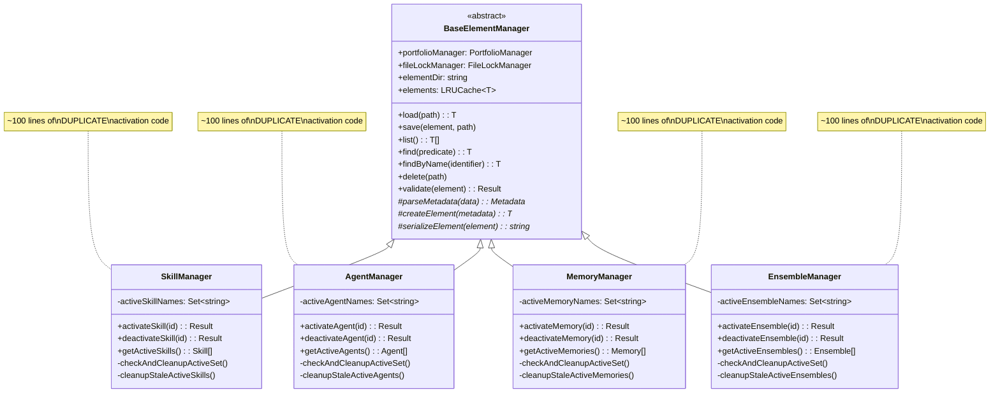
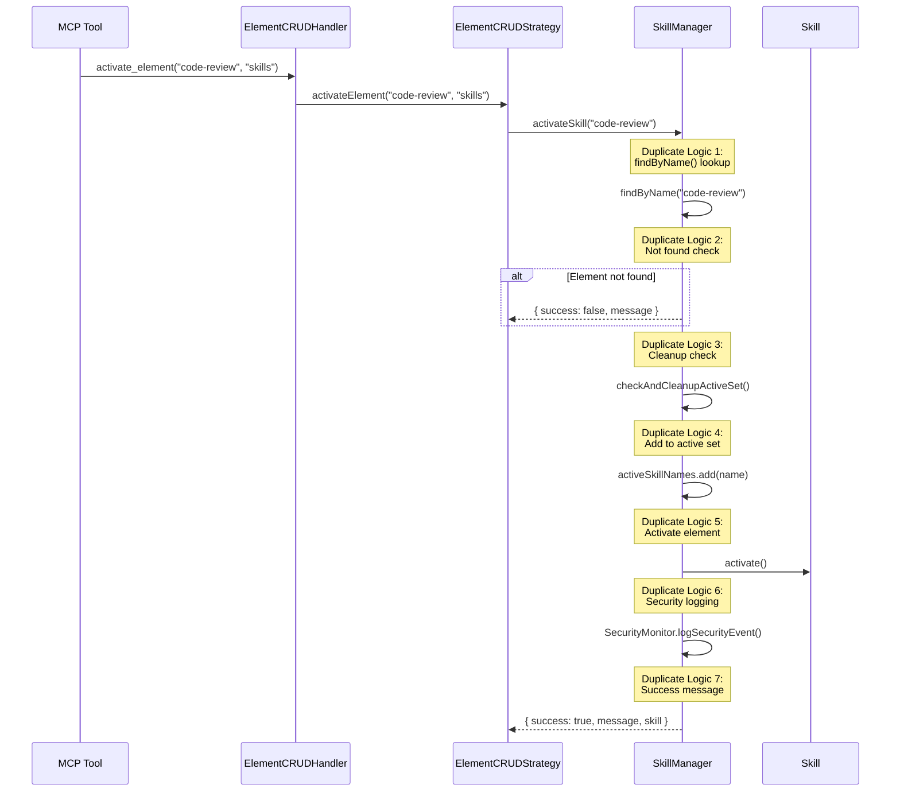
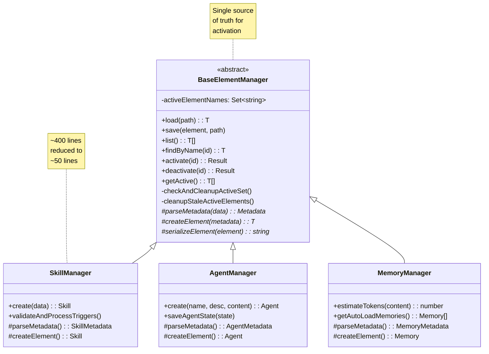
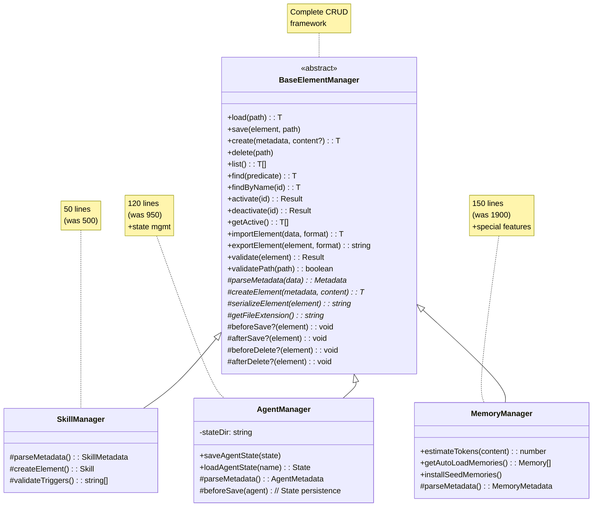
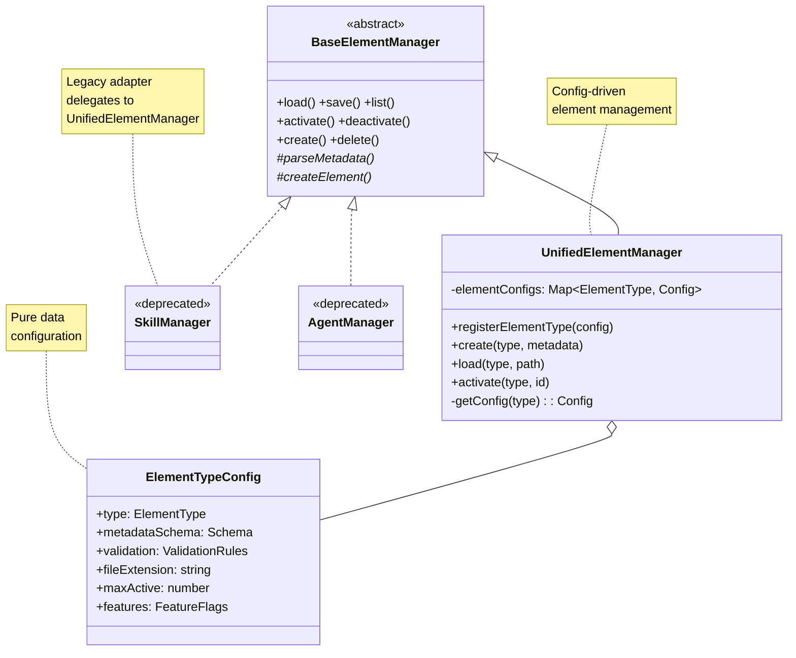

# Element Manager Consolidation Proposal

**Status:** Proposal
**Created:** 2025-11-20
**Author:** Claude (DollhouseMCP Team)
**Related Issues:** #18 (Activation Implementation)
**Related PRs:** #24 (Performance Optimizations)

---

## Executive Summary

### Problem Statement

Issue #18 implemented activation functionality across 4 separate element managers (SkillManager, AgentManager, MemoryManager, EnsembleManager), resulting in approximately 400 lines of duplicate activation code. This approach:

- **Does not scale** to 100s of future element types (planned: personas, tools, workflows, etc.)
- **Violates DRY principles** with ~100 lines of duplicate code per manager
- **Creates maintenance burden** where bug fixes must be applied in 4 places
- **Increases cognitive load** for developers implementing new element types
- **Adds unnecessary friction** to element type expansion

### Proposed Solution

Consolidate common functionality into BaseElementManager through a 3-phase migration:

1. **Phase 1 (Immediate):** Move activation logic to BaseElementManager
2. **Phase 2 (Short-term):** Consolidate all common CRUD patterns
3. **Phase 3 (Long-term):** Create optional unified manager with config-driven behavior

### Benefits & Impact

- **90% code reduction** for new element types (from ~500 lines to ~50 lines)
- **Single source of truth** for activation logic
- **Faster development** of new element types
- **Improved maintainability** with centralized bug fixes
- **Future scalability** supporting 100s of element types

---

## Phase 0: Current Architecture (As-Is)

### Architecture Diagram



### Current Code Flow



### Problems with Current Approach

#### 1. Code Duplication (Critical)

**Example: activateSkill() vs activateAgent() vs activateMemory()**

```typescript
// SkillManager.ts (lines 263-300) - 38 lines
async activateSkill(identifier: string): Promise<{ success: boolean; message: string; skill?: Skill }> {
  const skill = await this.findByName(identifier);
  if (!skill) {
    return {
      success: false,
      message: ElementMessages.notFound(ElementType.SKILL, identifier)
    };
  }
  this.checkAndCleanupActiveSet();
  this.activeSkillNames.add(skill.metadata.name);
  await skill.activate();
  SecurityMonitor.logSecurityEvent({...});
  logger.info(`Skill activated: ${skill.metadata.name}`);
  return {
    success: true,
    message: ElementMessages.activated(ElementType.SKILL, skill.metadata.name),
    skill
  };
}

// AgentManager.ts (lines 432-468) - 37 lines
// IDENTICAL LOGIC - only type names differ
async activateAgent(identifier: string): Promise<{ success: boolean; message: string; agent?: Agent }> {
  const agent = await this.findByName(identifier);
  if (!agent) {
    return {
      success: false,
      message: ElementMessages.notFound(ElementType.AGENT, identifier)
    };
  }
  this.checkAndCleanupActiveSet();
  this.activeAgentNames.add(agent.metadata.name);
  await agent.activate();
  SecurityMonitor.logSecurityEvent({...});
  logger.info(`Agent activated: ${agent.metadata.name}`);
  return {
    success: true,
    message: ElementMessages.activated(ElementType.AGENT, agent.metadata.name),
    agent
  };
}

// MemoryManager.ts + EnsembleManager.ts - SAME PATTERN
// Total: ~400 lines of duplicate code
```

#### 2. Scalability Concern

**Projection for 10 new element types:**

| Aspect | Current | With 10 More Types |
|--------|---------|-------------------|
| Managers with activation | 4 | 14 |
| Lines of activation code | ~400 | ~1,400 |
| Places to fix bugs | 4 | 14 |
| Test files needed | 4 | 14 |
| Memory leak cleanup methods | 4 | 14 |

#### 3. Maintenance Burden

**Recent bug fix example (Issue #24):**
- **Bug:** Memory leak in active element tracking
- **Fix required in:** 4 separate files
- **Lines changed:** ~60 (15 per manager)
- **Test updates:** 4 files
- **Risk:** Missing one manager means partial fix

#### 4. Developer Experience

**Cost to add new element type (current approach):**

```
1. Copy SkillManager.ts → NewTypeManager.ts
2. Search/replace "Skill" → "NewType" (50+ occurrences)
3. Copy activateSkill/deactivateSkill/getActiveSkills
4. Copy checkAndCleanupActiveSet + cleanup methods
5. Copy activeSkillNames Set
6. Update ElementType references
7. Write duplicate tests
8. Update handlers/strategies

Estimated time: 2-4 hours
Lines of code: ~500
```

---

## Phase 1: Consolidate Activation (Immediate)

### Objective

Move activation logic into BaseElementManager, making it inherited by all managers.

### Architecture After Phase 1



### Code Changes

#### Before (Current - Duplicated)

```typescript
// SkillManager.ts
export class SkillManager extends BaseElementManager<Skill> {
  private activeSkillNames: Set<string> = new Set();

  async activateSkill(identifier: string): Promise<Result> {
    const skill = await this.findByName(identifier);
    if (!skill) {
      return {
        success: false,
        message: ElementMessages.notFound(ElementType.SKILL, identifier)
      };
    }
    this.checkAndCleanupActiveSet();
    this.activeSkillNames.add(skill.metadata.name);
    await skill.activate();
    SecurityMonitor.logSecurityEvent({...});
    return {
      success: true,
      message: ElementMessages.activated(ElementType.SKILL, skill.metadata.name),
      skill
    };
  }

  async deactivateSkill(identifier: string): Promise<Result> {
    const skill = await this.findByName(identifier);
    if (!skill) {
      return { success: false, message: ElementMessages.notFound(...) };
    }
    this.activeSkillNames.delete(skill.metadata.name);
    await skill.deactivate();
    return { success: true, message: ElementMessages.deactivated(...) };
  }

  async getActiveSkills(): Promise<Skill[]> {
    const skills = await this.list();
    return skills.filter(s => this.activeSkillNames.has(s.metadata.name));
  }

  private checkAndCleanupActiveSet(): void { /* 20 lines */ }
  private async cleanupStaleActiveSkills(): Promise<void> { /* 40 lines */ }
}

// AgentManager.ts - IDENTICAL LOGIC with s/Skill/Agent/g
// MemoryManager.ts - IDENTICAL LOGIC with s/Skill/Memory/g
// EnsembleManager.ts - IDENTICAL LOGIC with s/Skill/Ensemble/g
```

#### After (Consolidated)

```typescript
// BaseElementManager.ts (NEW CODE)
export abstract class BaseElementManager<T extends IElement> {
  // Existing fields...
  protected readonly elementType: ElementType;

  // NEW: Activation tracking
  private activeElementNames: Set<string> = new Set();

  // NEW: Generic activation (works for all element types)
  async activate(identifier: string): Promise<{
    success: boolean;
    message: string;
    element?: T;
  }> {
    // Performance optimization: findByName instead of list()
    const element = await this.findByName(identifier);

    if (!element) {
      return {
        success: false,
        message: ElementMessages.notFound(this.elementType, identifier)
      };
    }

    // Memory leak prevention
    this.checkAndCleanupActiveSet();

    // Track by stable name identifier
    this.activeElementNames.add(element.metadata.name);

    // Update element status
    await element.activate();

    // Audit logging
    SecurityMonitor.logSecurityEvent({
      type: 'ELEMENT_CREATED',
      severity: 'LOW',
      source: `${this.constructor.name}.activate`,
      details: `${this.getElementLabelCapitalized()} activated: ${element.metadata.name}`
    });

    logger.info(`${this.getElementLabelCapitalized()} activated: ${element.metadata.name}`);

    return {
      success: true,
      message: ElementMessages.activated(this.elementType, element.metadata.name),
      element
    };
  }

  // NEW: Generic deactivation
  async deactivate(identifier: string): Promise<{
    success: boolean;
    message: string;
  }> {
    const element = await this.findByName(identifier);

    if (!element) {
      return {
        success: false,
        message: ElementMessages.notFound(this.elementType, identifier)
      };
    }

    this.activeElementNames.delete(element.metadata.name);
    await element.deactivate();

    logger.info(`${this.getElementLabelCapitalized()} deactivated: ${element.metadata.name}`);

    return {
      success: true,
      message: ElementMessages.deactivated(this.elementType, element.metadata.name)
    };
  }

  // NEW: Get active elements
  async getActiveElements(): Promise<T[]> {
    const elements = await this.list();
    return elements.filter(e => this.activeElementNames.has(e.metadata.name));
  }

  // NEW: Memory leak prevention (consolidated)
  private checkAndCleanupActiveSet(): void {
    const maxActive = this.getMaxActiveElements();
    const threshold = Math.floor(maxActive * 0.9);

    if (this.activeElementNames.size < threshold) {
      return;
    }

    if (this.activeElementNames.size >= maxActive) {
      logger.warn(
        `Active ${this.elementType} limit reached (${maxActive}). ` +
        `Consider deactivating unused elements.`
      );

      SecurityMonitor.logSecurityEvent({
        type: 'ELEMENT_CREATED',
        severity: 'MEDIUM',
        source: `${this.constructor.name}.checkAndCleanupActiveSet`,
        details: `Active ${this.elementType} limit reached: ${this.activeElementNames.size}/${maxActive}`
      });

      void this.cleanupStaleActiveElements();
    }
  }

  // NEW: Stale reference cleanup (consolidated)
  private async cleanupStaleActiveElements(): Promise<void> {
    try {
      const startSize = this.activeElementNames.size;
      const elements = await this.list();
      const existingNames = new Set(elements.map(e => e.metadata.name));

      const staleNames: string[] = [];
      for (const activeName of this.activeElementNames) {
        if (!existingNames.has(activeName)) {
          this.activeElementNames.delete(activeName);
          staleNames.push(activeName);
        }
      }

      const removed = startSize - this.activeElementNames.size;

      if (removed > 0) {
        logger.info(
          `Cleaned up ${removed} stale active ${this.elementType} reference(s).`
        );

        SecurityMonitor.logSecurityEvent({
          type: 'ELEMENT_DELETED',
          severity: 'LOW',
          source: `${this.constructor.name}.cleanupStaleActiveElements`,
          details: `Removed ${removed} stale references`,
          additionalData: { staleNames: staleNames.join(', ') }
        });
      }
    } catch (error) {
      logger.error(`Failed to cleanup stale active ${this.elementType}:`, error);
    }
  }

  // NEW: Override point for element-specific limits
  protected getMaxActiveElements(): number {
    // Default limits by element type
    const limits: Record<ElementType, number> = {
      [ElementType.SKILL]: 100,
      [ElementType.AGENT]: 50,
      [ElementType.MEMORY]: 30,
      [ElementType.ENSEMBLE]: 20,
      [ElementType.TEMPLATE]: 50,
      [ElementType.PERSONA]: 10
    };
    return limits[this.elementType] ?? 50;
  }

  // Existing methods...
  async list(): Promise<T[]> {
    // ... existing implementation ...

    // NEW: Apply active status during list()
    for (const element of elements) {
      if (this.activeElementNames.has(element.metadata.name)) {
        await element.activate();
      }
    }

    return elements;
  }
}

// SkillManager.ts (SIMPLIFIED - no more duplication)
export class SkillManager extends BaseElementManager<Skill> {
  constructor(portfolioManager: PortfolioManager, fileLockManager: FileLockManager) {
    super(ElementType.SKILL, portfolioManager, fileLockManager);
  }

  // Activation is now inherited! No code needed!
  // Just expose with domain-specific names:

  activateSkill = this.activate.bind(this);
  deactivateSkill = this.deactivate.bind(this);
  getActiveSkills = this.getActiveElements.bind(this);

  // Only skill-specific code remains...
  protected async parseMetadata(data: any): Promise<SkillMetadata> {
    // Skill-specific metadata parsing
  }

  protected createElement(metadata: SkillMetadata, content: string): Skill {
    return new Skill(metadata, content);
  }
}

// AgentManager.ts, MemoryManager.ts, EnsembleManager.ts - SAME PATTERN
// ~400 lines of duplicate code → ~12 lines (3 lines × 4 managers)
```

### Migration Steps

1. **Add activation methods to BaseElementManager**
   - Add `activeElementNames: Set<string>` field
   - Implement `activate(identifier)` generic method
   - Implement `deactivate(identifier)` generic method
   - Implement `getActiveElements()` generic method
   - Implement `checkAndCleanupActiveSet()` with configurable limits
   - Implement `cleanupStaleActiveElements()` consolidated cleanup
   - Add `getMaxActiveElements()` override point

2. **Update list() to apply active status**
   - Modify `BaseElementManager.list()` to check `activeElementNames`
   - Call `element.activate()` for matched elements

3. **Simplify specific managers**
   - SkillManager: Replace `activateSkill/deactivateSkill/getActiveSkills` with aliases
   - AgentManager: Replace `activateAgent/deactivateAgent/getActiveAgents` with aliases
   - MemoryManager: Replace `activateMemory/deactivateMemory/getActiveMemories` with aliases
   - EnsembleManager: Replace `activateEnsemble/deactivateEnsemble/getActiveEnsembles` with aliases

4. **Update tests**
   - Move common activation tests to `BaseElementManager.test.ts`
   - Keep only element-specific test cases in manager test files

5. **Update handlers/strategies**
   - Verify ElementCRUDStrategy calls still work
   - Update any direct references to old method names

### Effort Estimate

- **Development:** 4-6 hours
- **Testing:** 2-3 hours
- **Code Review:** 1 hour
- **Total:** ~1 day

### Risks & Mitigation

| Risk | Impact | Mitigation |
|------|--------|------------|
| Breaking existing activation calls | High | Use method aliases (`activateSkill = this.activate`) |
| Test failures | Medium | Run full test suite before/after migration |
| Handler compatibility | Low | ElementCRUDStrategy already abstracts manager calls |

---

## Phase 2: Full CRUD Consolidation (Short-term)

### Objective

Consolidate all common CRUD patterns into BaseElementManager, leaving only truly type-specific code in subclasses.

### Architecture After Phase 2



### What Moves to Base vs What Stays Specific

#### Moves to BaseElementManager

**Common CRUD patterns:**
- Generic `create(metadata, content?)` method
- Generic `importElement(data, format)` with YAML/JSON support
- Generic `exportElement(element, format)` with YAML/JSON support
- Path validation and sanitization
- Security event logging patterns
- Element caching strategies
- File naming conventions

**Example: Consolidated create()**

```typescript
// BaseElementManager.ts
export abstract class BaseElementManager<T extends IElement> {
  async create(
    metadata: Partial<T['metadata']>,
    content?: string
  ): Promise<T> {
    // Validate required fields
    if (!metadata.name) {
      throw new Error(`${this.getElementLabelCapitalized()} must have a name`);
    }

    // Sanitize inputs
    const sanitizedName = sanitizeInput(metadata.name, 100);
    const sanitizedDesc = metadata.description ?
      sanitizeInput(metadata.description, SECURITY_LIMITS.MAX_CONTENT_LENGTH) : '';
    const sanitizedContent = content ?
      sanitizeInput(content, 50000) : '';

    // Create element using template method
    const element = this.createElement(
      { ...metadata, name: sanitizedName, description: sanitizedDesc },
      sanitizedContent
    );

    // Generate filename
    const filename = this.generateFilename(sanitizedName);

    // Check for existing
    const exists = await this.exists(filename);
    if (exists) {
      throw new Error(
        `${this.getElementLabelCapitalized()} '${sanitizedName}' already exists`
      );
    }

    // Save to disk
    await this.save(element, filename);

    // Security logging
    SecurityMonitor.logSecurityEvent({
      type: 'ELEMENT_CREATED',
      severity: 'LOW',
      source: `${this.constructor.name}.create`,
      details: `${this.getElementLabelCapitalized()} created: ${sanitizedName}`
    });

    return element;
  }

  // Helper: Generate filename from name
  protected generateFilename(name: string): string {
    const normalized = name.toLowerCase().replaceAll(/[^a-z0-9-]/g, '-');
    return `${normalized}${this.getFileExtension()}`;
  }
}
```

#### Stays in Specific Managers

**Truly type-specific code:**

```typescript
// AgentManager.ts - Agent state management (unique to agents)
export class AgentManager extends BaseElementManager<Agent> {
  private readonly stateDir: string;
  private readonly stateCache: Map<string, AgentState> = new Map();

  // Agent-specific: State persistence
  async saveAgentState(name: string, state: AgentState): Promise<void> {
    const filePath = path.join(this.stateDir, `${name}.state.yaml`);

    // Optimistic locking check (agent-specific concern)
    const existingState = await this.loadAgentState(name);
    if (existingState?.stateVersion > state.stateVersion) {
      throw new Error('State version conflict');
    }

    const yamlContent = yaml.dump(state, { schema: yaml.FAILSAFE_SCHEMA });
    await this.fileLockManager.atomicWriteFile(filePath, yamlContent);
    this.stateCache.set(name, state);
  }

  // Hook into base save lifecycle
  protected override async afterSave(agent: Agent, filePath: string): Promise<void> {
    if (agent.needsStatePersistence()) {
      await this.saveAgentState(agent.metadata.name, agent.getState());
      agent.markStatePersisted();
    }
  }
}

// MemoryManager.ts - Auto-load feature (unique to memories)
export class MemoryManager extends BaseElementManager<Memory> {
  async getAutoLoadMemories(): Promise<Memory[]> {
    const allMemories = await this.list();
    return allMemories
      .filter(m => (m.metadata as MemoryMetadata).autoLoad === true)
      .sort((a, b) => {
        const priorityA = (a.metadata as MemoryMetadata).priority ?? 999;
        const priorityB = (b.metadata as MemoryMetadata).priority ?? 999;
        return priorityA - priorityB;
      });
  }

  async installSeedMemories(): Promise<void> {
    // Memory-specific seed installation logic
  }
}

// SkillManager.ts - Trigger validation (unique to skills)
export class SkillManager extends BaseElementManager<Skill> {
  protected override async parseMetadata(data: any): Promise<SkillMetadata> {
    const metadata = await super.parseMetadata(data);

    // Skill-specific: Validate trigger format
    if (metadata.triggers) {
      metadata.triggers = this.validateAndProcessTriggers(
        metadata.triggers,
        metadata.name
      );
    }

    return metadata;
  }

  private validateAndProcessTriggers(triggers: string[], skillName: string): string[] {
    const validTriggers: string[] = [];
    const rejectedTriggers: string[] = [];

    for (const raw of triggers) {
      const sanitized = sanitizeInput(raw, 50);
      if (/^[a-zA-Z0-9\-_]+$/.test(sanitized)) {
        validTriggers.push(sanitized);
      } else {
        rejectedTriggers.push(sanitized);
      }
    }

    if (rejectedTriggers.length > 0) {
      logger.warn(
        `Skill "${skillName}": Rejected ${rejectedTriggers.length} invalid triggers`
      );
    }

    return validTriggers;
  }
}
```

### Code Reduction Examples

#### SkillManager

**Before Phase 2:** 490 lines
**After Phase 2:** ~50 lines (90% reduction)

```typescript
// Before: 490 lines
export class SkillManager extends BaseElementManager<Skill> {
  private activeSkillNames: Set<string> = new Set();

  async create(data: Partial<SkillMetadata> & { content?: string }): Promise<Skill> {
    // 30 lines of create logic
  }

  async activateSkill(identifier: string): Promise<Result> {
    // 38 lines of activation logic
  }

  async deactivateSkill(identifier: string): Promise<Result> {
    // 20 lines of deactivation logic
  }

  async getActiveSkills(): Promise<Skill[]> {
    // 3 lines
  }

  private checkAndCleanupActiveSet(): void {
    // 20 lines
  }

  private async cleanupStaleActiveSkills(): Promise<void> {
    // 40 lines
  }

  async importElement(data: string, format: 'yaml' | 'json'): Promise<Skill> {
    // 80 lines of import logic
  }

  async exportElement(element: Skill, format: 'yaml' | 'json'): Promise<string> {
    // 20 lines of export logic
  }

  protected async parseMetadata(data: any): Promise<SkillMetadata> {
    // 15 lines with trigger validation
  }

  protected createElement(metadata: SkillMetadata, content: string): Skill {
    // 2 lines
  }

  protected async serializeElement(element: Skill): Promise<string> {
    // 25 lines
  }

  // ... more methods ...
}

// After: 50 lines
export class SkillManager extends BaseElementManager<Skill> {
  // All CRUD/activation inherited from base!

  // Aliases for domain-specific names
  activateSkill = this.activate.bind(this);
  deactivateSkill = this.deactivate.bind(this);
  getActiveSkills = this.getActiveElements.bind(this);

  // Only skill-specific code:
  protected override async parseMetadata(data: any): Promise<SkillMetadata> {
    const metadata = await super.parseMetadata(data);
    if (metadata.triggers) {
      metadata.triggers = this.validateAndProcessTriggers(
        metadata.triggers,
        metadata.name
      );
    }
    return metadata;
  }

  protected createElement(metadata: SkillMetadata, content: string): Skill {
    return new Skill(metadata, content);
  }

  private validateAndProcessTriggers(triggers: string[], name: string): string[] {
    // 20 lines - skill-specific validation
  }
}
```

### Migration Steps

1. **Enhance BaseElementManager with common patterns**
   - Add generic `create(metadata, content?)` method
   - Add generic `importElement(data, format)` with YAML/JSON parsing
   - Add generic `exportElement(element, format)` with serialization
   - Add lifecycle hooks (`beforeSave`, `afterSave`, `beforeDelete`, `afterDelete`)
   - Add common validation patterns

2. **Refactor each manager incrementally**
   - Start with SkillManager (simplest)
   - Move to AgentManager (has state management)
   - Move to MemoryManager (has auto-load)
   - Move to EnsembleManager (has element references)

3. **Update tests**
   - Create comprehensive BaseElementManager test suite
   - Reduce specific manager tests to only type-specific concerns

4. **Update documentation**
   - Document template methods and hooks
   - Provide examples for new element types

### Effort Estimate

- **Development:** 2-3 days
- **Testing:** 1-2 days
- **Code Review:** 1 day
- **Total:** ~1 week

---

## Phase 3: Unified Element Manager (Long-term)

### Objective

Create optional UnifiedElementManager that eliminates the need for separate manager classes entirely. New element types become pure configuration.

### Architecture After Phase 3



### Configuration-Driven Element Types

```typescript
// Element type configuration (pure data)
interface ElementTypeConfig {
  type: ElementType;

  // Metadata schema
  metadataSchema: {
    required: string[];
    optional: string[];
    defaults: Record<string, any>;
  };

  // Validation rules
  validation: {
    namePattern?: RegExp;
    descriptionMaxLength?: number;
    contentMaxLength?: number;
    customValidation?: (element: IElement) => ValidationResult;
  };

  // File handling
  fileExtension: string;
  fileNamingStrategy: 'kebab-case' | 'snake_case' | 'camelCase';

  // Activation settings
  maxActiveElements: number;
  cleanupThreshold: number;

  // Features
  features: {
    requiresState?: boolean;
    supportsAutoLoad?: boolean;
    supportsTriggers?: boolean;
    supportsNesting?: boolean;
  };

  // Custom hooks (optional)
  hooks?: {
    beforeSave?: (element: IElement) => Promise<void>;
    afterSave?: (element: IElement) => Promise<void>;
    beforeDelete?: (element: IElement) => Promise<void>;
    afterDelete?: (element: IElement) => Promise<void>;
  };
}

// Example: Skill configuration
const skillConfig: ElementTypeConfig = {
  type: ElementType.SKILL,
  metadataSchema: {
    required: ['name', 'description'],
    optional: ['triggers', 'examples', 'parameters'],
    defaults: {
      version: '1.0.0',
      triggers: []
    }
  },
  validation: {
    namePattern: /^[a-zA-Z0-9-]+$/,
    descriptionMaxLength: SECURITY_LIMITS.MAX_CONTENT_LENGTH,
    contentMaxLength: 50000,
    customValidation: (element) => {
      const skill = element as Skill;
      if (skill.metadata.triggers) {
        return validateSkillTriggers(skill.metadata.triggers);
      }
      return { valid: true };
    }
  },
  fileExtension: '.md',
  fileNamingStrategy: 'kebab-case',
  maxActiveElements: 100,
  cleanupThreshold: 90,
  features: {
    supportsTriggers: true
  }
};

// Example: Agent configuration
const agentConfig: ElementTypeConfig = {
  type: ElementType.AGENT,
  metadataSchema: {
    required: ['name', 'description'],
    optional: ['specializations', 'decisionFramework', 'maxConcurrentGoals'],
    defaults: {
      version: '1.0.0',
      maxConcurrentGoals: 3
    }
  },
  validation: {
    namePattern: /^[a-zA-Z0-9_-]+$/,
    descriptionMaxLength: SECURITY_LIMITS.MAX_CONTENT_LENGTH,
    contentMaxLength: 50000
  },
  fileExtension: '.md',
  fileNamingStrategy: 'kebab-case',
  maxActiveElements: 50,
  cleanupThreshold: 45,
  features: {
    requiresState: true  // Triggers state management
  },
  hooks: {
    afterSave: async (element) => {
      const agent = element as Agent;
      if (agent.needsStatePersistence()) {
        await stateManager.saveAgentState(agent);
      }
    }
  }
};
```

### UnifiedElementManager Implementation

```typescript
export class UnifiedElementManager extends BaseElementManager<IElement> {
  private elementConfigs: Map<ElementType, ElementTypeConfig> = new Map();

  constructor(
    portfolioManager: PortfolioManager,
    fileLockManager: FileLockManager
  ) {
    // Initialize with default element type (unused in unified mode)
    super(ElementType.SKILL, portfolioManager, fileLockManager);
  }

  // Register element type configuration
  registerElementType(config: ElementTypeConfig): void {
    this.elementConfigs.set(config.type, config);
    logger.info(`Registered element type: ${config.type}`);
  }

  // Generic create with type parameter
  async create<T extends IElement>(
    type: ElementType,
    metadata: Partial<T['metadata']>,
    content?: string
  ): Promise<T> {
    const config = this.getConfig(type);

    // Apply defaults from config
    const fullMetadata = {
      ...config.metadataSchema.defaults,
      ...metadata
    };

    // Validate required fields
    for (const field of config.metadataSchema.required) {
      if (!fullMetadata[field]) {
        throw new Error(`${field} is required for ${type}`);
      }
    }

    // Validate using config rules
    const validationResult = this.validateWithConfig(fullMetadata, content, config);
    if (!validationResult.valid) {
      throw new Error(`Validation failed: ${validationResult.errors?.join(', ')}`);
    }

    // Create element (factory pattern based on type)
    const element = this.createElementByType(type, fullMetadata, content);

    // Generate filename using config strategy
    const filename = this.generateFilename(
      fullMetadata.name,
      config.fileExtension,
      config.fileNamingStrategy
    );

    // Execute hooks
    if (config.hooks?.beforeSave) {
      await config.hooks.beforeSave(element);
    }

    // Save
    await this.save(element, filename);

    // Execute hooks
    if (config.hooks?.afterSave) {
      await config.hooks.afterSave(element);
    }

    return element as T;
  }

  // Generic load with type parameter
  async loadByType<T extends IElement>(
    type: ElementType,
    path: string
  ): Promise<T> {
    const config = this.getConfig(type);

    // Delegate to base load with type-specific element directory
    const elementDir = this.getElementDirForType(type);
    const element = await this.load(path);

    return element as T;
  }

  // Generic activate with type parameter
  async activateByType(
    type: ElementType,
    identifier: string
  ): Promise<{ success: boolean; message: string; element?: IElement }> {
    const config = this.getConfig(type);

    // Use config-based max active limit
    this.setMaxActiveElements(config.maxActiveElements);

    // Delegate to base activate
    return this.activate(identifier);
  }

  private getConfig(type: ElementType): ElementTypeConfig {
    const config = this.elementConfigs.get(type);
    if (!config) {
      throw new Error(`Element type not registered: ${type}`);
    }
    return config;
  }

  private createElementByType<T extends IElement>(
    type: ElementType,
    metadata: any,
    content?: string
  ): T {
    // Factory pattern - create appropriate element instance
    switch (type) {
      case ElementType.SKILL:
        return new Skill(metadata, content || '') as T;
      case ElementType.AGENT:
        return new Agent(metadata) as T;
      case ElementType.MEMORY:
        return new Memory(metadata) as T;
      case ElementType.ENSEMBLE:
        return new Ensemble(metadata, metadata.elements) as T;
      default:
        throw new Error(`Unknown element type: ${type}`);
    }
  }
}
```

### Adding a New Element Type (With UnifiedElementManager)

**Before (Phase 0-2): ~500 lines of code, 2-4 hours**

```typescript
// 1. Create manager class (500 lines)
export class WorkflowManager extends BaseElementManager<Workflow> {
  // ... all the CRUD/activation code ...
}

// 2. Create element class (200 lines)
export class Workflow implements IElement {
  // ... element implementation ...
}

// 3. Register with DI container
// 4. Create handlers/strategies
// 5. Write tests
```

**After (Phase 3): ~50 lines of config, 30 minutes**

```typescript
// 1. Create element class only (if needed)
export class Workflow implements IElement {
  // ... element implementation ...
}

// 2. Register configuration
const workflowConfig: ElementTypeConfig = {
  type: ElementType.WORKFLOW,
  metadataSchema: {
    required: ['name', 'description', 'steps'],
    optional: ['triggers', 'timeout'],
    defaults: { version: '1.0.0' }
  },
  validation: {
    namePattern: /^[a-zA-Z0-9-]+$/,
    customValidation: (element) => validateWorkflowSteps(element)
  },
  fileExtension: '.yaml',
  fileNamingStrategy: 'kebab-case',
  maxActiveElements: 30,
  cleanupThreshold: 27,
  features: {
    supportsTriggers: true
  }
};

// 3. Register with unified manager
unifiedManager.registerElementType(workflowConfig);

// Done! All CRUD/activation/etc. is automatic
```

### Backward Compatibility

Existing managers delegate to UnifiedElementManager:

```typescript
// SkillManager.ts (adapter pattern)
export class SkillManager extends BaseElementManager<Skill> {
  private unifiedManager: UnifiedElementManager;

  constructor(
    portfolioManager: PortfolioManager,
    fileLockManager: FileLockManager,
    unifiedManager: UnifiedElementManager
  ) {
    super(ElementType.SKILL, portfolioManager, fileLockManager);
    this.unifiedManager = unifiedManager;
  }

  // Delegate to unified manager
  override async create(
    metadata: Partial<SkillMetadata>,
    content?: string
  ): Promise<Skill> {
    return this.unifiedManager.create<Skill>(
      ElementType.SKILL,
      metadata,
      content
    );
  }

  override async activate(identifier: string) {
    return this.unifiedManager.activateByType(ElementType.SKILL, identifier);
  }

  // ... other methods delegate similarly ...
}
```

### Migration Path

1. **Phase 3a: Implement UnifiedElementManager**
   - Create UnifiedElementManager class
   - Create ElementTypeConfig interface
   - Implement configuration-driven factory
   - Add registration system

2. **Phase 3b: Create element type configs**
   - Define configs for existing types (Skills, Agents, Memories, Ensembles)
   - Register with UnifiedElementManager

3. **Phase 3c: Gradual migration**
   - Keep existing managers as adapters
   - New element types use UnifiedElementManager directly
   - Deprecate old managers over time

4. **Phase 3d: Remove legacy managers**
   - Once all code uses UnifiedElementManager
   - Remove SkillManager, AgentManager, etc.
   - Update DI container

### Benefits of Phase 3

- **Zero-code element types:** New types are pure configuration
- **Extreme scalability:** Support 100s of element types with no code duplication
- **Consistent behavior:** All types follow same patterns automatically
- **Easy customization:** Override specific behaviors with hooks
- **Reduced test burden:** Test once in UnifiedElementManager

### Effort Estimate

- **Development:** 1-2 weeks
- **Testing:** 1 week
- **Migration:** 1-2 weeks (gradual)
- **Total:** ~1 month

---

## Decision Points & Trade-offs

### Phase 1 (Immediate)

**Should we proceed?**

| Pros | Cons |
|------|------|
| ✅ Immediate value (90% reduction) | ⚠️ Requires backward compatibility |
| ✅ Low risk (method aliases) | ⚠️ Test updates needed |
| ✅ 1 day effort | ⚠️ Handler verification |
| ✅ Unblocks scaling | |

**Recommendation:** ✅ **YES - Proceed immediately**

### Phase 2 (Short-term)

**Should we consolidate all CRUD?**

| Pros | Cons |
|------|------|
| ✅ Massive code reduction | ⚠️ Larger migration effort |
| ✅ True DRY compliance | ⚠️ Need robust template methods |
| ✅ Easier new element types | ⚠️ Must preserve type-specific features |
| ✅ Better maintainability | ⚠️ More complex base class |

**Questions:**
1. Should we preserve individual manager classes for clarity?
2. How do we handle truly unique features (Agent state, Memory auto-load)?
3. Should hooks be synchronous or async?

**Recommendation:** ⚠️ **REVIEW - Discuss with team**

### Phase 3 (Long-term)

**Should we go fully config-driven?**

| Pros | Cons |
|------|------|
| ✅ Ultimate scalability | ❌ Significant architectural change |
| ✅ Zero-code new types | ❌ Learning curve for config system |
| ✅ Plugin-like extensibility | ❌ May over-engineer for current needs |
| ✅ Consistent patterns | ❌ Debugging config vs code trade-off |

**Questions:**
1. Is config-driven architecture appropriate for our scale?
2. Do we need 100s of element types in practice?
3. Should configuration be code or data (JSON/YAML)?
4. How do we handle complex type-specific behaviors?

**Recommendation:** 🤔 **DEFER - Evaluate after Phase 2**

---

## Comparison Matrix

### Code Metrics by Phase

| Metric | Phase 0 (Current) | Phase 1 | Phase 2 | Phase 3 |
|--------|------------------|---------|---------|---------|
| **BaseElementManager Lines** | 800 | 950 (+150) | 1,200 (+400) | 1,500 (+700) |
| **SkillManager Lines** | 490 | 50 (-440) | 50 (no change) | 0 (-50) |
| **AgentManager Lines** | 950 | 120 (-830) | 120 (no change) | 0 (-120) |
| **MemoryManager Lines** | 1,900 | 200 (-1,700) | 150 (-50) | 0 (-150) |
| **EnsembleManager Lines** | 690 | 50 (-640) | 50 (no change) | 0 (-50) |
| **Config Lines (New)** | 0 | 0 | 0 | 200 (+200) |
| **Total LOC** | 4,830 | 1,370 (-72%) | 1,570 (-67%) | 1,700 (-65%) |
| **Duplicate Code (lines)** | ~400 | 0 (-100%) | 0 (-100%) | 0 (-100%) |
| **Managers to maintain** | 4 | 4 | 4 | 1 (-75%) |

### Effort to Add New Element Type

| Phase | LOC Required | Time Required | Skills Required |
|-------|-------------|---------------|----------------|
| Phase 0 (Current) | ~500 | 2-4 hours | Medium (understand patterns) |
| Phase 1 | ~50 | 1 hour | Low (just type-specific) |
| Phase 2 | ~50 | 30 min | Low (minimal template methods) |
| Phase 3 | ~50 (config) | 15 min | Very Low (just configuration) |

### Maintenance Scenarios

**Scenario: Fix activation bug affecting all element types**

| Phase | Files to Change | Lines Changed | Test Files |
|-------|----------------|---------------|------------|
| Phase 0 | 4 managers | ~60 (15 each) | 4 |
| Phase 1 | 1 base class | ~15 | 1 |
| Phase 2 | 1 base class | ~15 | 1 |
| Phase 3 | 1 unified manager | ~15 | 1 |

---

## Appendix A: Current Duplication Analysis

### Exact Code Duplication

**activateSkill/activateAgent/activateMemory/activateEnsemble:**

```typescript
// Pattern repeated 4 times with only type names different
async activate<Type>(identifier: string): Promise<Result<Type>> {
  const element = await this.findByName(identifier);
  if (!element) {
    return {
      success: false,
      message: ElementMessages.notFound(this.elementType, identifier)
    };
  }
  this.checkAndCleanupActiveSet();
  this.active<Type>Names.add(element.metadata.name);
  await element.activate();
  SecurityMonitor.logSecurityEvent({
    type: 'ELEMENT_CREATED',
    severity: 'LOW',
    source: `${this.constructor.name}.activate<Type>`,
    details: `<Type> activated: ${element.metadata.name}`
  });
  logger.info(`<Type> activated: ${element.metadata.name}`);
  return {
    success: true,
    message: ElementMessages.activated(this.elementType, element.metadata.name),
    element
  };
}
```

**Lines duplicated:**
- SkillManager: 38 lines (lines 263-300)
- AgentManager: 37 lines (lines 432-468)
- MemoryManager: 37 lines (lines 740-776)
- EnsembleManager: 33 lines (lines 526-558)

**Total duplication:** 145 lines of nearly identical code

### Pattern Duplication

**checkAndCleanupActiveSet:**
- SkillManager: 23 lines (lines 361-384)
- AgentManager: 21 lines (lines 516-536)
- MemoryManager: 21 lines (lines 825-845)
- EnsembleManager: 19 lines (lines 616-636)

**cleanupStale<Type>:**
- SkillManager: 44 lines (lines 397-443)
- AgentManager: 45 lines (lines 543-588)
- MemoryManager: 45 lines (lines 852-897)
- EnsembleManager: 45 lines (lines 643-688)

**Total duplication:** ~250 lines of pattern-duplicated code

### Grand Total Duplication

**~400 lines of activation-related duplicate code** across 4 managers

---

## Appendix B: Implementation Checklist

### Phase 1: Activation Consolidation

- [ ] BaseElementManager Implementation
  - [ ] Add `activeElementNames: Set<string>` field
  - [ ] Implement `activate(identifier)` generic method
  - [ ] Implement `deactivate(identifier)` generic method
  - [ ] Implement `getActiveElements()` generic method
  - [ ] Implement `checkAndCleanupActiveSet()` with limits
  - [ ] Implement `cleanupStaleActiveElements()` cleanup
  - [ ] Add `getMaxActiveElements()` override point
  - [ ] Update `list()` to apply active status

- [ ] SkillManager Refactoring
  - [ ] Replace `activateSkill` with alias to `activate`
  - [ ] Replace `deactivateSkill` with alias to `deactivate`
  - [ ] Replace `getActiveSkills` with alias to `getActiveElements`
  - [ ] Remove `activeSkillNames` field
  - [ ] Remove `checkAndCleanupActiveSet()` method
  - [ ] Remove `cleanupStaleActiveSkills()` method

- [ ] AgentManager Refactoring
  - [ ] Same pattern as SkillManager
  - [ ] Update state persistence hooks if needed

- [ ] MemoryManager Refactoring
  - [ ] Same pattern as SkillManager
  - [ ] Ensure auto-load feature still works

- [ ] EnsembleManager Refactoring
  - [ ] Same pattern as SkillManager

- [ ] Testing
  - [ ] Create BaseElementManager activation tests
  - [ ] Update SkillManager tests (remove duplicate activation tests)
  - [ ] Update AgentManager tests
  - [ ] Update MemoryManager tests
  - [ ] Update EnsembleManager tests
  - [ ] Run full test suite
  - [ ] Verify ElementCRUDStrategy still works

- [ ] Documentation
  - [ ] Update architecture docs
  - [ ] Update API reference
  - [ ] Add migration notes

### Phase 2: Full CRUD Consolidation

- [ ] BaseElementManager Enhancement
  - [ ] Add generic `create(metadata, content?)` method
  - [ ] Add generic `importElement(data, format)` method
  - [ ] Add generic `exportElement(element, format)` method
  - [ ] Add lifecycle hooks (`beforeSave`, `afterSave`, etc.)
  - [ ] Add `generateFilename()` helper
  - [ ] Document template method pattern

- [ ] Manager Refactoring (per manager)
  - [ ] Remove duplicate CRUD methods
  - [ ] Keep only type-specific logic
  - [ ] Implement required template methods
  - [ ] Add lifecycle hooks if needed
  - [ ] Update tests

- [ ] Testing
  - [ ] Comprehensive BaseElementManager CRUD tests
  - [ ] Reduced specific manager tests
  - [ ] Integration tests for all element types

### Phase 3: Unified Element Manager

- [ ] Core Implementation
  - [ ] Create UnifiedElementManager class
  - [ ] Define ElementTypeConfig interface
  - [ ] Implement registration system
  - [ ] Implement config-driven factory
  - [ ] Implement config-driven validation

- [ ] Element Type Configs
  - [ ] Create skill config
  - [ ] Create agent config
  - [ ] Create memory config
  - [ ] Create ensemble config

- [ ] Backward Compatibility
  - [ ] Create adapter pattern for existing managers
  - [ ] Test legacy code still works
  - [ ] Document deprecation timeline

- [ ] Migration
  - [ ] Update DI container
  - [ ] Update handlers/strategies
  - [ ] Update tests
  - [ ] Update documentation

---

## Appendix C: Testing Strategy

### Phase 1 Testing

**BaseElementManager activation tests:**

```typescript
describe('BaseElementManager - Activation', () => {
  describe('activate()', () => {
    it('should activate element by name', async () => {
      const result = await manager.activate('test-skill');
      expect(result.success).toBe(true);
      expect(result.element?.status).toBe(ElementStatus.ACTIVE);
    });

    it('should return error for non-existent element', async () => {
      const result = await manager.activate('non-existent');
      expect(result.success).toBe(false);
      expect(result.message).toContain('not found');
    });

    it('should add element to active set', async () => {
      await manager.activate('test-skill');
      const active = await manager.getActiveElements();
      expect(active).toHaveLength(1);
    });

    it('should trigger cleanup at threshold', async () => {
      // Activate elements up to threshold
      for (let i = 0; i < 90; i++) {
        await manager.activate(`skill-${i}`);
      }
      // Verify cleanup was triggered
      expect(spy.cleanupStaleActiveElements).toHaveBeenCalled();
    });
  });

  describe('deactivate()', () => {
    it('should deactivate active element', async () => {
      await manager.activate('test-skill');
      const result = await manager.deactivate('test-skill');
      expect(result.success).toBe(true);
      const active = await manager.getActiveElements();
      expect(active).toHaveLength(0);
    });
  });

  describe('getActiveElements()', () => {
    it('should return only active elements', async () => {
      await manager.activate('skill-1');
      await manager.activate('skill-2');
      const active = await manager.getActiveElements();
      expect(active).toHaveLength(2);
    });
  });
});
```

**Reduced SkillManager tests:**

```typescript
describe('SkillManager - Type-Specific', () => {
  // Keep only skill-specific tests
  it('should validate skill triggers', async () => {
    // Trigger validation is skill-specific
  });

  it('should parse skill metadata with parameters', async () => {
    // Metadata parsing is skill-specific
  });

  // Remove all generic activation tests (now in BaseElementManager)
});
```

---

## Conclusion

This consolidation proposal addresses the code duplication introduced in Issue #18 through a phased approach:

- **Phase 1 (Immediate):** Provides immediate value with low risk
- **Phase 2 (Short-term):** Achieves full DRY compliance
- **Phase 3 (Long-term):** Enables extreme scalability if needed

The team should proceed with Phase 1 immediately to unblock element type expansion while evaluating Phases 2-3 based on actual scaling needs.

---

**Next Steps:**

1. Review this proposal with the team
2. Get architectural approval for Phase 1
3. Create implementation PR for Phase 1
4. Evaluate Phase 2 after Phase 1 success
5. Defer Phase 3 decision until scaling needs clarify
