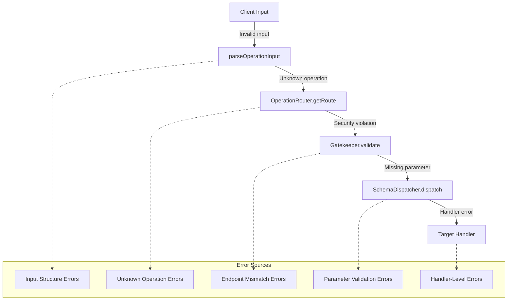
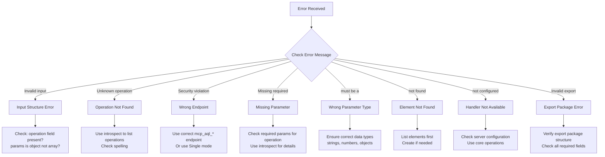

# MCP-AQL Debugging Guide

> This guide covers common error scenarios, their causes, and troubleshooting steps
> for MCP-AQL operations.

## Table of Contents

- [Error Categories Overview](#error-categories-overview)
- [Unknown Operation Errors](#unknown-operation-errors)
- [Endpoint Routing Errors (Gatekeeper Violations)](#endpoint-routing-errors-gatekeeper-violations)
- [Parameter Validation Errors](#parameter-validation-errors)
- [Schema Mismatch Errors](#schema-mismatch-errors)
- [Element Not Found Errors](#element-not-found-errors)
- [Handler Configuration Errors](#handler-configuration-errors)
- [Import/Export Errors](#importexport-errors)
- [Debugging Flow Diagram](#debugging-flow-diagram)
- [Quick Reference Table](#quick-reference-table)

---

## Error Categories Overview

MCP-AQL errors fall into distinct categories based on where they occur in the request flow:



---

## Unknown Operation Errors

### Error Message

```
Unknown operation: "nonexistent_op". See tool descriptions for available operations on each endpoint.
```

### Source Location

- **File:** `src/handlers/mcp-aql/Gatekeeper.ts:126-128`
- **File:** `src/handlers/mcp-aql/OperationRouter.ts:335-337`

### Cause

The operation name provided does not exist in `OPERATION_ROUTES`.

### Example - Incorrect

```javascript
// Operation name misspelled
{
  operation: "create_elements",  // Wrong: plural
  element_type: "persona",
  params: { element_name: "MyPersona", description: "Test" }
}
```

### Example - Correct

```javascript
// Correct operation name
{
  operation: "create_element",   // Correct: singular
  element_type: "persona",
  params: { element_name: "MyPersona", description: "Test", instructions: "Be helpful." }
}
```

### Troubleshooting Steps

1. **Use introspection to discover available operations:**
   ```javascript
   { operation: "introspect", params: { query: "operations" } }
   ```

2. **Check spelling and casing** - Operations use snake_case (e.g., `create_element`, not `createElement`)

3. **Verify the operation exists for your use case:**
   | Need | Operation |
   |------|-----------|
   | Create element | `create_element` |
   | List elements | `list_elements` |
   | Get one element | `get_element` or `get_element_details` |
   | Update element | `edit_element` |
   | Delete element | `delete_element` |

---

## Endpoint Routing Errors (Gatekeeper Violations)

### Error Message

```
Security violation: Operation "delete_element" must be called via mcp_aql_delete endpoint,
not mcp_aql_create. This operation is classified as DELETE due to its destructive potential.
```

### Source Location

- **File:** `src/handlers/mcp-aql/Gatekeeper.ts:156-160`

### Cause

An operation was called via the wrong CRUDE endpoint. Each operation is classified to a specific endpoint:

| Endpoint | Operations | Safety |
|----------|------------|--------|
| `mcp_aql_create` | `create_element`, `import_element`, `activate_element`, `addEntry` | Non-destructive |
| `mcp_aql_read` | `list_elements`, `get_element`, `search`, `introspect`, etc. | Read-only |
| `mcp_aql_update` | `edit_element` | Modifying |
| `mcp_aql_delete` | `delete_element`, `clear`, `clear_github_auth` | Destructive |
| `mcp_aql_execute` | `execute_agent`, `get_execution_state`, etc. | Runtime lifecycle |

### Example - Incorrect

```javascript
// Calling DELETE operation via CREATE endpoint
// Endpoint: mcp_aql_create
{
  operation: "delete_element",  // Wrong endpoint!
  element_type: "persona",
  params: { element_name: "OldPersona" }
}
```

### Example - Correct

```javascript
// Calling DELETE operation via DELETE endpoint
// Endpoint: mcp_aql_delete
{
  operation: "delete_element",
  element_type: "persona",
  params: { element_name: "OldPersona" }
}
```

### Troubleshooting Steps

1. **Check which endpoint to use via introspection:**
   ```javascript
   {
     operation: "introspect",
     params: { query: "operations", name: "delete_element" }
   }
   // Response includes: "mcpTool": "mcp_aql_delete"
   ```

2. **Use the endpoint matching guide:**

   | If you want to... | Use endpoint |
   |-------------------|--------------|
   | Create new elements | `mcp_aql_create` |
   | Read/query/list elements | `mcp_aql_read` |
   | Modify existing elements | `mcp_aql_update` |
   | Delete elements/data | `mcp_aql_delete` |
   | Execute agents | `mcp_aql_execute` |

3. **Consider Single Mode** - If using `MCP_INTERFACE_MODE=single`, routing is handled server-side via `UnifiedEndpoint`

---

## Parameter Validation Errors

### Missing Required Parameter

#### Error Message

```
Missing required parameter 'element_name' for operation 'create_element'.
Sources checked (in order): [input.element_type → params.element_type] → params.element_name.
Provided params: {description}. input.element_type: 'persona'
```

### Source Location

- **File:** `src/handlers/mcp-aql/SchemaDispatcher.ts:223-257`

### Cause

A required parameter was not provided in any of its valid source locations.

### Example - Incorrect

```javascript
// Missing element_name
{
  operation: "create_element",
  element_type: "persona",
  params: {
    description: "A helpful assistant"
    // Missing: element_name
    // Missing: instructions (required for personas)
  }
}
```

### Example - Correct

```javascript
{
  operation: "create_element",
  element_type: "persona",
  params: {
    element_name: "MyPersona",
    description: "A helpful assistant",
    instructions: "You are helpful and thorough. Always provide clear explanations."
  }
}
```

### Type Validation Errors

#### Error Message

```
Parameter 'element_name' for operation 'create_element' must be a string, got number
```

### Source Location

- **File:** `src/handlers/mcp-aql/SchemaDispatcher.ts:283-355`

### Cause

A parameter was provided with the wrong type.

### Example - Incorrect

```javascript
{
  operation: "create_element",
  element_type: "persona",
  params: {
    element_name: 123,  // Wrong: should be string
    description: "A helpful assistant"
  }
}
```

### Troubleshooting Steps

1. **Check parameter requirements via introspection:**
   ```javascript
   {
     operation: "introspect",
     params: { query: "operations", name: "create_element" }
   }
   ```

2. **Review required fields per element type:**

   | Element Type | Required Fields |
   |--------------|-----------------|
   | `persona` | `element_name`, `description`, `instructions` |
   | `skill` | `element_name`, `description`, `content` |
   | `template` | `element_name`, `description`, `content` |
   | `agent` | `element_name`, `description`, `content` (goal + steps) |
   | `memory` | `element_name`, `description` |
   | `ensemble` | `element_name`, `description`, `metadata.elements` |

3. **Parameter sources** - Parameters can come from multiple locations:
   - Top-level: `element_type`
   - Params object: `params.element_type`
   - The schema checks sources in order and uses the first defined value

---

## Schema Mismatch Errors

### GraphQL-Style Input Format (edit_element)

#### Error Message

```
Missing required parameter 'input' for operation 'edit_element'.
```

### Source Location

- **File:** `src/handlers/mcp-aql/OperationSchema.ts:804-825`

### Cause

The `edit_element` operation requires a nested `input` object following GraphQL mutation patterns.

### Example - Incorrect (Flat Format)

```javascript
// Wrong: flat parameter structure
{
  operation: "edit_element",
  element_type: "persona",
  params: {
    element_name: "MyPersona",
    description: "Updated description"  // Wrong: should be in input object
  }
}
```

### Example - Correct (GraphQL-Style)

```javascript
// Correct: nested input object
{
  operation: "edit_element",
  element_type: "persona",
  params: {
    element_name: "MyPersona",
    input: {                              // Updates go inside input
      description: "Updated description",
      metadata: {
        triggers: ["helper", "assistant"]
      }
    }
  }
}
```

### element_type Location Confusion

#### Cause

The `element_type` can be specified in multiple places. The system checks in order:

1. `input.element_type` (top-level)
2. `input.elementType` (legacy camelCase)
3. `params.element_type` (inside params)

### Example - All Valid Formats

```javascript
// Format 1: Top-level (preferred)
{
  operation: "list_elements",
  element_type: "persona"
}

// Format 2: Inside params
{
  operation: "list_elements",
  params: {
    element_type: "persona"
  }
}

// Format 3: Legacy camelCase (supported)
{
  operation: "list_elements",
  elementType: "persona"
}
```

---

## Element Not Found Errors

### Error Message

```
Memory not found: nonexistent-memory
```

```
Element not found: persona/NonexistentPersona
```

### Source Location

- **File:** `src/handlers/mcp-aql/MCPAQLHandler.ts:744-746` (Memory)
- **File:** `src/handlers/mcp-aql/SchemaDispatcher.ts:641-643` (Export)

### Cause

The specified element does not exist in the portfolio.

### Example - Incorrect

```javascript
{
  operation: "addEntry",
  params: {
    element_name: "my-notes",  // Memory doesn't exist
    content: "This is a note"
  }
}
```

### Troubleshooting Steps

1. **List existing elements first:**
   ```javascript
   {
     operation: "list_elements",
     element_type: "memory"
   }
   ```

2. **Create the element if it doesn't exist:**
   ```javascript
   {
     operation: "create_element",
     element_type: "memory",
     params: {
       element_name: "my-notes",
       description: "Project notes storage"
     }
   }
   ```

3. **Check element name spelling and casing** - Names are case-sensitive

---

## Handler Configuration Errors

### Error Message

```
Collection operations not available: CollectionHandler not configured
```

```
Handler 'enhancedIndexHandler' is required for operation 'find_similar_elements' but not configured.
```

### Source Location

- **File:** `src/handlers/mcp-aql/SchemaDispatcher.ts:418-441`

### Cause

The operation requires a handler that is marked as `optional: true` in the schema and hasn't been configured in the `HandlerRegistry`.

### Optional Handlers

| Handler | Operations |
|---------|------------|
| `collectionHandler` | `browse_collection`, `search_collection`, `install_collection_content` |
| `portfolioHandler` | `portfolio_status`, `sync_portfolio`, `search_portfolio` |
| `authHandler` | `setup_github_auth`, `check_github_auth`, `clear_github_auth` |
| `enhancedIndexHandler` | `find_similar_elements`, `get_element_relationships` |
| `personaHandler` | `import_persona` |
| `syncHandler` | `portfolio_element_manager` |
| `buildInfoService` | `get_build_info` |

### Troubleshooting Steps

1. **Verify the server configuration** includes the required handler
2. **Check if the feature is available** in your deployment
3. **Use core operations** that don't require optional handlers

---

## Import/Export Errors

### Invalid Export Package

#### Error Message

```
Invalid export package: missing fields: exportVersion, elementType
```

```
Invalid export package: data field is not valid JSON
```

### Source Location

- **File:** `src/handlers/mcp-aql/SchemaDispatcher.ts:676-768`
- **File:** `src/handlers/mcp-aql/MCPAQLHandler.ts:599-677`

### Cause

The export package structure is malformed or missing required fields.

### Export Package Structure

```typescript
interface ExportPackage {
  exportVersion: string;  // e.g., "1.0"
  exportedAt: string;     // ISO timestamp
  elementType: string;    // e.g., "persona"
  elementName: string;    // e.g., "MyPersona"
  format: 'json' | 'yaml';
  data: string;           // Serialized element data
}
```

### Example - Incorrect

```javascript
{
  operation: "import_element",
  params: {
    data: {
      // Missing: exportVersion, elementType
      format: "json",
      data: "{}"
    }
  }
}
```

### Example - Correct

```javascript
{
  operation: "import_element",
  params: {
    data: {
      exportVersion: "1.0",
      exportedAt: "2024-01-15T10:30:00Z",
      elementType: "persona",
      elementName: "MyPersona",
      format: "json",
      data: "{\"name\":\"MyPersona\",\"description\":\"A helpful assistant\",\"instructions\":\"Be helpful.\"}"
    },
    overwrite: false
  }
}
```

### Element Already Exists

#### Error Message

```
Element 'MyPersona' already exists. Use overwrite: true to replace.
```

### Solution

```javascript
{
  operation: "import_element",
  params: {
    data: { /* export package */ },
    overwrite: true  // Allow replacement
  }
}
```

---

## Debugging Flow Diagram

Use this flowchart to diagnose MCP-AQL errors:



---

## Quick Reference Table

| Error Pattern | Likely Cause | Quick Fix |
|---------------|--------------|-----------|
| `Unknown operation` | Typo in operation name | Use `introspect` to list operations |
| `Security violation` | Wrong endpoint | Match operation to endpoint (CREATE/READ/UPDATE/DELETE/EXECUTE) |
| `Missing required parameter` | Parameter not provided | Add parameter to `params` or top-level |
| `must be a string` | Wrong type | Check data type matches schema |
| `not found` | Element doesn't exist | Use `list_elements` first, create if needed |
| `not configured` | Optional handler missing | Check server setup or use core operations |
| `Invalid input` | Malformed request | Ensure `operation` is string, `params` is object |
| `Invalid export package` | Bad import data | Include all required export fields |

---

## Related Documentation

- [OVERVIEW.md](./OVERVIEW.md) - Architecture overview
- [OPERATIONS.md](./OPERATIONS.md) - Complete operation reference with examples
- [INTROSPECTION.md](./INTROSPECTION.md) - How to discover operations
- [ENDPOINT_MODES.md](./ENDPOINT_MODES.md) - CRUDE vs Single mode
