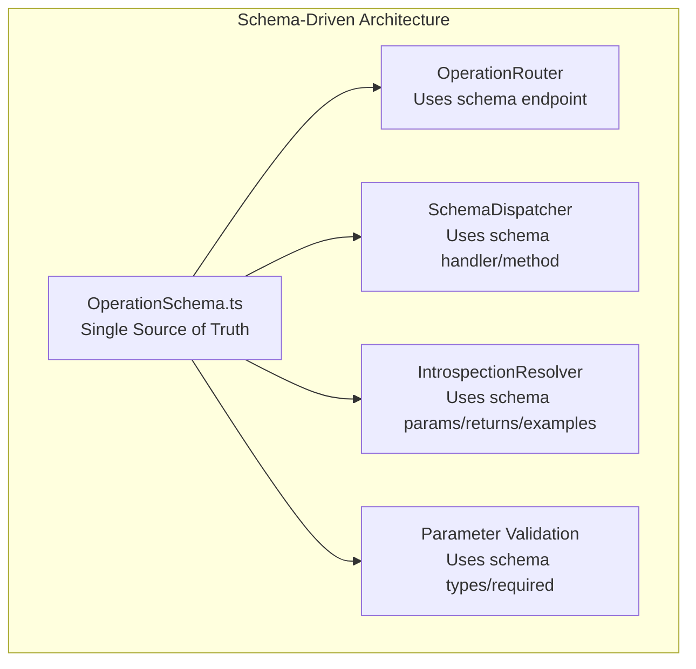
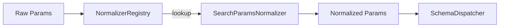

# MCP-AQL Design Decisions

> This document explains the key design decisions in MCP-AQL, their rationale,
> alternatives considered, and trade-offs made.

## Table of Contents

- [Why CRUDE not CRUD](#why-crude-not-crud)
- [Why GraphQL-Style Input](#why-graphql-style-input)
- [Why snake_case Parameters](#why-snake_case-parameters)
- [Why Schema-Driven Operations](#why-schema-driven-operations)
- [Why Introspection](#why-introspection)
- [Why Gatekeeper Pattern](#why-gatekeeper-pattern)
- [Why Normalizers](#why-normalizers)

---

## Why CRUDE not CRUD

### Decision

Extend traditional CRUD (Create, Read, Update, Delete) with an EXECUTE endpoint,
creating the CRUDE pattern (Create, Read, Update, Delete, Execute).

### Rationale

Agent execution operations have fundamentally different characteristics than
element management operations:

| Characteristic | CRUD Operations | EXECUTE Operations |
|---------------|-----------------|-------------------|
| Idempotency | Generally idempotent | Non-idempotent |
| Target | Element definitions | Runtime state |
| Lifecycle | Discrete operations | Stateful lifecycle |
| Side effects | Predictable | Unbounded |

### Problem Being Solved

Agent execution was initially placed in DELETE due to its "potentially destructive"
nature, but this was semantically confusing:

```typescript
// Before: Confusing - why is execute in DELETE?
mcp_aql_delete({ operation: "execute_agent", ... })

// After: Clear semantic intent
mcp_aql_execute({ operation: "execute_agent", ... })
```

### Code Reference

```typescript
// From src/handlers/mcp-aql/OperationRouter.ts:149-178
// ===== EXECUTE endpoint (runtime execution lifecycle) =====
// These operations manage the execution lifecycle of executable elements
// (agents, workflows, pipelines). Unlike CRUD which manages definitions,
// EXECUTE manages runtime state and is inherently non-idempotent.
execute_agent: {
  endpoint: 'EXECUTE',
  handler: 'Execute.execute',
  description: 'Start execution of an agent or executable element',
},
get_execution_state: {
  endpoint: 'EXECUTE',
  handler: 'Execute.getState',
  description: 'Query current execution state including progress and findings',
},
// ...
```

### Alternatives Considered

1. **Keep execute in DELETE** - Rejected due to semantic confusion
2. **Create ACTION endpoint** - Rejected as "ACTION" is too generic
3. **Create RUN endpoint** - Rejected as less descriptive than EXECUTE

---

## Why GraphQL-Style Input

### Decision

Use GraphQL-aligned nested `input` objects for update operations (Issue #287).

### Rationale

GraphQL's input pattern provides several benefits:

1. **Deep Merging** - Nested updates merge cleanly without explicit field selection
2. **Consistency** - Matches familiar GraphQL mutation patterns
3. **Flexibility** - Easy to add new updateable fields without breaking API

### Problem Being Solved

Before the nested input pattern, updates required flattening:

```typescript
// Before: Flat parameters - unclear what gets updated
{
  operation: "edit_element",
  params: {
    element_name: "MyPersona",
    element_type: "persona",
    description: "new desc",    // Updateable field
    triggers: ["new", "triggers"] // Updateable field
    // Which are identifiers vs updateable fields?
  }
}

// After: Clear separation with nested input
{
  operation: "edit_element",
  element_type: "persona",
  params: {
    element_name: "MyPersona",
    input: {                    // Everything in input gets updated
      description: "new desc",
      metadata: {
        triggers: ["new", "triggers"]
      }
    }
  }
}
```

### Code Reference

```typescript
// From src/handlers/mcp-aql/OperationSchema.ts:804-825
edit_element: {
  endpoint: 'UPDATE',
  handler: 'elementCRUD',
  method: 'editElement',
  description: 'Edit an element using GraphQL-aligned nested input objects',
  needsFullInput: true,
  argBuilder: 'namedWithType',
  params: {
    element_name: { type: 'string', required: true, mapTo: 'elementName' },
    element_type: { type: 'string', required: true, mapTo: 'elementType',
      sources: ['input.element_type', 'input.elementType', 'params.element_type'] },
    input: { type: 'object', required: true,
      description: 'Nested object with fields to update (deep-merged with existing element)' },
  }
}
```

### Alternatives Considered

1. **Patch-style updates** - `{ op: "replace", path: "/description", value: "..." }`
   - Rejected: Too verbose for common cases
2. **Field-specific operations** - `set_description`, `set_metadata`, etc.
   - Rejected: Explosion of operations
3. **Full replace** - Send complete element data
   - Rejected: Overwrites unintended fields, larger payloads

---

## Why snake_case Parameters

### Decision

Standardize on snake_case for all public-facing parameters (Issue #290):
- `element_name` instead of `elementName`
- `element_type` instead of `elementType`

### Rationale

1. **LLM Compatibility** - LLMs handle snake_case more reliably across models
2. **Consistency** - Matches Python/JSON conventions common in AI APIs
3. **Readability** - Clear word boundaries without camelCase ambiguity

### Problem Being Solved

LLMs were inconsistent with camelCase:

```typescript
// LLM might generate any of these:
{ elementType: "persona" }      // Correct camelCase
{ element_type: "persona" }     // snake_case
{ ElementType: "persona" }      // PascalCase
{ elementtype: "persona" }      // lowercase
```

By standardizing on snake_case, we align with the most common LLM output pattern.

### Code Reference

```typescript
// From src/handlers/mcp-aql/types.ts:23-44
export interface OperationInput {
  operation: string;

  // Issue #290: Use element_type (snake_case) as primary
  element_type?: ElementType;

  // Legacy support for camelCase
  elementType?: ElementType;

  params?: Record<string, unknown>;
}

// From src/handlers/mcp-aql/types.ts:438-451
export function parseOperationInput(input: unknown): OperationInput | null {
  if (isOperationInput(input)) {
    // Normalize element_type to elementType internally
    const normalized = input as unknown as Record<string, unknown>;
    if (normalized.element_type !== undefined && normalized.elementType === undefined) {
      return {
        ...input,
        elementType: normalized.element_type as ElementType,
      };
    }
    return input;
  }
  // ...
}
```

### Backward Compatibility

Both formats are accepted:

```typescript
// Both work:
{ operation: "list_elements", element_type: "persona" }  // Preferred
{ operation: "list_elements", elementType: "persona" }   // Supported
```

---

## Why Schema-Driven Operations

### Decision

Define operations declaratively in `OperationSchema.ts` rather than
imperatively in switch statements (Issue #247).

### Rationale

1. **Single Source of Truth** - Schema defines parameters, types, and routing
2. **Auto-Generated Introspection** - Schema metadata powers discovery
3. **Reduced Boilerplate** - No manual dispatch code for new operations
4. **Type Safety** - Schema validation catches errors at compile time

### Problem Being Solved

Before schema-driven operations, adding a new operation required:

1. Adding to OperationRouter (endpoint mapping)
2. Adding dispatch logic in MCPAQLHandler (switch case)
3. Adding parameter definitions in IntrospectionResolver
4. Adding examples in IntrospectionResolver

Now, a single schema entry handles all of this:

```typescript
// From src/handlers/mcp-aql/OperationSchema.ts:201-213
browse_collection: {
  endpoint: 'READ',
  handler: 'collectionHandler',
  method: 'browseCollection',
  description: 'Browse the DollhouseMCP community collection',
  optional: true,
  params: {
    section: { type: 'string', description: 'Collection section to browse' },
    type: { type: 'string', description: 'Element type filter' },
  },
  returns: { name: 'CollectionBrowseResult', kind: 'object', description: '...' },
  examples: ['{ operation: "browse_collection", params: { section: "personas" } }'],
}
```

### Architecture



### Code Reference

```typescript
// From src/handlers/mcp-aql/SchemaDispatcher.ts:799-893
static async dispatch(
  operation: string,
  params: Record<string, unknown>,
  registry: HandlerRegistry,
  input?: OperationInput
): Promise<unknown> {
  // Get schema definition
  const schema = getOperationSchema(operation);
  if (!schema) {
    throw new Error(`No schema definition found for operation '${operation}'`);
  }

  // Map params according to schema
  const mappedParams = schema.params
    ? mapParams(params, schema.params, input, schema.paramStyle)
    : {};

  // Validate required params
  if (schema.params) {
    validateRequiredParams(params, schema.params, operation, input);
    validateParamTypes(params, schema.params, operation);
  }

  // Get and call handler method
  const handler = getHandler(registry, schema.handler, operation, schema.optional ?? false);
  const method = getMethod(handler, schema.method, schema.handler, operation);
  const args = buildArgs(params, schema, mappedParams, input);

  return method(...args);
}
```

---

## Why Introspection

### Decision

Implement GraphQL-style introspection via the `introspect` operation
instead of relying on tool schema parsing.

### Rationale

1. **Token Efficiency** - LLMs discover operations on-demand vs parsing all upfront
2. **Dynamic Discovery** - Operations can be filtered/extended at runtime
3. **Self-Documenting** - API describes itself without external documentation
4. **Familiar Pattern** - GraphQL introspection is a known paradigm

### Problem Being Solved

With 42 discrete tools consuming ~29,592 tokens of tool schemas, LLMs have
limited context for actual work. With introspection (and ~1,100 tokens for Single mode):

```javascript
// Step 1: Quick discovery (~50 tokens)
{ operation: "introspect", params: { query: "operations" } }

// Step 2: Get details for relevant operation (~100 tokens)
{ operation: "introspect", params: { query: "operations", name: "create_element" } }

// Step 3: Use the operation
{ operation: "create_element", ... }
```

### Code Reference

```typescript
// From src/handlers/mcp-aql/IntrospectionResolver.ts:470-500
static resolve(params: Record<string, unknown>): IntrospectionResult {
  const query = (params.query as string) || 'operations';
  const name = params.name as string | undefined;

  switch (query) {
    case 'operations':
      if (name) {
        return { operation: this.getOperationDetails(name) };
      }
      return { operations: this.listOperations() };

    case 'types':
      if (name) {
        return { type: this.getTypeDetails(name) };
      }
      return { types: this.listTypes() };

    default:
      return {};
  }
}
```

---

## Why Gatekeeper Pattern

### Decision

Implement centralized access control via the Gatekeeper policy engine
rather than distributed permission checks.

### Rationale

1. **Single Enforcement Point** - All operations pass through Gatekeeper
2. **Policy Extensibility** - Element policies can modify permission levels
3. **Session Management** - Confirmations scoped to session
4. **Audit Trail** - All decisions logged centrally

### Problem Being Solved

Distributed permission checks led to inconsistent enforcement:

```typescript
// Before: Each handler checked permissions differently
class MemoryHandler {
  async clear(name: string) {
    if (!this.isConfirmed("clear")) { // Handler-specific check
      throw new Error("Confirmation required");
    }
    // ...
  }
}

// After: Centralized enforcement
class Gatekeeper {
  enforce(input: EnforceInput): GatekeeperDecision {
    // Layer 1: Route validation
    this.validateRoute(input.operation, input.endpoint);

    // Layer 2: Element policy resolution
    const policyResult = resolveElementPolicy(input.operation, activeElements);

    // Layer 3: Session confirmation check
    const confirmation = this.session.checkConfirmation(input.operation);

    // Layer 4: Default policy application
    return createDecisionFromPolicy(input.operation, policyResult);
  }
}
```

### Code Reference

```typescript
// From src/handlers/mcp-aql/Gatekeeper.ts:176-220
enforce(input: EnforceInput): GatekeeperDecision {
  const { operation, endpoint, elementType, activeElements = [] } = input;

  // Layer 1: Route validation (throws if invalid)
  try {
    this.validateRoute(operation, endpoint);
  } catch (error) {
    return {
      allowed: false,
      permissionLevel: PermissionLevel.DENY,
      errorCode: GatekeeperErrorCode.ENDPOINT_MISMATCH,
      reason: error instanceof Error ? error.message : String(error),
    };
  }

  // Layer 2: Element policy resolution
  const policyResult = resolveElementPolicy(operation, activeElements, elementType);

  // Layer 3: Check session confirmations
  const confirmation = this.session.checkConfirmation(operation, elementType);
  if (confirmation) {
    return {
      allowed: true,
      permissionLevel: policyResult.permissionLevel,
      reason: `Operation "${operation}" approved via session confirmation`,
      policySource: 'session_confirmation',
    };
  }

  // Layer 4: Apply default/element policy
  return createDecisionFromPolicy(operation, policyResult, elementType);
}
```

---

## Why Normalizers

### Decision

Implement a normalizer pattern for parameter transformation before dispatch (Issue #243).

### Rationale

1. **Separation of Concerns** - Transform logic separate from dispatch logic
2. **Reusability** - Same normalizer for multiple operations
3. **Testability** - Normalizers tested independently
4. **Extensibility** - Easy to add new normalizers

### Problem Being Solved

The unified `search` operation needed to transform user-friendly parameters
into the format expected by the underlying `searchAll` handler:

```typescript
// User input (friendly)
{
  operation: "search",
  params: {
    query: "creative",
    scope: "local",           // Simple string
    limit: 10                 // Simple number
  }
}

// Handler expects (complex)
{
  query: "creative",
  sources: ["local"],         // Array format
  pageSize: 10                // Different name
}
```

### Architecture



### Code Reference

```typescript
// From src/handlers/mcp-aql/normalizers/SearchParamsNormalizer.ts
export class SearchParamsNormalizer implements Normalizer {
  readonly name = 'searchParams';

  normalize(
    params: Record<string, unknown>,
    context: NormalizerContext
  ): NormalizerResult {
    // Transform scope to sources array
    const scope = params.scope;
    let sources: string[] | undefined;

    if (scope === 'all' || scope === undefined) {
      sources = undefined; // Default to all
    } else if (typeof scope === 'string') {
      sources = [scope];
    } else if (Array.isArray(scope)) {
      sources = scope as string[];
    }

    // Transform limit to pageSize
    const pageSize = params.limit as number | undefined;

    return {
      success: true,
      params: {
        query: params.query,
        sources,
        pageSize,
        elementType: params.type,
        // ... other transformations
      }
    };
  }
}
```

### Schema Integration

```typescript
// From src/handlers/mcp-aql/OperationSchema.ts:609-633
search: {
  endpoint: 'READ',
  handler: 'portfolioHandler',
  method: 'searchAll',
  description: 'Unified search across local, GitHub, and collection sources',
  optional: true,
  normalizer: 'searchParams',  // <-- Normalizer specified here
  argBuilder: 'named',
  params: {
    query: { type: 'string', required: true },
    scope: { type: 'unknown', description: 'Search scope: "local", "github", "collection", "all", or array' },
    // ...
  }
}
```

---

## Summary Table

| Decision | Issue | Key Trade-off |
|----------|-------|---------------|
| CRUDE not CRUD | N/A | Semantic clarity vs familiarity |
| GraphQL-style input | #287 | Flexibility vs simplicity |
| snake_case parameters | #290 | LLM compatibility vs JS convention |
| Schema-driven operations | #247 | Maintainability vs runtime overhead |
| Introspection | #254 | Token efficiency vs upfront discovery |
| Gatekeeper pattern | N/A | Centralized control vs flexibility |
| Normalizers | #243 | Separation of concerns vs complexity |

---

## Related Documentation

- [OVERVIEW.md](./OVERVIEW.md) - Architecture overview
- [OPERATIONS.md](./OPERATIONS.md) - Complete operation reference
- [INTROSPECTION.md](./INTROSPECTION.md) - Introspection system
- [ENDPOINT_MODES.md](./ENDPOINT_MODES.md) - Mode configuration
- [DEBUGGING.md](./DEBUGGING.md) - Troubleshooting guide
