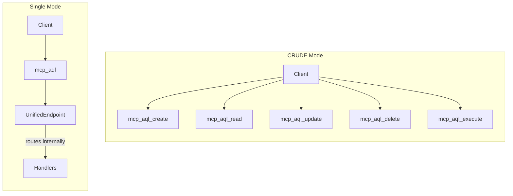
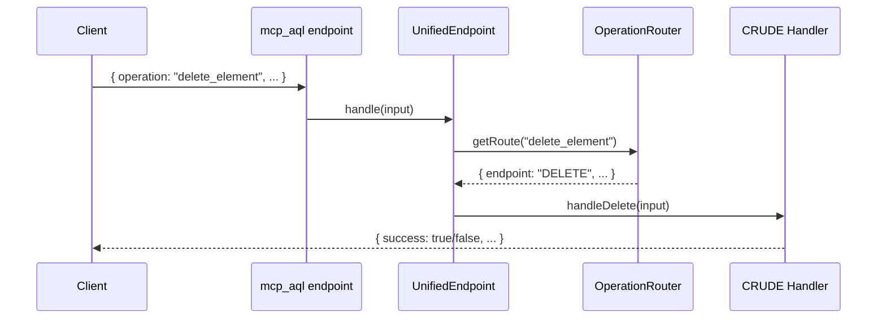

# MCP-AQL Endpoint Modes

> MCP-AQL supports two operational modes: CRUDE mode (5 endpoints) and
> Single mode (1 endpoint). This document covers configuration, trade-offs,
> and implementation details.

## Table of Contents

- [Mode Comparison](#mode-comparison)
- [Configuration](#configuration)
- [CRUDE Mode](#crude-mode)
- [Single Mode](#single-mode)
- [Security Considerations](#security-considerations)
- [Implementation Details](#implementation-details)

---

## Mode Comparison

| Aspect | CRUDE Mode (5 Endpoints) | Single Mode (1 Endpoint) |
|--------|--------------------------|--------------------------|
| **Endpoints** | 5 semantic endpoints | 1 unified endpoint |
| **Token Cost** | ~4,314 tokens | ~1,100 tokens |
| **Routing** | Client chooses endpoint | Server routes internally |
| **Permission Control** | Endpoint-level granularity | Operation-level only |
| **Client Complexity** | Must know which endpoint to use | Simple single entry point |
| **Error Messages** | Semantic endpoint mismatch errors | Generic routing errors |



---

## Configuration

MCP-AQL mode is configured via the `MCP_INTERFACE_MODE` environment variable:

```bash
# CRUDE mode (default) - 5 semantic endpoints
MCP_INTERFACE_MODE=crude

# Single mode - 1 unified endpoint
MCP_INTERFACE_MODE=single

# Both modes - All 6 endpoints available
MCP_INTERFACE_MODE=all
```

### Configuration Implementation

```typescript
// Environment variable parsing
const MCP_INTERFACE_MODE = process.env.MCP_INTERFACE_MODE || 'crude';

// Available values: 'crude', 'single', 'all'
switch (MCP_INTERFACE_MODE) {
  case 'crude':
    // Register: mcp_aql_create, mcp_aql_read, mcp_aql_update, mcp_aql_delete, mcp_aql_execute
    break;
  case 'single':
    // Register: mcp_aql
    break;
  case 'all':
    // Register all 6 endpoints
    break;
}
```

---

## CRUDE Mode

### Endpoint Definitions

Each CRUDE endpoint exposes operations matching its semantic category:

#### mcp_aql_create

```typescript
// Additive, non-destructive operations
{
  name: 'mcp_aql_create',
  description: `Additive, non-destructive operations.

Supported operations: create_element, import_element, addEntry, activate_element, install_collection_content, submit_collection_content, init_portfolio, sync_portfolio, portfolio_element_manager, setup_github_auth, configure_oauth, import_persona

Element types: persona, skill, template, agent, memory, ensemble

These operations add new data without removing or overwriting existing content.`,
  inputSchema: {
    type: 'object',
    properties: {
      operation: { type: 'string', description: 'Operation name to execute' },
      element_type: { type: 'string', description: 'Target element type (optional)' },
      params: { type: 'object', description: 'Operation parameters' }
    },
    required: ['operation']
  }
}
```

#### mcp_aql_read

```typescript
// Safe, read-only operations
{
  name: 'mcp_aql_read',
  description: `Safe, read-only operations.

Supported operations: search, list_elements, get_element, get_element_details, search_elements, query_elements, get_active_elements, validate_element, render, export_element, deactivate_element, introspect, browse_collection, search_collection, search_collection_enhanced, get_collection_content, get_collection_cache_health, portfolio_status, portfolio_config, search_portfolio, search_all, check_github_auth, oauth_helper_status, dollhouse_config, get_build_info, find_similar_elements, get_element_relationships, search_by_verb, get_relationship_stats

These queries only read data and never modify server state.`
}
```

#### mcp_aql_update

```typescript
// Modifying operations that overwrite data
{
  name: 'mcp_aql_update',
  description: `Modifying operations that overwrite data.

Supported operations: edit_element

These operations modify existing data, potentially overwriting previous values.`
}
```

#### mcp_aql_delete

```typescript
// Destructive operations that remove data
{
  name: 'mcp_aql_delete',
  description: `Destructive operations that remove data.

Supported operations: delete_element, clear, clear_github_auth

These operations remove data. Use with caution.`
}
```

#### mcp_aql_execute

```typescript
// Execution lifecycle operations
{
  name: 'mcp_aql_execute',
  description: `Execution lifecycle operations for executable elements.

Supported operations: execute_agent, get_execution_state, record_execution_step, complete_execution, continue_execution

These operations manage runtime execution state. Unlike CRUD operations, Execute operations handle the execution lifecycle.

IMPORTANT: Execute operations are potentially destructive and non-idempotent.`
}
```

### Gatekeeper Enforcement

In CRUDE mode, the Gatekeeper enforces that operations are called via correct endpoints:

```typescript
// From src/handlers/mcp-aql/Gatekeeper.ts:107-161
validateRoute(operation: string, calledEndpoint: CRUDEndpoint): void {
  const route = getRoute(operation);

  if (!route) {
    throw new Error(`Unknown operation: "${operation}"`);
  }

  if (route.endpoint !== calledEndpoint) {
    throw new Error(
      `Security violation: Operation "${operation}" must be called via ` +
      `mcp_aql_${route.endpoint.toLowerCase()} endpoint, ` +
      `not mcp_aql_${calledEndpoint.toLowerCase()}.`
    );
  }
}
```

**Example Error:**
```
Security violation: Operation "delete_element" must be called via mcp_aql_delete endpoint,
not mcp_aql_create. This operation is classified as DELETE due to its destructive potential.
```

---

## Single Mode

### UnifiedEndpoint Implementation

Single mode uses `UnifiedEndpoint` to route all operations through a single entry point:

```typescript
// From src/handlers/mcp-aql/UnifiedEndpoint.ts:46-166
export class UnifiedEndpoint {
  constructor(private readonly mcpAqlHandler: MCPAQLHandler) {}

  async handle(input: unknown): Promise<OperationResult | BatchResult> {
    // Step 1: Validate and normalize input
    const parsedInput = parseOperationInput(input);
    if (!parsedInput) {
      return this.failure('Invalid input');
    }

    // Step 2: Determine correct CRUDE endpoint for this operation
    const route = getRoute(parsedInput.operation);
    if (!route) {
      return this.failure(`Unknown operation: "${parsedInput.operation}"`);
    }

    // Step 3: Route to appropriate handler
    return this.routeToHandler(route.endpoint, parsedInput);
  }

  private async routeToHandler(
    endpoint: CRUDEndpoint,
    input: unknown
  ): Promise<OperationResult | BatchResult> {
    switch (endpoint) {
      case 'CREATE':
        return this.mcpAqlHandler.handleCreate(input);
      case 'READ':
        return this.mcpAqlHandler.handleRead(input);
      case 'UPDATE':
        return this.mcpAqlHandler.handleUpdate(input);
      case 'DELETE':
        return this.mcpAqlHandler.handleDelete(input);
      case 'EXECUTE':
        return this.mcpAqlHandler.handleExecute(input);
    }
  }
}
```

### Endpoint Definition

```typescript
{
  name: 'mcp_aql',
  description: `Unified MCP-AQL endpoint for all element operations.

Operations are automatically routed to appropriate handlers based on their type.
Use the 'introspect' operation to discover available operations.

Example: { operation: "introspect", params: { query: "operations" } }`,
  inputSchema: {
    type: 'object',
    properties: {
      operation: { type: 'string', description: 'Operation name to execute' },
      element_type: { type: 'string', description: 'Target element type (optional)' },
      params: { type: 'object', description: 'Operation parameters' }
    },
    required: ['operation']
  }
}
```

### Server-Side Security

In Single mode, security is enforced server-side since the client cannot choose endpoints:



---

## Security Considerations

### CRUDE Mode Security

1. **Client Responsibility** - Client must choose correct endpoint
2. **Endpoint Mismatch Detection** - Gatekeeper throws on wrong endpoint
3. **Semantic Grouping** - Dangerous operations isolated to DELETE/EXECUTE
4. **Permission Flags** - Each endpoint has defined readOnly/destructive flags

### Single Mode Security

1. **Server-Side Routing** - Client cannot bypass by calling wrong endpoint
2. **Same Validation** - Operations still pass through Gatekeeper validation
3. **Audit Logging** - All routing decisions are logged
4. **Simpler Client** - Reduced attack surface from client complexity

### Security Trade-offs

| Security Aspect | CRUDE Mode | Single Mode |
|-----------------|------------|-------------|
| Endpoint-level blocking | Yes | No (all operations exposed) |
| Client error prevention | Better (semantic errors) | Worse (generic errors) |
| Attack surface | Larger (5 endpoints) | Smaller (1 endpoint) |
| Audit granularity | Endpoint + Operation | Operation only |

---

## Implementation Details

### Request Flow Comparison

```mermaid
graph TB
    subgraph "CRUDE Mode Flow"
        C_INPUT[Input]
        C_ENDPOINT[Chosen Endpoint<br/>mcp_aql_*]
        C_HANDLER[MCPAQLHandler<br/>handleCreate/Read/Update/Delete/Execute]
        C_GATE[Gatekeeper.validate]
        C_DISPATCH[dispatch]

        C_INPUT --> C_ENDPOINT
        C_ENDPOINT --> C_HANDLER
        C_HANDLER --> C_GATE
        C_GATE --> C_DISPATCH
    end

    subgraph "Single Mode Flow"
        S_INPUT[Input]
        S_ENDPOINT[mcp_aql]
        S_UNIFIED[UnifiedEndpoint.handle]
        S_ROUTER[OperationRouter.getRoute]
        S_HANDLER[MCPAQLHandler<br/>handleCreate/Read/Update/Delete/Execute]
        S_GATE[Gatekeeper.validate]
        S_DISPATCH[dispatch]

        S_INPUT --> S_ENDPOINT
        S_ENDPOINT --> S_UNIFIED
        S_UNIFIED --> S_ROUTER
        S_ROUTER --> S_HANDLER
        S_HANDLER --> S_GATE
        S_GATE --> S_DISPATCH
    end
```



### Token Measurement

Empirical token measurements from Claude Code MCP tool listing:

| Mode | Endpoints/Tools | Measured Tokens | Token Reduction vs Discrete |
|------|-----------------|-----------------|----------------------------|
| **Discrete** | 42 tools | **~29,592** | — |
| **CRUDE** | 5 endpoints | **~4,314** | 85% reduction |
| **Single** | 1 endpoint | **~1,100** | 96% reduction |

**Per-Endpoint Breakdown (CRUDE Mode):**

| Endpoint | Tokens |
|----------|--------|
| mcp_aql_create | 858 |
| mcp_aql_read | 911 |
| mcp_aql_update | 766 |
| mcp_aql_delete | 783 |
| mcp_aql_execute | 996 |
| **Total** | **4,314** |

### Help Text Generation

Both modes provide help text through introspection or utility functions:

```typescript
// From src/handlers/mcp-aql/UnifiedEndpoint.ts:174-210
export function getOperationHelp(): string {
  return `
## MCP-AQL Unified Endpoint Operations (CRUDE)

### CREATE Operations (additive, non-destructive)
- create_element: Create a new element
- import_element: Import an element from exported data
- addEntry: Add an entry to a memory element
- activate_element: Activate an element for use in session

### READ Operations (safe, read-only)
- list_elements: List elements with filtering and pagination
- get_element: Retrieve a single element by name
- search_elements: Full-text search across elements
...

### UPDATE Operations (modifying)
- edit_element: Modify an existing element's fields

### DELETE Operations (destructive)
- delete_element: Permanently delete an element
- clear: Clear entries from a memory element

### EXECUTE Operations (runtime lifecycle, potentially destructive)
- execute_agent: Start execution of an agent
- get_execution_state: Query current execution state
...
`.trim();
}
```

---

## Related Documentation

- [OVERVIEW.md](./OVERVIEW.md) - Architecture overview
- [OPERATIONS.md](./OPERATIONS.md) - Complete operation reference
- [DESIGN_DECISIONS.md](./DESIGN_DECISIONS.md) - Why these design choices
- [DEBUGGING.md](./DEBUGGING.md) - Troubleshooting guide
