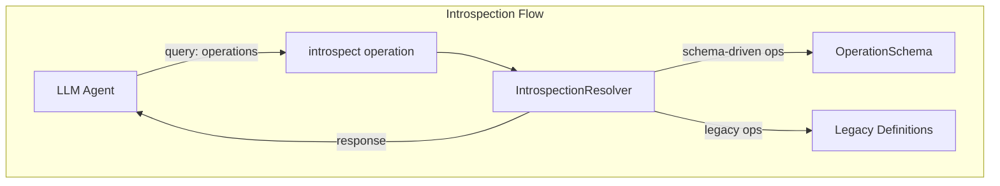
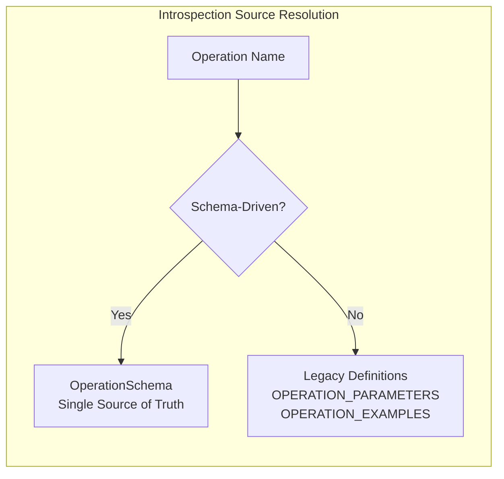
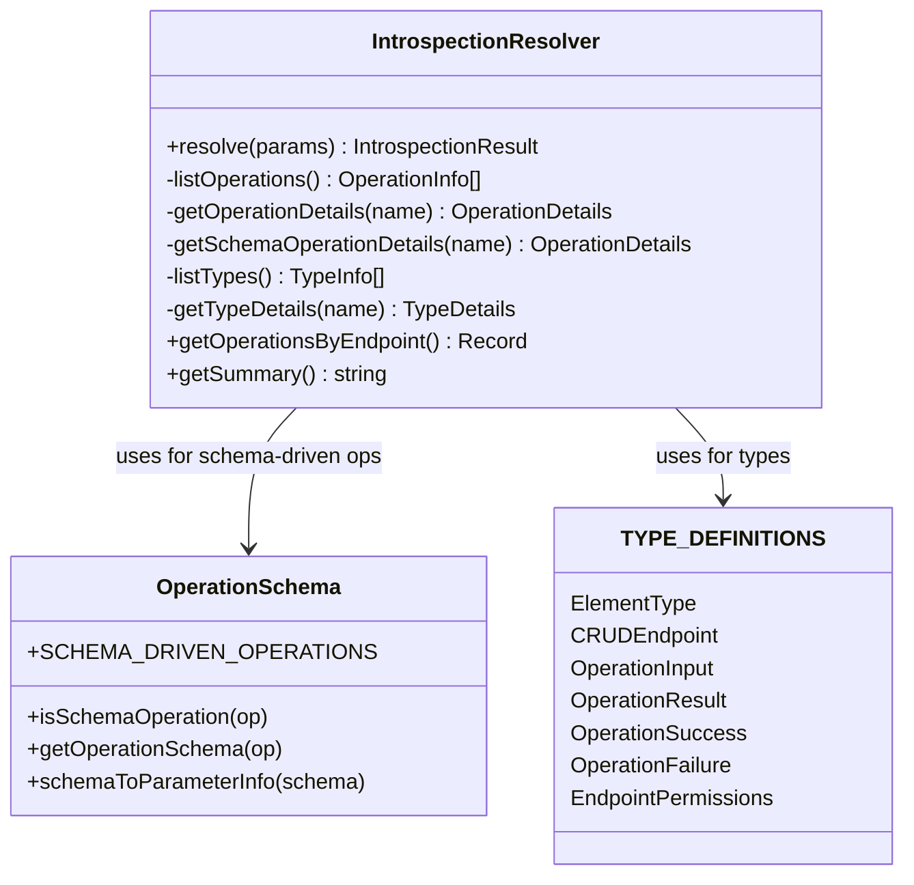

# MCP-AQL Introspection System

> The introspection system provides GraphQL-style discovery capabilities,
> allowing LLMs to understand available operations, their parameters,
> return types, and examples at runtime.

## Table of Contents

- [Overview](#overview)
- [Introspection Queries](#introspection-queries)
- [Schema Integration](#schema-integration)
- [Response Structures](#response-structures)
- [Usage Examples](#usage-examples)
- [Implementation Details](#implementation-details)

---

## Overview

MCP-AQL introspection enables:

1. **Operation Discovery** - List all available operations
2. **Parameter Documentation** - Get required/optional parameters for any operation
3. **Type Information** - Understand element types, enums, and structures
4. **Usage Examples** - See example invocations for each operation



---

## Introspection Queries

The `introspect` operation supports two query types:

### Query Types

| Query | Description | Optional `name` Parameter |
|-------|-------------|---------------------------|
| `operations` | List all available operations | Get details for specific operation |
| `types` | List all available types | Get details for specific type |

### Basic Usage

```javascript
// List all operations
{
  operation: "introspect",
  params: { query: "operations" }
}

// Get details for a specific operation
{
  operation: "introspect",
  params: { query: "operations", name: "create_element" }
}

// List all types
{
  operation: "introspect",
  params: { query: "types" }
}

// Get details for a specific type
{
  operation: "introspect",
  params: { query: "types", name: "ElementType" }
}
```

---

## Schema Integration

The introspection system uses a dual-source approach (Issue #254):

### Source Priority



### Schema-Driven Operations

For operations defined in `OperationSchema.ts`, introspection data comes directly from the schema:

```typescript
// From src/handlers/mcp-aql/IntrospectionResolver.ts:548-599
private static getSchemaOperationDetails(name: string): OperationDetails | null {
  const schema = getOperationSchema(name);
  if (!schema) {
    return null;
  }

  // Convert schema returns to TypeInfo
  const returns: TypeInfo = schema.returns
    ? { name: schema.returns.name, kind: schema.returns.kind, description: schema.returns.description }
    : { name: 'OperationResult', kind: 'union', description: 'Success with data or failure with error' };

  return {
    name,
    endpoint: schema.endpoint,
    mcpTool: `mcp_aql_${schema.endpoint.toLowerCase()}`,
    description: schema.description,
    permissions: PermissionGuard.getPermissions(schema.endpoint as CRUDEndpoint),
    parameters: schemaToParameterInfo(schema.params),
    returns,
    examples: schema.examples || [],
  };
}
```

### Legacy Operations

For operations not yet migrated to the schema, data comes from fallback definitions:

```typescript
// From src/handlers/mcp-aql/IntrospectionResolver.ts:252-326
const OPERATION_PARAMETERS: Record<string, ParameterInfo[]> = {
  create_element: [
    { name: 'element_name', type: 'string', required: true, description: 'Element name' },
    { name: 'element_type', type: 'ElementType', required: true, description: 'Element type' },
    // ...
  ],
  // ... other operations
};
```

---

## Response Structures

### OperationInfo (List Response)

```typescript
// From src/handlers/mcp-aql/IntrospectionResolver.ts:40-47
interface OperationInfo {
  name: string;        // e.g., 'create_element'
  endpoint: string;    // e.g., 'CREATE'
  description: string; // Brief description
}
```

### OperationDetails (Details Response)

```typescript
// From src/handlers/mcp-aql/IntrospectionResolver.ts:80-97
interface OperationDetails {
  name: string;
  endpoint: string;
  mcpTool: string;           // e.g., 'mcp_aql_create'
  description: string;
  permissions: EndpointPermissions;
  parameters: ParameterInfo[];
  returns: TypeInfo;
  examples: string[];
}
```

### ParameterInfo

```typescript
// From src/handlers/mcp-aql/IntrospectionResolver.ts:52-63
interface ParameterInfo {
  name: string;
  type: string;        // e.g., 'string', 'ElementType', 'object'
  required: boolean;
  description: string;
  default?: unknown;
}
```

### TypeInfo / TypeDetails

```typescript
// From src/handlers/mcp-aql/IntrospectionResolver.ts:68-77
interface TypeInfo {
  name: string;
  kind: 'enum' | 'object' | 'scalar' | 'union';
  description?: string;
}

// From src/handlers/mcp-aql/IntrospectionResolver.ts:102-115
interface TypeDetails extends TypeInfo {
  values?: string[];          // For enum types
  fields?: ParameterInfo[];   // For object types
  members?: string[];         // For union types
}
```

---

## Usage Examples

### Discovering All Operations

**Request:**
```javascript
{
  operation: "introspect",
  params: { query: "operations" }
}
```

**Response:**
```json
{
  "success": true,
  "data": {
    "operations": [
      { "name": "create_element", "endpoint": "CREATE", "description": "Create a new element of any type" },
      { "name": "import_element", "endpoint": "CREATE", "description": "Import an element from exported data" },
      { "name": "activate_element", "endpoint": "CREATE", "description": "Activate an element for use in session" },
      { "name": "list_elements", "endpoint": "READ", "description": "List elements with filtering and pagination" },
      { "name": "get_element", "endpoint": "READ", "description": "Get an element by name" },
      { "name": "edit_element", "endpoint": "UPDATE", "description": "Edit an element using GraphQL-aligned nested input objects" },
      { "name": "delete_element", "endpoint": "DELETE", "description": "Delete an element" },
      { "name": "execute_agent", "endpoint": "EXECUTE", "description": "Start execution of an agent" }
    ]
  }
}
```

### Getting Operation Details

**Request:**
```javascript
{
  operation: "introspect",
  params: { query: "operations", name: "create_element" }
}
```

**Response:**
```json
{
  "success": true,
  "data": {
    "operation": {
      "name": "create_element",
      "endpoint": "CREATE",
      "mcpTool": "mcp_aql_create",
      "description": "Create a new element of any type",
      "permissions": {
        "readOnly": false,
        "destructive": false
      },
      "parameters": [
        { "name": "element_name", "type": "string", "required": true, "description": "Element name" },
        { "name": "element_type", "type": "string", "required": true, "description": "Element type (persona, skill, template, agent, memory, ensemble)" },
        { "name": "description", "type": "string", "required": true, "description": "Element description" },
        { "name": "content", "type": "string", "required": false, "description": "Element content - REQUIRED for agents, skills, templates" },
        { "name": "instructions", "type": "string", "required": false, "description": "Behavioral instructions - REQUIRED for personas" },
        { "name": "metadata", "type": "object", "required": false, "description": "Additional metadata" }
      ],
      "returns": {
        "name": "Element",
        "kind": "object",
        "description": "Newly created element"
      },
      "examples": [
        "{ operation: \"create_element\", element_type: \"persona\", params: { element_name: \"MyPersona\", description: \"A helpful assistant\", instructions: \"You are helpful and thorough.\" } }"
      ]
    }
  }
}
```

### Discovering Types

**Request:**
```javascript
{
  operation: "introspect",
  params: { query: "types" }
}
```

**Response:**
```json
{
  "success": true,
  "data": {
    "types": [
      { "name": "ElementType", "kind": "enum", "description": "The 6 core element types supported by DollhouseMCP" },
      { "name": "CRUDEndpoint", "kind": "enum", "description": "CRUDE endpoint categories for operation classification" },
      { "name": "OperationInput", "kind": "object", "description": "Standard input structure for all MCP-AQL operations" },
      { "name": "OperationResult", "kind": "union", "description": "Standard result type for all operations" },
      { "name": "OperationSuccess", "kind": "object", "description": "Successful operation result" },
      { "name": "OperationFailure", "kind": "object", "description": "Failed operation result" }
    ]
  }
}
```

### Getting Type Details

**Request:**
```javascript
{
  operation: "introspect",
  params: { query: "types", name: "ElementType" }
}
```

**Response:**
```json
{
  "success": true,
  "data": {
    "type": {
      "name": "ElementType",
      "kind": "enum",
      "description": "The 6 core element types supported by DollhouseMCP",
      "values": ["persona", "skill", "template", "agent", "memory", "ensemble"]
    }
  }
}
```

---

## Implementation Details

### IntrospectionResolver Architecture



### Type Registry

```typescript
// From src/handlers/mcp-aql/IntrospectionResolver.ts:139-242
const TYPE_DEFINITIONS: Record<string, TypeDetails> = {
  ElementType: {
    name: 'ElementType',
    kind: 'enum',
    description: 'The 6 core element types supported by DollhouseMCP',
    values: ['persona', 'skill', 'template', 'agent', 'memory', 'ensemble'],
  },
  CRUDEndpoint: {
    name: 'CRUDEndpoint',
    kind: 'enum',
    description: 'CRUDE endpoint categories for operation classification',
    values: ['CREATE', 'READ', 'UPDATE', 'DELETE', 'EXECUTE'],
  },
  OperationInput: {
    name: 'OperationInput',
    kind: 'object',
    description: 'Standard input structure for all MCP-AQL operations',
    fields: [
      { name: 'operation', type: 'string', required: true, description: 'The operation to perform' },
      { name: 'elementType', type: 'ElementType', required: false, description: 'Element type for element operations' },
      { name: 'params', type: 'object', required: false, description: 'Operation-specific parameters' },
    ],
  },
  // ... OperationResult, OperationSuccess, OperationFailure, EndpointPermissions
};
```

### Utility Methods

The IntrospectionResolver provides utility methods for documentation generation:

```typescript
// From src/handlers/mcp-aql/IntrospectionResolver.ts:647-664
static getOperationsByEndpoint(): Record<CRUDEndpoint, OperationInfo[]> {
  const grouped: Record<CRUDEndpoint, OperationInfo[]> = {
    CREATE: [], READ: [], UPDATE: [], DELETE: [], EXECUTE: [],
  };

  for (const op of this.listOperations()) {
    const endpoint = op.endpoint as CRUDEndpoint;
    if (grouped[endpoint]) {
      grouped[endpoint].push(op);
    }
  }

  return grouped;
}

// From src/handlers/mcp-aql/IntrospectionResolver.ts:669-682
static getSummary(): string {
  const opsByEndpoint = this.getOperationsByEndpoint();
  const lines: string[] = ['MCP-AQL Operations:'];

  for (const [endpoint, ops] of Object.entries(opsByEndpoint)) {
    const opNames = ops.map(o => o.name).join(', ');
    lines.push(`  ${endpoint}: ${opNames}`);
  }

  lines.push(`\nTypes: ${Object.keys(TYPE_DEFINITIONS).join(', ')}`);
  lines.push('\nUse introspect with name parameter for details.');

  return lines.join('\n');
}
```

---

## Related Documentation

- [OVERVIEW.md](./OVERVIEW.md) - Architecture overview
- [OPERATIONS.md](./OPERATIONS.md) - Complete operation reference
- [DESIGN_DECISIONS.md](./DESIGN_DECISIONS.md) - Design rationale
- [DEBUGGING.md](./DEBUGGING.md) - Troubleshooting guide
