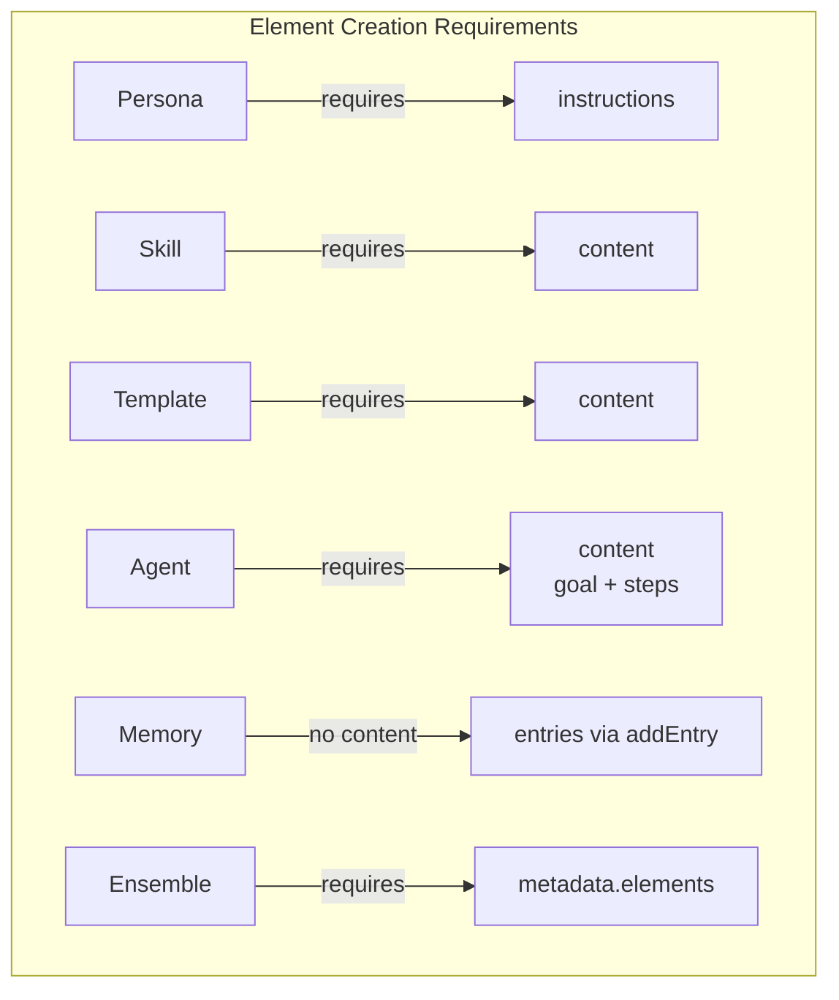

# MCP-AQL Operations Reference

> Complete reference for all MCP-AQL operations, their parameters, endpoints,
> and response formats.

## Table of Contents

- [Parameter Naming Convention](#parameter-naming-convention)
- [Operation Input Format](#operation-input-format)
- [Response Format](#response-format)
- [CREATE Operations](#create-operations)
- [READ Operations](#read-operations)
- [UPDATE Operations](#update-operations)
- [DELETE Operations](#delete-operations)
- [EXECUTE Operations](#execute-operations)
- [Element Type Requirements](#element-type-requirements)

---

## Parameter Naming Convention

MCP-AQL uses **snake_case** for all public-facing parameters (Issue #290):

| Parameter | Type | Description |
|-----------|------|-------------|
| `element_name` | string | The name of an element |
| `element_type` | ElementType | The type of element (persona, skill, template, agent, memory, ensemble) |

> **Note:** The system accepts both `element_type` (preferred) and `elementType` (legacy) for backward compatibility. Internally, `element_type` is normalized to `elementType`.

### Element Types

```typescript
// From src/handlers/mcp-aql/types.ts:10-17
enum ElementType {
  Persona = 'persona',
  Skill = 'skill',
  Template = 'template',
  Agent = 'agent',
  Memory = 'memory',
  Ensemble = 'ensemble',
}
```

---

## Operation Input Format

All operations follow a consistent input structure:

```typescript
// From src/handlers/mcp-aql/types.ts:23-44
interface OperationInput {
  operation: string;        // Required: The operation to perform
  element_type?: ElementType;  // Optional: Element type (snake_case, preferred)
  elementType?: ElementType;   // Optional: Element type (camelCase, legacy)
  params?: Record<string, unknown>;  // Optional: Operation-specific parameters
}
```

### Example Formats

```javascript
// Preferred format (element_type at top level)
{
  operation: "create_element",
  element_type: "persona",
  params: {
    element_name: "MyPersona",
    description: "A helpful assistant",
    instructions: "You are helpful and thorough."
  }
}

// Alternative format (element_type in params)
{
  operation: "create_element",
  params: {
    element_name: "MyPersona",
    element_type: "persona",
    description: "A helpful assistant",
    instructions: "You are helpful and thorough."
  }
}
```

---

## Response Format

All operations return a discriminated union result:

```typescript
// From src/handlers/mcp-aql/types.ts:108-133
type OperationResult = OperationSuccess | OperationFailure;

interface OperationSuccess {
  success: true;
  data: unknown;  // Operation-specific payload
  error?: never;
}

interface OperationFailure {
  success: false;
  error: string;  // Human-readable error message
  data?: never;
}
```

### Success Example

```json
{
  "success": true,
  "data": {
    "name": "MyPersona",
    "type": "persona",
    "description": "A helpful assistant"
  }
}
```

### Failure Example

```json
{
  "success": false,
  "error": "Missing required parameter 'element_name' for operation 'create_element'"
}
```

---

## CREATE Operations

CREATE operations are additive and non-destructive.

### create_element

Create a new element of any type.

| Parameter | Type | Required | Description |
|-----------|------|----------|-------------|
| `element_name` | string | Yes | Element name |
| `element_type` | ElementType | Yes | Element type |
| `description` | string | Yes | Element description |
| `instructions` | string | Personas only | Behavioral instructions (REQUIRED for personas) |
| `content` | string | Agents/Skills/Templates | Element content (REQUIRED for agents, skills, templates) |
| `metadata` | object | No | Additional metadata |

**Schema Definition:**
```typescript
// From src/handlers/mcp-aql/OperationSchema.ts:713-742
create_element: {
  endpoint: 'CREATE',
  handler: 'elementCRUD',
  method: 'createElement',
  description: 'Create a new element of any type',
  needsFullInput: true,
  argBuilder: 'namedWithType',
  params: {
    element_name: { type: 'string', required: true, mapTo: 'elementName' },
    element_type: { type: 'string', required: true, mapTo: 'elementType',
      sources: ['input.element_type', 'input.elementType', 'params.element_type'] },
    description: { type: 'string', required: true },
    content: { type: 'string', description: 'REQUIRED for agents, skills, templates' },
    instructions: { type: 'string', description: 'REQUIRED for personas' },
    metadata: { type: 'object' },
  }
}
```

**Examples:**
```javascript
// Create a persona (requires instructions)
{
  operation: "create_element",
  element_type: "persona",
  params: {
    element_name: "CodeReviewer",
    description: "A thorough code reviewer",
    instructions: "You are a meticulous code reviewer. Focus on code quality, security, and maintainability."
  }
}

// Create an agent (requires content with goal + steps)
{
  operation: "create_element",
  element_type: "agent",
  params: {
    element_name: "TaskRunner",
    description: "Executes multi-step tasks",
    content: "goal: Complete assigned tasks\nsteps:\n  - Analyze the task\n  - Execute step by step\n  - Report results"
  }
}

// Create a skill (requires content)
{
  operation: "create_element",
  element_type: "skill",
  params: {
    element_name: "BugAnalysis",
    description: "Analyzes bugs and suggests fixes",
    content: "# Bug Analysis Skill\n\nAnalyze reported bugs and suggest comprehensive fixes."
  }
}
```

---

### import_element

Import an element from exported data.

| Parameter | Type | Required | Description |
|-----------|------|----------|-------------|
| `data` | string or object | Yes | Export package (JSON string or object) |
| `overwrite` | boolean | No | Overwrite if exists (default: false) |

**Example:**
```javascript
{
  operation: "import_element",
  params: {
    data: {
      exportVersion: "1.0",
      elementType: "persona",
      elementName: "MyPersona",
      format: "json",
      data: "{\"name\":\"MyPersona\",\"description\":\"...\"}"
    },
    overwrite: false
  }
}
```

---

### activate_element

Activate an element for use in the current session.

| Parameter | Type | Required | Description |
|-----------|------|----------|-------------|
| `element_name` | string | Yes | Element name to activate |
| `element_type` | ElementType | Yes | Element type |
| `context` | object | No | Activation context |

**Example:**
```javascript
{
  operation: "activate_element",
  element_type: "persona",
  params: {
    element_name: "CodeReviewer"
  }
}
```

---

### addEntry

Add an entry to a memory element.

| Parameter | Type | Required | Description |
|-----------|------|----------|-------------|
| `element_name` | string | Yes | Memory element name |
| `content` | string | Yes | Entry content |
| `tags` | string[] | No | Entry tags |
| `metadata` | object | No | Entry metadata |

**Example:**
```javascript
{
  operation: "addEntry",
  params: {
    element_name: "project-notes",
    content: "Completed the API refactoring on 2024-01-15",
    tags: ["milestone", "api"]
  }
}
```

---

## READ Operations

READ operations are safe and read-only.

### list_elements

List elements with optional filtering and pagination.

| Parameter | Type | Required | Description |
|-----------|------|----------|-------------|
| `element_type` | ElementType | Yes | Element type to list |
| `page` | number | No | Page number (default: 1) |
| `pageSize` | number | No | Items per page (default: 25) |

**Example:**
```javascript
{
  operation: "list_elements",
  element_type: "persona"
}
```

---

### get_element / get_element_details

Get an element by name (both operations are equivalent).

| Parameter | Type | Required | Description |
|-----------|------|----------|-------------|
| `element_name` | string | Yes | Element name |
| `element_type` | ElementType | Yes | Element type |

**Example:**
```javascript
{
  operation: "get_element",
  element_type: "persona",
  params: {
    element_name: "CodeReviewer"
  }
}
```

---

### search

Unified search across local, GitHub, and collection sources (Issue #243).

| Parameter | Type | Required | Description |
|-----------|------|----------|-------------|
| `query` | string | Yes | Search query |
| `scope` | string or string[] | No | Search scope(s): "local", "github", "collection", "all" |
| `type` | string | No | Filter by element type |
| `page` | number | No | Page number |
| `limit` | number | No | Results per page |
| `sort` | object | No | Sort options: { field, order } |
| `filters` | object | No | Filter options: { tags, author, createdAfter, createdBefore } |

**Examples:**
```javascript
// Search all sources
{
  operation: "search",
  params: { query: "creative assistant" }
}

// Search only local portfolio
{
  operation: "search",
  params: { query: "helper", scope: "local" }
}

// Search multiple scopes
{
  operation: "search",
  params: { query: "code review", scope: ["local", "collection"] }
}
```

---

### introspect

Query available operations and types for discovery.

| Parameter | Type | Required | Description |
|-----------|------|----------|-------------|
| `query` | string | Yes | What to introspect: "operations" or "types" |
| `name` | string | No | Specific operation or type name |

**Examples:**
```javascript
// List all operations
{ operation: "introspect", params: { query: "operations" } }

// Get details for a specific operation
{ operation: "introspect", params: { query: "operations", name: "create_element" } }

// List all types
{ operation: "introspect", params: { query: "types" } }

// Get details for a specific type
{ operation: "introspect", params: { query: "types", name: "ElementType" } }
```

---

### render

Render a template with provided variables.

| Parameter | Type | Required | Description |
|-----------|------|----------|-------------|
| `element_name` | string | Yes | Template name |
| `variables` | object | Yes | Template variables |

**Example:**
```javascript
{
  operation: "render",
  params: {
    element_name: "meeting-notes",
    variables: {
      date: "2024-01-15",
      attendees: ["Alice", "Bob"],
      topics: ["Q1 planning", "Budget review"]
    }
  }
}
```

---

### export_element

Export an element to a portable format.

| Parameter | Type | Required | Description |
|-----------|------|----------|-------------|
| `element_name` | string | Yes | Element name |
| `element_type` | ElementType | Yes | Element type |
| `format` | "json" or "yaml" | No | Export format (default: "json") |

**Example:**
```javascript
{
  operation: "export_element",
  element_type: "persona",
  params: {
    element_name: "CodeReviewer",
    format: "yaml"
  }
}
```

---

## UPDATE Operations

UPDATE operations modify existing state.

### edit_element

Edit an element using GraphQL-style nested input objects (Issue #287).

| Parameter | Type | Required | Description |
|-----------|------|----------|-------------|
| `element_name` | string | Yes | Element name |
| `element_type` | ElementType | Yes | Element type |
| `input` | object | Yes | Nested object with fields to update (deep-merged) |

**Schema Definition:**
```typescript
// From src/handlers/mcp-aql/OperationSchema.ts:804-825
edit_element: {
  endpoint: 'UPDATE',
  handler: 'elementCRUD',
  method: 'editElement',
  description: 'Edit an element using GraphQL-aligned nested input objects',
  needsFullInput: true,
  argBuilder: 'namedWithType',
  params: {
    element_name: { type: 'string', required: true, mapTo: 'elementName' },
    element_type: { type: 'string', required: true, mapTo: 'elementType',
      sources: ['input.element_type', 'input.elementType', 'params.element_type'] },
    input: { type: 'object', required: true,
      description: 'Nested object with fields to update (deep-merged with existing element)' },
  }
}
```

**Examples:**
```javascript
// Update description
{
  operation: "edit_element",
  element_type: "persona",
  params: {
    element_name: "CodeReviewer",
    input: {
      description: "An expert code reviewer focusing on security"
    }
  }
}

// Update nested metadata
{
  operation: "edit_element",
  element_type: "skill",
  params: {
    element_name: "BugAnalysis",
    input: {
      description: "Enhanced bug analysis",
      metadata: {
        triggers: ["bug", "issue", "error"],
        priority: "high"
      }
    }
  }
}
```

---

## DELETE Operations

DELETE operations are destructive.

### delete_element

Permanently delete an element.

| Parameter | Type | Required | Description |
|-----------|------|----------|-------------|
| `element_name` | string | Yes | Element name |
| `element_type` | ElementType | Yes | Element type |
| `deleteData` | boolean | No | Also delete associated data files |

**Example:**
```javascript
{
  operation: "delete_element",
  element_type: "memory",
  params: {
    element_name: "old-project-notes",
    deleteData: true
  }
}
```

---

### clear

Clear all entries from a memory element.

| Parameter | Type | Required | Description |
|-----------|------|----------|-------------|
| `element_name` | string | Yes | Memory element name |

**Example:**
```javascript
{
  operation: "clear",
  params: {
    element_name: "temp-memory"
  }
}
```

---

## EXECUTE Operations

EXECUTE operations manage runtime execution lifecycle (Issue #244).

### execute_agent

Start execution of an agent or executable element.

| Parameter | Type | Required | Description |
|-----------|------|----------|-------------|
| `name` | string | Yes | Agent name |
| `parameters` | object | Yes | Execution parameters |

**Example:**
```javascript
{
  operation: "execute_agent",
  params: {
    name: "code-reviewer",
    parameters: {
      goal: "Review the authentication module",
      files: ["src/auth/"]
    }
  }
}
```

---

### get_execution_state

Query current execution state.

| Parameter | Type | Required | Description |
|-----------|------|----------|-------------|
| `name` | string | Yes | Agent name |
| `includeDecisionHistory` | boolean | No | Include decision history |
| `includeContext` | boolean | No | Include execution context |

---

### record_execution_step

Record execution progress or findings.

| Parameter | Type | Required | Description |
|-----------|------|----------|-------------|
| `name` | string | Yes | Agent name |
| `stepDescription` | string | Yes | Description of step completed |
| `outcome` | "success" or "failure" or "partial" | Yes | Step outcome |
| `findings` | string | No | Step findings or results |
| `confidence` | number | No | Confidence score (0-1) |

---

### complete_execution

Signal that execution finished successfully.

| Parameter | Type | Required | Description |
|-----------|------|----------|-------------|
| `name` | string | Yes | Agent name |
| `outcome` | "success" or "failure" or "partial" | Yes | Execution outcome |
| `summary` | string | Yes | Summary of execution results |
| `goalId` | string | No | Goal ID if tracking specific goal |

---

### continue_execution

Resume execution from saved state.

| Parameter | Type | Required | Description |
|-----------|------|----------|-------------|
| `name` | string | Yes | Agent name |
| `previousStepResult` | string | No | Result from previous step |
| `parameters` | object | No | Additional parameters for continuation |

---

## Element Type Requirements

Different element types have different required fields:

| Element Type | Required Fields | Notes |
|-------------|-----------------|-------|
| **persona** | `instructions` | Must be substantial behavioral instructions |
| **skill** | `content` | Skill definition and capabilities |
| **template** | `content` | Template with variable placeholders |
| **agent** | `content` | Goal + steps definition |
| **memory** | - | No content required, stores entries |
| **ensemble** | `metadata.elements` | Array of element references |



---

## Related Documentation

- [OVERVIEW.md](./OVERVIEW.md) - Architecture overview
- [INTROSPECTION.md](./INTROSPECTION.md) - Introspection system
- [DESIGN_DECISIONS.md](./DESIGN_DECISIONS.md) - Design rationale
- [DEBUGGING.md](./DEBUGGING.md) - Troubleshooting guide
