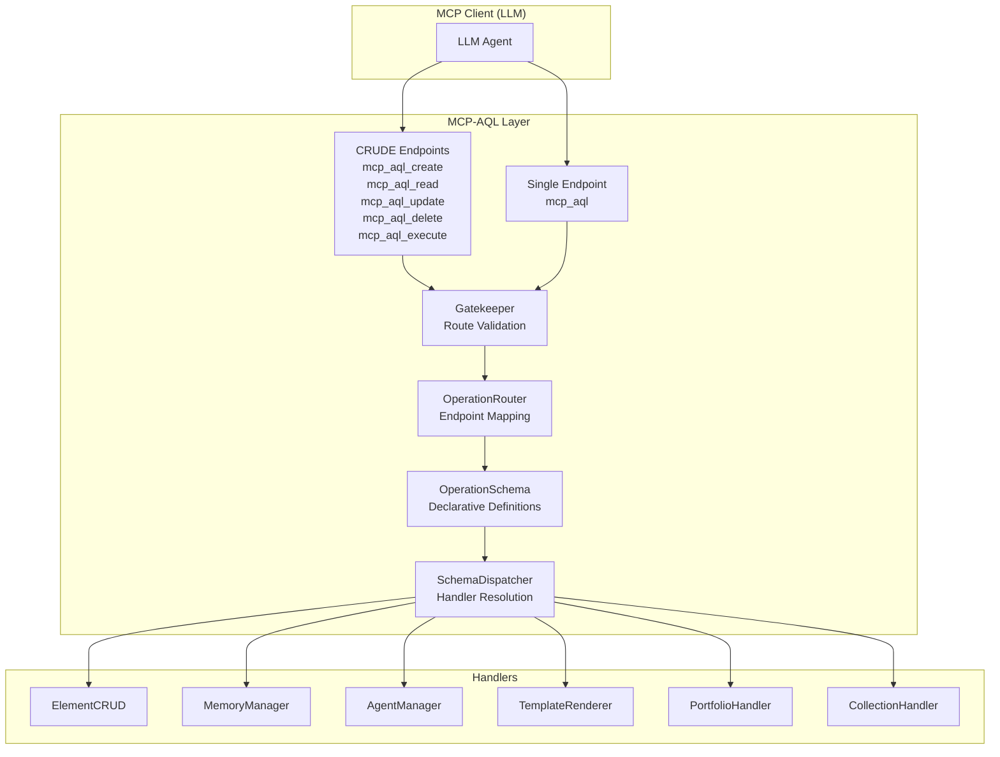
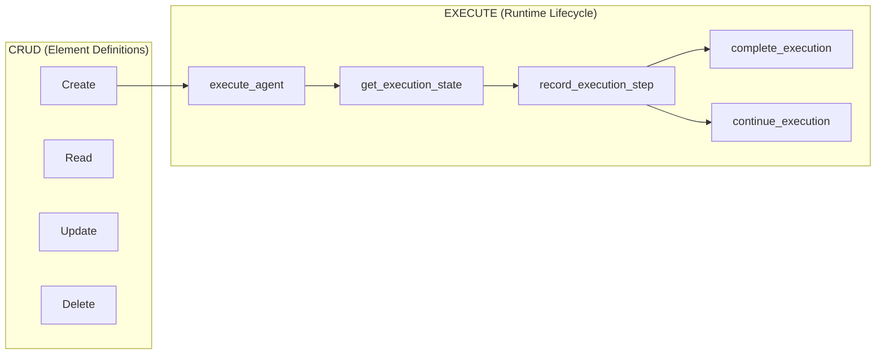
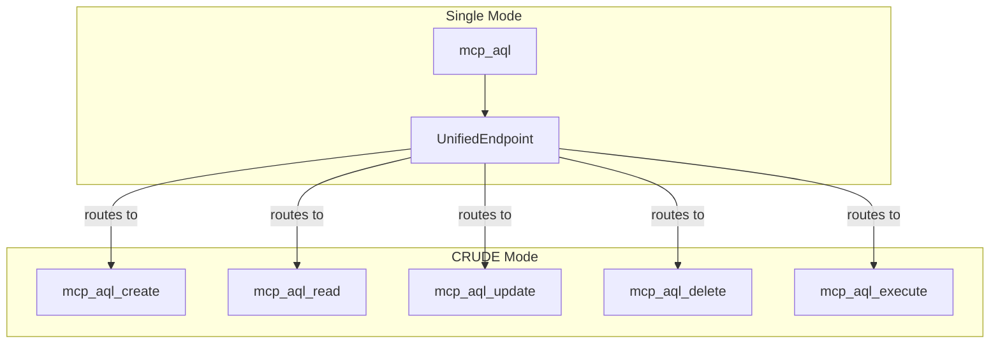
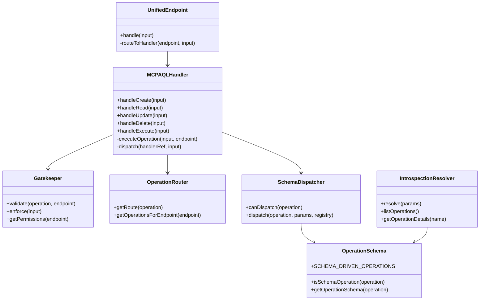
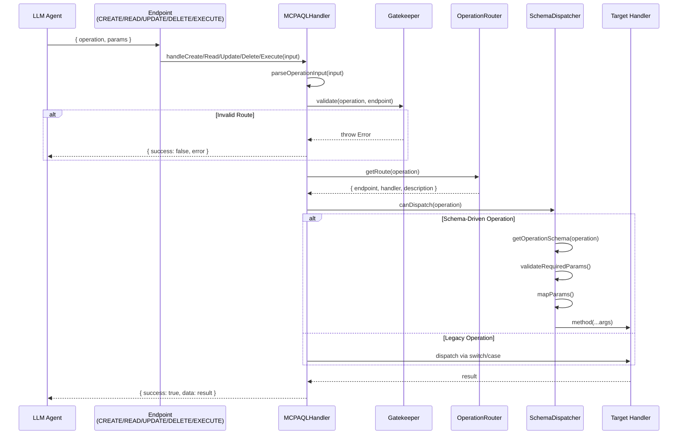

# MCP-AQL Architecture Overview

> **MCP-AQL** (Model Context Protocol - Agent Query Language) is a unified interface
> that consolidates 50+ discrete MCP tools into 5 CRUDE endpoints (Create, Read,
> Update, Delete, Execute), providing ~96% token reduction while maintaining full
> functionality.

## Table of Contents

- [Architecture Summary](#architecture-summary)
- [The CRUDE Pattern](#the-crude-pattern)
- [Endpoint Modes](#endpoint-modes)
- [Token Efficiency](#token-efficiency)
- [Core Components](#core-components)
- [Request Flow](#request-flow)

---

## Architecture Summary

MCP-AQL provides a schema-driven operation dispatch system that:

1. **Consolidates Operations** - 50+ tools into 5 endpoints
2. **Enables Discovery** - GraphQL-style introspection for operation discovery
3. **Enforces Security** - Gatekeeper validates endpoint/operation matching
4. **Supports Flexibility** - Choose between CRUDE mode (5 endpoints) or Single mode (1 endpoint)



---

## The CRUDE Pattern

MCP-AQL extends traditional CRUD with an **EXECUTE** endpoint, creating the CRUDE pattern:

| Endpoint | Safety | Description | Example Operations |
|----------|--------|-------------|-------------------|
| **CREATE** | Non-destructive | Additive operations that create new state | `create_element`, `import_element`, `activate_element` |
| **READ** | Read-only | Safe operations that query state | `list_elements`, `get_element`, `search`, `introspect` |
| **UPDATE** | Modifying | Operations that modify existing state | `edit_element` |
| **DELETE** | Destructive | Operations that remove state | `delete_element`, `clear` |
| **EXECUTE** | Stateful | Runtime lifecycle operations | `execute_agent`, `get_execution_state`, `complete_execution` |

### Permission Flags

Each endpoint has defined permission characteristics:

```typescript
// From src/handlers/mcp-aql/Gatekeeper.ts:67-73
private static readonly ENDPOINT_PERMISSIONS: Record<CRUDEndpoint, EndpointPermissions> = {
  CREATE: { readOnly: false, destructive: false },
  READ: { readOnly: true, destructive: false },
  UPDATE: { readOnly: false, destructive: true },
  DELETE: { readOnly: false, destructive: true },
  EXECUTE: { readOnly: false, destructive: true },  // Potentially destructive
};
```

### Why CRUDE not CRUD?

The EXECUTE endpoint was added because agent execution operations:
- Are inherently **non-idempotent** (calling `execute_agent` twice creates two executions)
- Manage **runtime state** rather than element definitions
- Require **lifecycle management** (start, update progress, complete)



---

## Endpoint Modes

MCP-AQL supports two operational modes, configurable via `MCP_INTERFACE_MODE`:

### CRUDE Mode (Default)

Exposes 5 separate endpoints, each with semantic meaning:

```
mcp_aql_create  - CREATE operations
mcp_aql_read    - READ operations
mcp_aql_update  - UPDATE operations
mcp_aql_delete  - DELETE operations
mcp_aql_execute - EXECUTE operations
```

**Advantages:**
- Clear semantic grouping
- Endpoint-level permission control
- Client can choose which endpoints to expose

**Token Cost:** ~4,314 tokens for tool registration

### Single Mode

Exposes 1 unified endpoint that routes internally:

```
mcp_aql - All operations through single entry point
```

**Advantages:**
- Minimal token footprint (~1,100 tokens)
- Simpler client integration
- Server-side routing enforcement

**Token Cost:** ~1,100 tokens for tool registration



---

## Token Efficiency

### Token Reduction Analysis

Empirical measurements from Claude Code MCP tool listing:

| Configuration | Tool Registrations | Measured Tokens | Reduction |
|--------------|-------------------|-----------------|-----------|
| Discrete Tools | 42 | **~29,592** | — |
| CRUDE Mode | 5 endpoints | **~4,314** | 85% |
| Single Mode | 1 endpoint | **~1,100** | 96% |

### How LLMs Discover Operations

Instead of parsing 50+ tool schemas, LLMs use introspection:

```typescript
// Query all available operations
{ operation: "introspect", params: { query: "operations" } }

// Get details for a specific operation
{ operation: "introspect", params: { query: "operations", name: "create_element" } }

// Query available types
{ operation: "introspect", params: { query: "types", name: "ElementType" } }
```

---

## Core Components

### Component Architecture



### File Locations

| Component | File Path | Responsibility |
|-----------|-----------|----------------|
| MCPAQLHandler | `src/handlers/mcp-aql/MCPAQLHandler.ts` | Main entry point, orchestrates dispatch |
| UnifiedEndpoint | `src/handlers/mcp-aql/UnifiedEndpoint.ts` | Single endpoint mode routing |
| Gatekeeper | `src/handlers/mcp-aql/Gatekeeper.ts` | Route validation, policy enforcement |
| OperationRouter | `src/handlers/mcp-aql/OperationRouter.ts` | Operation-to-endpoint mapping |
| OperationSchema | `src/handlers/mcp-aql/OperationSchema.ts` | Declarative operation definitions |
| SchemaDispatcher | `src/handlers/mcp-aql/SchemaDispatcher.ts` | Schema-driven handler dispatch |
| IntrospectionResolver | `src/handlers/mcp-aql/IntrospectionResolver.ts` | GraphQL-style introspection |

---

## Request Flow

### Standard Request Flow



### Batch Request Flow

MCP-AQL supports batch operations for executing multiple operations in a single request:

```typescript
// Batch request format
{
  operations: [
    { operation: "create_element", params: { ... } },
    { operation: "create_element", params: { ... } },
    { operation: "activate_element", params: { ... } }
  ]
}

// Batch result format
{
  success: true,
  results: [
    { index: 0, operation: "create_element", result: { success: true, data: ... } },
    { index: 1, operation: "create_element", result: { success: true, data: ... } },
    { index: 2, operation: "activate_element", result: { success: true, data: ... } }
  ],
  summary: { total: 3, succeeded: 3, failed: 0 }
}
```

---

## Related Documentation

- [OPERATIONS.md](./OPERATIONS.md) - Complete operation reference
- [INTROSPECTION.md](./INTROSPECTION.md) - Introspection system details
- [ENDPOINT_MODES.md](./ENDPOINT_MODES.md) - Mode configuration
- [DESIGN_DECISIONS.md](./DESIGN_DECISIONS.md) - Design rationale
- [DEBUGGING.md](./DEBUGGING.md) - Troubleshooting guide
