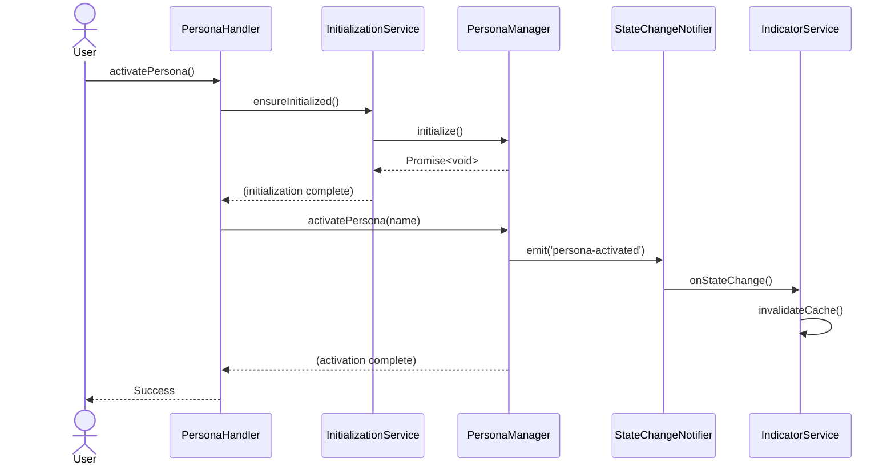

# Persona State Lifecycle & Indicator Flow

**Last Updated:** October 2025  
**Audience:** Contributors working on persona activation, status indicators, or initialization flows.  
**Key files:**
- `src/services/InitializationService.ts`
- `src/services/StateChangeNotifier.ts`
- `src/services/IndicatorService.ts`
- `src/persona/PersonaManager.ts`
- `src/di/Container.ts`

---

## 1. Goals

The persona subsystem has two user-facing responsibilities:

1. **Activate personas safely** before any handler reads the portfolio (prevents race conditions during server startup).  
2. **Display the current persona indicator** consistently in every MCP response.

Three cooperating services manage this lifecycle: `InitializationService`, `StateChangeNotifier`, and `IndicatorService`.



---

## 2. InitializationService

Located in `src/services/InitializationService.ts`, this lightweight coordinator ensures the persona portfolio is loaded exactly once even when multiple handlers request it concurrently.

Workflow:
1. `ensureInitialized()` is called from handlers (e.g., `PersonaHandler`, `ElementCRUDHandler`) before serving requests.
2. The first call kicks off `PersonaManager.initialize()` and stores a promise.
3. Subsequent callers await the same promise instead of re-triggering IO.
4. Failures reset `initialized = false` so retries are possible.

Why this matters: calling `PersonaManager.initialize()` ad hoc can cause duplicate loads and sporadic failures in tests that skip the `run()` entrypoint.

---

## 3. StateChangeNotifier

`StateChangeNotifier` (`src/services/StateChangeNotifier.ts`) is a small `EventEmitter` subclass that broadcasts persona lifecycle events:

```ts
type PersonaStateChangeType = 'persona-activated' | 'persona-deactivated' | 'user-changed';
```

`PersonaManager` publishes events whenever:
- A persona is activated/deactivated.
- The active user (for attribution) changes.

Consumers subscribe to both the generic `state-change` channel and specific typed channels (`state-change:persona-activated`). Disposal simply removes all listeners.

---

## 4. IndicatorService

`IndicatorService` (`src/services/IndicatorService.ts`) centralizes the persona indicator formatting logic that used to live inside handler scaffolding.

Key behaviors:
- Injected with `PersonaManager`, `IndicatorConfig`, and optional `StateChangeNotifier`.
- Caches the rendered indicator (`formatIndicator`) keyed by persona filename.
- Listens for state-change events to invalidate the cache.
- Supports a fallback provider so handlers can render alternative banners when no persona is active.
- Exposes `updateConfig()` to respond to dynamic config edits (e.g., hiding version numbers).

Every handler that needs the banner—`PersonaHandler`, `PortfolioHandler`, `EnhancedIndexHandler`, etc.—receives `IndicatorService` via DI, ensuring consistent styling and avoiding duplicated formatting code.

---

## 5. DI Container Wiring

`src/di/Container.ts` constructs the services in this order:

```ts
const personaManager = new PersonaManager(...);
const stateChangeNotifier = new StateChangeNotifier();
const indicatorService = new IndicatorService(personaManager, indicatorConfig, stateChangeNotifier);
const initService = new InitializationService(personaManager);
```

Handlers receive both `indicatorService` and `initService`, guaranteeing:
- initialization → persona directory ready before use;
- indicator cache invalidation when personas change.

---

## 6. Testing Notes

- `tests/unit/persona/PersonaManager.test.ts` validates activation/notification behaviors.  
- `tests/unit/services/IndicatorService.test.ts` (if absent, add) should cover cache invalidation and fallback handling.  
- Integration tests that activate personas should confirm indicator output in tool responses (snapshot regression).

---

## 7. Future Enhancements

- **Session-scoped indicators:** allow multi-session differentiation via notifier events.  
- **Telemetry hooks:** emit persona changes to analytics for usage tracking.  
- **Graceful shutdown:** coordinate `dispose()` calls across manager/notifier/indicator to prevent memory leaks in long-lived processes.

---

## 8. Related Documentation

- `docs/architecture/overview.md` – high-level component relationships.  
- `docs/agent/development/SESSION_MANAGEMENT.md` – operational guidance for persona activation during development sessions.  
- `src/config/indicator-config.ts` – customization options for indicator appearance.
