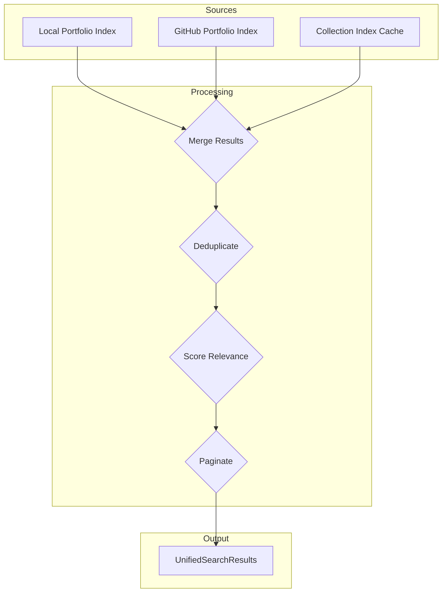

# Unified Search Pipeline

**Last Updated:** October 2025  
**Audience:** Engineers maintaining `search_all`, `search_portfolio`, and GitHub/collection discovery features.  
**Primary code:** `src/portfolio/UnifiedIndexManager.ts`, `src/handlers/PortfolioHandler.ts`, `src/server/tools/PortfolioTools.ts`.

---

## 1. Responsibility Overview

`UnifiedIndexManager` provides a single entry point for search across three sources:

1. **Local portfolio** (`PortfolioIndexManager`)  
2. **GitHub portfolio** (`GitHubPortfolioIndexer` + `GitHubClient`)  
3. **Community collection** (`CollectionIndexCache`)

The manager normalizes results, annotates matches (name, keyword, trigger), detects duplicates/version drift, and maintains caches for fast repeat queries.

---

## 2. High-Level Flow

```
searchAll(options)         (PortfolioHandler)
     │
     └──► UnifiedIndexManager.search()
              │
              ├─► Local index (PortfolioIndexManager)
              ├─► GitHub indexer (GitHubPortfolioIndexer + GitHubClient)
              └─► Collection cache (CollectionIndexCache)
              │
              ▼
        Merge + dedupe + scoring
              │
              ▼
        Return UnifiedSearchResult[]
```

Each source can be toggled via `options.sources` (`local`, `github`, `collection`). Pagination, sorting, and type filters (`personas`, `skills`, etc.) are applied after aggregation.

---

## Detailed Data Flow



---

## 3. Source Integrations

### Local Portfolio
`PortfolioIndexManager.getIndex()` returns a precomputed structure with name, description, keywords, tags, triggers, and filesystem metadata. The unified manager queries against this map using:

- Name equality / slug matching  
- Keyword overlap / fuzzy search  
- Trigger match (leverages Enhanced Index metadata when available)

### GitHub Portfolio
`GitHubPortfolioIndexer` lazily fetches and caches element listings from the authenticated user’s GitHub repo. It uses `GitHubClient` with rate-limited API calls and respects TTL configured in `IndexConfigManager`.

### Community Collection
`CollectionIndexCache` downloads `collection-index.json` from `dollhousemcp.github.io`. Conditional requests (ETag/Last-Modified) avoid redundant downloads. When offline or unable to fetch, it falls back to the last on-disk snapshot.

---

## 4. Result Normalization

Every `UnifiedSearchResult` includes:

| Field | Description |
|-------|-------------|
| `entry` | Normalized metadata (type, name, description, version, tags). |
| `source` | `local`, `github`, or `collection`. |
| `matchType` | Primary match reason (`name`, `keyword`, `trigger`, `tag`). |
| `score` | Composite score (0–1) combining fuzzy match and semantic weights. |
| `isDuplicate` | Flag when same element exists in multiple sources. |
| `versionConflict` | Optional recommendation (e.g., “Use 1.2.0 from GitHub; local is 1.0.0”). |

Duplicate detection relies on canonicalized names plus semantic similarity; duplicates are marked but not collapsed so the caller can choose which to inspect.

---

## 5. Caching Strategy

| Cache | Purpose | Implementation |
|-------|---------|----------------|
| Result cache | Recent search queries (keyed by normalized options) | LRU cache (`CacheFactory.createSearchResultCache`) with TTL ~5 minutes |
| Index cache | Source index snapshots for merged view | LRU cache (`CacheFactory.createIndexCache`) |
| Collection cache | Raw collection index | `CollectionIndexCache` (see companion document) |

`UnifiedIndexManager` also tracks ownership of injected dependencies so DI can reuse singletons or allow tests to supply mocks.

---

## 6. Handler Integration

`PortfolioHandler.searchAll()` orchestrates validation, option parsing, and response formatting:

1. Validate query string and optional type filter.  
2. Determine included sources.  
3. Call `unifiedIndexManager.search(options)`.  
4. Format Markdown response with icons, match summaries, duplicate warnings, and pagination hints.

`PortfolioTools.ts` exposes `search_all` as an MCP tool; CLI/AI clients can call it directly with JSON payloads.

---

## 7. Error Handling

- Each source call is wrapped in try/catch. Failures are logged via `ErrorHandler` with context (query, source).  
- If one source fails (e.g., GitHub rate limit), other sources still contribute results.  
- Sanitized error messages are returned to the MCP client on fatal failures.

---

## 8. Testing

- Unit coverage lives under `tests/unit/portfolio/UnifiedIndexManager.test.ts`.  
- Integration coverage exercises `PortfolioHandler` and the MCP tool surfaces.  
- When editing duplicate detection or scoring, update/extend fixtures to keep regression expectations in lockstep.

---

## 9. Future Enhancements

- Weighted scoring based on usage telemetry (`context` block in capability index).  
- Smarter pagination / streaming for large result sets.  
- Selective source refresh (e.g., manual “pull latest GitHub index” command).  
- Richer duplicate resolution output (explicit diff summary).
