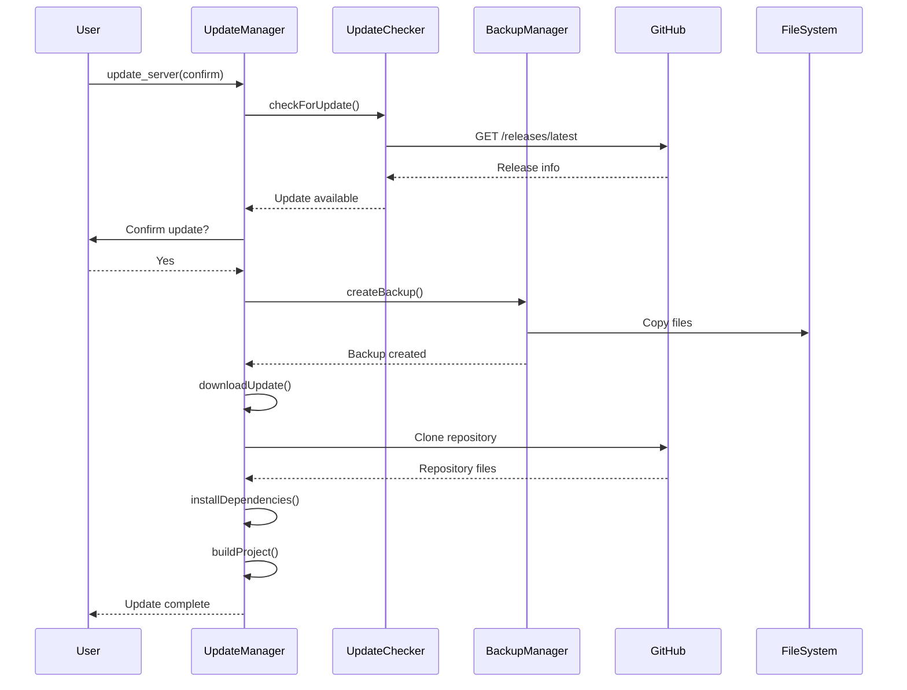

# Auto-Update System Architecture

## Overview

The DollhouseMCP auto-update system is designed with a modular architecture that emphasizes security, reliability, and user control. The system integrates directly with GitHub releases and provides a seamless update experience through MCP tools.

## Architecture Diagram

```
┌─────────────────────────────────────────────────────────┐
│                    MCP Interface                         │
│  ┌──────────────┐  ┌──────────────┐  ┌──────────────┐  │
│  │check_for_    │  │update_server │  │rollback_     │  │
│  │updates       │  │              │  │update        │  │
│  └──────┬───────┘  └──────┬───────┘  └──────┬───────┘  │
└─────────┼──────────────────┼──────────────────┼─────────┘
          │                  │                  │
          ▼                  ▼                  ▼
    ┌─────────────────────────────────────────────────┐
    │                UpdateManager                     │
    │  - Orchestrates update workflow                 │
    │  - Manages state transitions                    │
    │  - Coordinates component interactions           │
    └──────┬────────┬────────┬────────┬──────────────┘
           │        │        │        │
           ▼        ▼        ▼        ▼
    ┌──────────┐┌──────────┐┌──────────┐┌──────────┐
    │Update    ││Backup    ││Version   ││Dependency│
    │Checker   ││Manager   ││Manager   ││Checker   │
    └─────┬────┘└─────┬────┘└─────┬────┘└─────┬────┘
          │           │           │           │
          ▼           ▼           ▼           ▼
    ┌──────────┐┌──────────┐┌──────────────────────┐
    │Rate      ││Signature ││   GitHub API /      │
    │Limiter   ││Verifier  ││   File System       │
    └──────────┘└──────────┘└──────────────────────┘
```

## Component Responsibilities

### UpdateManager
The central orchestrator that coordinates all update operations:
- Manages the complete update lifecycle
- Handles user interactions and confirmations
- Coordinates backup, download, and installation
- Provides rollback functionality
- Ensures atomic operations

### UpdateChecker
Responsible for checking GitHub for new releases:
- Fetches latest release information from GitHub API
- Compares versions using semantic versioning
- Sanitizes release notes for security
- Implements retry logic with exponential backoff
- Caches results to reduce API calls

### BackupManager
Manages backup creation and restoration:
- Creates timestamped backup directories
- Implements safe copy operations
- Validates backup integrity
- Manages backup retention (keeps 5 most recent)
- Provides rollback functionality
- Detects production/Docker environments

### VersionManager
Handles version parsing and comparison:
- Parses semantic versions (including pre-release)
- Compares versions for update eligibility
- Validates version formats
- Reads version from package.json

### RateLimiter
Implements token bucket algorithm for API rate limiting:
- 10 requests per minute default
- 5 requests burst capacity
- Thread-safe implementation
- Configurable limits
- Prevents API abuse

### SignatureVerifier
Validates GPG signatures on releases:
- Downloads and verifies .sig files
- Manages GPG keyring
- Provides trust verification
- Optional but recommended for production

### DependencyChecker
Validates system dependencies:
- Checks Git version (2.20.0-2.50.0)
- Checks npm version (8.0.0-12.0.0)
- Validates command availability
- Provides clear error messages

## Update Process Flow



## State Management

The system maintains several states during operation:

1. **Idle** - No update operation in progress
2. **Checking** - Querying GitHub for updates
3. **Backing Up** - Creating backup of current installation
4. **Downloading** - Fetching update from GitHub
5. **Installing** - Running npm install and build
6. **Completed** - Update successfully installed
7. **Failed** - Update failed (rollback available)

## Error Handling

Each component implements comprehensive error handling:
- **Graceful Degradation** - Non-critical failures don't stop updates
- **Detailed Logging** - All operations logged for debugging
- **User-Friendly Messages** - Clear error descriptions
- **Automatic Cleanup** - Failed updates clean up resources
- **Rollback Support** - Easy recovery from failures

## Security Architecture

Multiple layers of security protection:

1. **Input Validation**
   - DOMPurify for XSS prevention
   - Regex patterns for injection detection
   - URL whitelist validation

2. **Command Execution**
   - Uses spawn() instead of exec()
   - No shell interpretation
   - Argument sanitization

3. **API Protection**
   - Rate limiting
   - Timeout controls
   - Retry limits

4. **File System Safety**
   - Path traversal prevention
   - Production directory protection
   - Safe file operations

## Performance Considerations

- **Caching** - API responses cached for 15 minutes
- **Parallel Operations** - Where safe, operations run in parallel
- **Resource Limits** - Memory and CPU constraints
- **Timeout Controls** - All operations have timeouts
- **Efficient Backups** - Only necessary files backed up

## Extensibility

The modular design allows for easy extension:
- Custom update sources (beyond GitHub)
- Alternative backup strategies
- Additional verification methods
- Custom notification systems
- Integration with CI/CD pipelines