# Release Lifecycle and Versioning Guide

This guide explains how DollhouseMCP manages releases, from early development through stable production. It covers versioning conventions, branch strategies, npm publishing, and the complete flow from feature development to user availability.

## Overview

DollhouseMCP follows a structured release lifecycle that enables:

- **Parallel development**: Work on new features while stabilizing releases
- **Early access**: Let users test pre-release versions before they're stable
- **Traceability**: Every build maps to a specific commit
- **Safety**: Stable users are never accidentally upgraded to unstable code

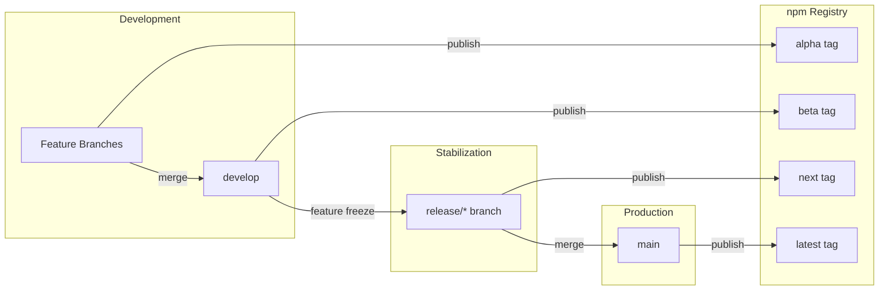

## Semantic Versioning

DollhouseMCP uses [Semantic Versioning 2.0](https://semver.org/) (SemVer) for all releases.

### Version Format

```
MAJOR.MINOR.PATCH-PRERELEASE+BUILD
```

| Component | When to Increment | Example |
|-----------|-------------------|---------|
| **MAJOR** | Breaking changes that require user action | `2.0.0` |
| **MINOR** | New features, backwards compatible | `1.7.0` |
| **PATCH** | Bug fixes only | `1.6.5` |
| **PRERELEASE** | Pre-release identifier | `2.0.0-beta.3` |
| **BUILD** | Build metadata (commit hash) | `2.0.0-beta.3+b96ef61` |

### Pre-release Identifiers

Pre-release versions use a channel name and iteration number:

```
2.0.0-alpha.feature-oauth.1    # Feature-specific alpha
2.0.0-alpha.fix-42.1           # Fix-specific alpha
2.0.0-beta.3                   # Integration beta
2.0.0-rc.1                     # Release candidate
2.0.0                          # Stable release
```

### Version Sorting

SemVer defines a strict sort order. Pre-release versions always sort below their stable counterpart:

```
2.0.0-alpha.1 < 2.0.0-alpha.2 < 2.0.0-beta.1 < 2.0.0-beta.2 < 2.0.0-rc.1 < 2.0.0
```

This means users requesting `^2.0.0` will never accidentally receive a pre-release version.

## Release Channels

DollhouseMCP uses four release channels, each serving a different audience and purpose.

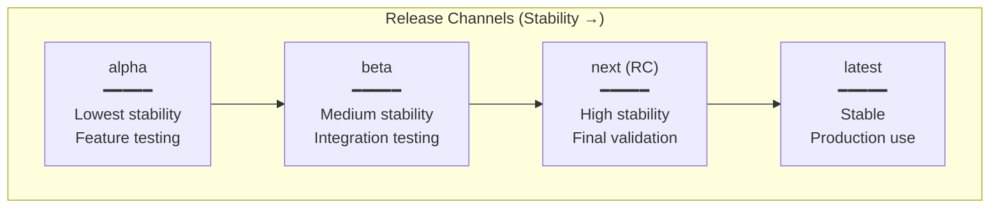

### Channel Details

| Channel | npm Tag | Source Branch | Audience | Stability |
|---------|---------|---------------|----------|-----------|
| **Alpha** | `@alpha` | feature/*, fix/* | Core team, specific testers | Lowest - features incomplete |
| **Beta** | `@beta` | develop | Adventurous users, early adopters | Medium - features complete, bugs expected |
| **Release Candidate** | `@next` | release/* | Wider testing, production validation | High - bug fixes only |
| **Stable** | `@latest` | main | Everyone | Production-ready |

### How Users Install Each Channel

```bash
# Stable (default) - what most users should use
npm install @dollhousemcp/mcp-server

# Beta - for early adopters who want new features
npm install @dollhousemcp/mcp-server@beta

# Release candidate - for testing upcoming stable releases
npm install @dollhousemcp/mcp-server@next

# Alpha - for specific feature testing
npm install @dollhousemcp/mcp-server@alpha

# Specific version - when you need an exact version
npm install @dollhousemcp/mcp-server@2.0.0-beta.3
```

## Branch Strategy

The branch strategy supports parallel development while maintaining stability.

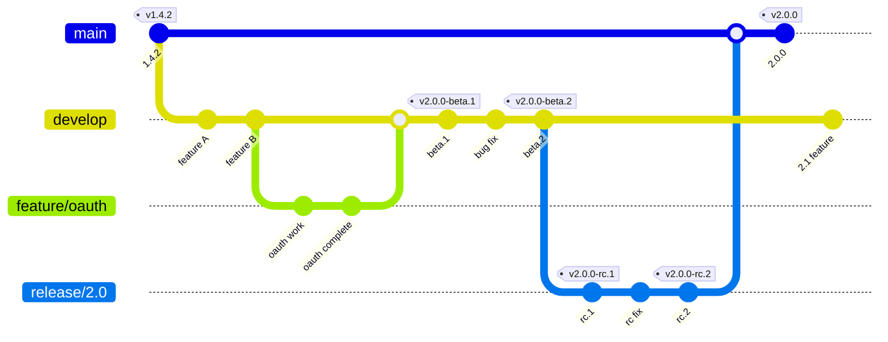

### Branch Types

| Branch | Purpose | Merges To | npm Publishes |
|--------|---------|-----------|---------------|
| `main` | Stable releases only | - | `@latest` |
| `develop` | Integration branch | main (via release/*) | `@beta` |
| `feature/*` | New features | develop | `@alpha` (optional) |
| `fix/*` | Bug fixes | develop | `@alpha` (optional) |
| `release/*` | Release stabilization | main, then develop | `@next` |
| `hotfix/*` | Emergency production fixes | main, then develop | `@latest` |

### The Release Branch (Approach 2: More Controlled)

When preparing a release, we create a dedicated release branch. This allows:

1. **Continued development**: New features for the next version continue on `develop`
2. **Focused stabilization**: Only bug fixes go into the release branch
3. **Parallel work**: No one is blocked waiting for the release

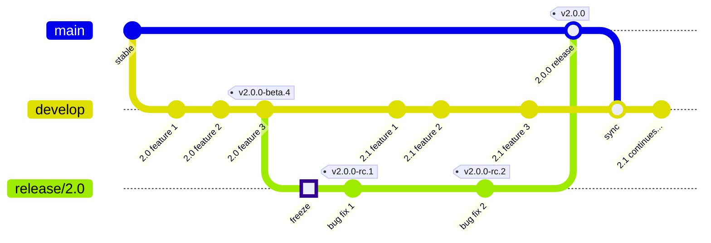

**Key point**: After the release branch is created ("freeze" point), `develop` continues with 2.1.0 features while `release/2.0` only receives bug fixes.

## Complete Release Lifecycle

### Phase 1: Feature Development

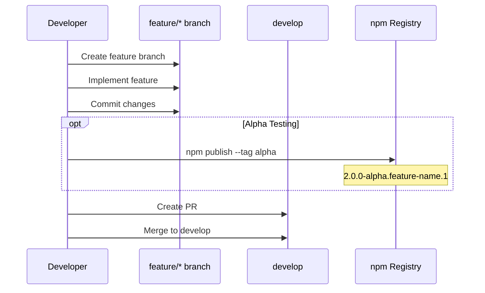

Features are developed on feature branches. Alpha publishes are optional - use them when you need external testers for a specific feature.

### Phase 2: Integration (Beta)

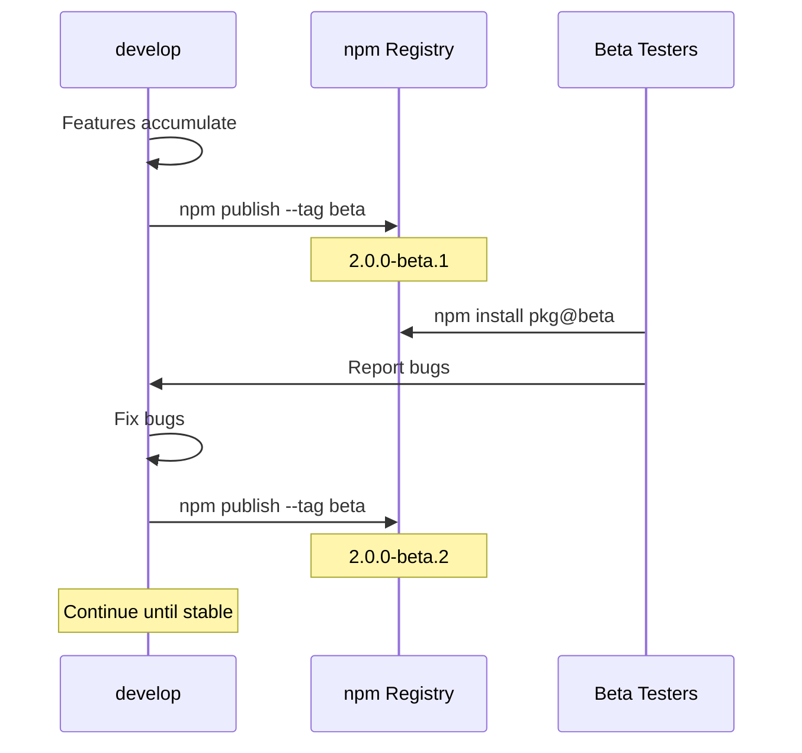

Beta versions are published regularly from `develop`. Early adopters can install `@beta` to get the latest integrated features.

### Phase 3: Release Candidate

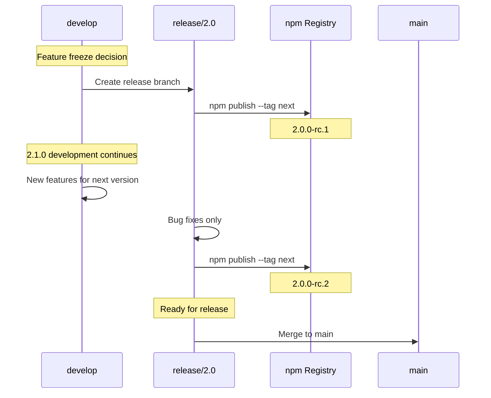

The release branch is created when you decide to freeze features. From this point:
- `release/*` only receives bug fixes
- `develop` continues with next version features

### Phase 4: Stable Release

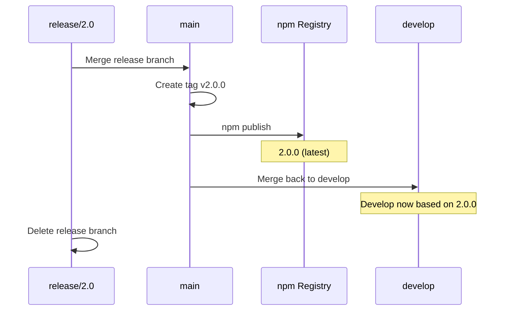

After merging to main and publishing, merge main back to develop so future work includes all release fixes.

## npm Publishing

### Understanding npm Tags vs Versions

| Concept | What It Is | Behavior |
|---------|------------|----------|
| **Version** | Permanent, immutable snapshot | `2.0.0-beta.1` exists forever |
| **Tag** | Mutable pointer to a version | `@beta` can point to different versions over time |

Tags work like git branches - they move. Versions work like git commits - they're permanent.

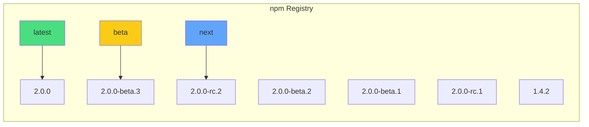

### Publishing Commands

```bash
# Beta release (from develop)
npm version 2.0.0-beta.3 --no-git-tag-version
npm run build
npm publish --tag beta

# Release candidate (from release/*)
npm version 2.0.0-rc.1 --no-git-tag-version
npm run build
npm publish --tag next

# Stable release (from main)
npm version 2.0.0
npm run build
npm publish
```

### Viewing Published Versions

```bash
# See all versions and tags
npm view @dollhousemcp/mcp-server

# See just the dist-tags (which versions tags point to)
npm view @dollhousemcp/mcp-server dist-tags

# See all published versions
npm view @dollhousemcp/mcp-server versions
```

### Safety Features

npm provides built-in safety for pre-releases:

1. **Default installs get stable only**: `npm install pkg` always gets `@latest`
2. **Explicit opt-in required**: Users must request `@beta` or `@next`
3. **Version resolution prefers stable**: Semver ranges like `^2.0.0` skip pre-releases

### If You Make a Mistake

```bash
# Unpublish within 72 hours (npm policy)
npm unpublish @dollhousemcp/mcp-server@2.0.0-beta.1

# Or deprecate (always available, preferred for older versions)
npm deprecate @dollhousemcp/mcp-server@2.0.0-beta.1 "Use beta.2 instead"

# Always do a dry run first
npm publish --tag beta --dry-run
```

## Version String Format

Every build includes the commit hash for traceability.

### Format by Branch Type

| Branch | Version Format | Example |
|--------|----------------|---------|
| main | `X.Y.Z` | `2.0.0` |
| develop | `X.Y.Z-beta.N+HASH` | `2.0.0-beta.3+b96ef61` |
| release/* | `X.Y.Z-rc.N+HASH` | `2.0.0-rc.1+819d41e` |
| feature/* | `X.Y.Z-alpha.BRANCH.N+HASH` | `2.0.0-alpha.feature-oauth.1+a1b1822` |
| fix/* | `X.Y.Z-alpha.BRANCH.N+HASH` | `2.0.0-alpha.fix-42.1+579aea9` |

### Commit Hash Traceability

The `+HASH` suffix (build metadata) provides:

- **Exact reproducibility**: Check out that commit to get the same code
- **Debugging**: Know exactly which code is running
- **Audit trail**: Trace any build back to its source

**Note**: npm ignores build metadata for version comparison but preserves it for display.

## Quick Reference

### Which Branch to Use

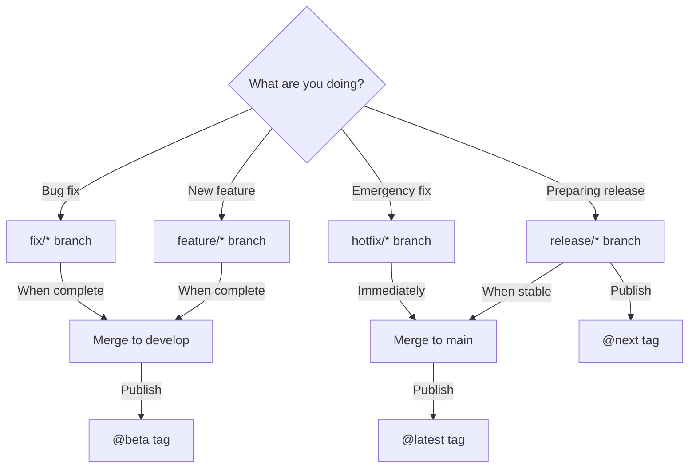

### Typical Release Flow Commands

```bash
# 1. Create release branch when ready to stabilize
git checkout develop
git checkout -b release/2.0

# 2. Update version and publish RC
npm version 2.0.0-rc.1 --no-git-tag-version
npm run build
npm publish --tag next

# 3. Fix any bugs found, publish more RCs as needed
# ... make fixes ...
npm version 2.0.0-rc.2 --no-git-tag-version
npm run build
npm publish --tag next

# 4. When stable, merge to main
git checkout main
git merge release/2.0

# 5. Tag and publish stable
npm version 2.0.0
npm run build
npm publish
git tag v2.0.0
git push origin v2.0.0

# 6. Merge back to develop
git checkout develop
git merge main
git push

# 7. Clean up
git branch -d release/2.0
git push origin --delete release/2.0
```

## Common Scenarios

### Scenario 1: Publishing a Feature for Testing

You've completed a feature and want specific users to test it before merging.

```bash
# On your feature branch
npm version 2.0.0-alpha.feature-dark-mode.1 --no-git-tag-version
npm run build
npm publish --tag alpha

# Tell your tester:
# "Install with: npm install @dollhousemcp/mcp-server@2.0.0-alpha.feature-dark-mode.1"
```

### Scenario 2: Regular Beta Release from Develop

You've merged several features and want early adopters to test.

```bash
git checkout develop
npm version 2.0.0-beta.5 --no-git-tag-version
npm run build
npm publish --tag beta
```

### Scenario 3: Starting Release Stabilization

Features are complete for 2.0.0, time to stabilize.

```bash
# Create release branch
git checkout develop
git checkout -b release/2.0

# Publish first RC
npm version 2.0.0-rc.1 --no-git-tag-version
npm run build
npm publish --tag next

# Develop can now continue with 2.1.0 features
```

### Scenario 4: Hotfix in Production

Critical bug found in production that can't wait for the normal release cycle.

```bash
git checkout main
git checkout -b hotfix/critical-auth-bug

# Make the fix
npm version 2.0.1 --no-git-tag-version
npm run build

# Merge and publish immediately
git checkout main
git merge hotfix/critical-auth-bug
npm publish
git tag v2.0.1
git push origin v2.0.1

# Merge to develop to include the fix
git checkout develop
git merge main
```

## Beta Tester Communication

Effective communication with beta testers helps identify issues early and builds community engagement.

### Feedback Channels

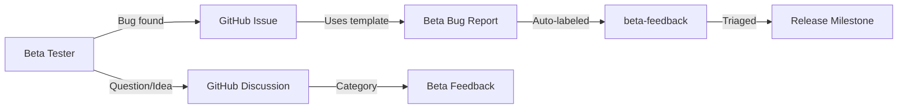

| Feedback Type | Where to Direct | Why |
|---------------|-----------------|-----|
| **Bug reports** | GitHub Issues | Trackable, assignable, linkable to PRs |
| **Questions** | GitHub Discussions | Conversational, no action required |
| **Ideas/Impressions** | GitHub Discussions | Open-ended, community can engage |
| **Security issues** | Private email | Responsible disclosure |

### Beta Bug Report Template

A dedicated issue template (`.github/ISSUE_TEMPLATE/beta_bug_report.md`) captures:

- **Version information**: Exact pre-release version and channel
- **Regression check**: Did this work in a previous version?
- **Environment details**: OS, Node version, AI client
- **Impact assessment**: How severely does this affect testing?

### Labels for Triage

| Label | Purpose |
|-------|---------|
| `beta-feedback` | All issues from pre-release testing |
| `type: bug` | Confirmed bugs |
| `priority: *` | Severity for release planning |

### Beta Release Notes Template

When publishing a beta, include clear guidance for testers:

```markdown
## What's New in 2.0.0-beta.3

### Features
- Feature A: Brief description
- Feature B: Brief description

### Bug Fixes
- Fixed issue with X (#123)

### Known Issues
- Issue Y is still being investigated (#456)

---

## Testing This Release

Install with:
\`\`\`bash
npm install @dollhousemcp/mcp-server@beta
\`\`\`

**Found a bug?** [Open an issue](https://github.com/DollhouseMCP/mcp-server/issues/new?template=beta_bug_report.md)

**Questions or feedback?** [Start a discussion](https://github.com/DollhouseMCP/mcp-server/discussions/categories/beta-feedback)

Please include your version (`2.0.0-beta.3+b96ef61`) in all reports.
```

### Communicating Breaking Changes

For pre-releases with breaking changes, clearly document:

1. **What changed**: Specific API or behavior changes
2. **Why it changed**: Rationale for the breaking change
3. **Migration path**: How to update existing code
4. **Timeline**: When this will reach stable

## Related Documentation

- [Development Workflow](./workflow.md) - Branch naming and PR process
- [Release Workflow](../agent/RELEASE_WORKFLOW.md) - Detailed release steps
- [CONTRIBUTING.md](../CONTRIBUTING.md) - Contributing guidelines
- [Version Script](../../scripts/update-version.mjs) - Automated version updates

---

*Last Updated: December 2025*
*Maintainer: @mickdarling*
