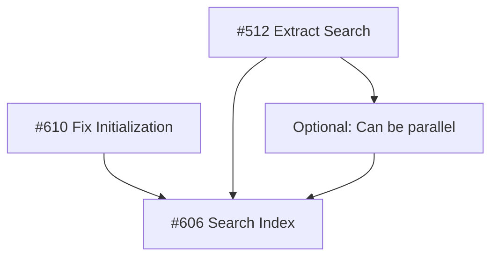

# Coordination Plan - Search Index & Related Fixes

**Date**: August 16, 2025  
**Goal**: Get PR #606 (search index) working with bite-sized fixes  
**Approach**: Fix blocking issues in small, focused PRs

## Current Situation

### PR #606 Status
- **Branch**: feature/search-index-implementation
- **Blocking Issue**: MCP server doesn't respond to commands
- **File Size**: index.ts is 176KB (4,941 lines) → 633KB compiled
- **Tests**: Docker tests fail due to initialization race condition

### Related Issues

| Issue | Title | Priority | Status | Blocks |
|-------|-------|----------|--------|--------|
| #610 | Fix race condition in server initialization | HIGH | New | #606 |
| #512 | Refactor: Clean up root directory clutter and split massive index.ts | MEDIUM | Open | #606 performance |
| #606 | Search index implementation | HIGH | In Progress | - |

## Bite-Sized Execution Plan

### Step 1: Fix Initialization Race Condition (#610) 
**Size**: Small (1-2 hours)  
**Branch**: `fix/server-initialization-race-condition`  
**Changes**:
```typescript
// Move initialization from constructor to run()
async run() {
  await this.initializePortfolio();  // Wait for this
  await this.server.connect(transport);  // Then connect
}
```
**Testing**:
- Verify MCP responds to commands
- Docker tests should pass
- All existing tests still pass

### Step 2: Extract Search Module (Part of #512)
**Size**: Medium (3-4 hours)  
**Branch**: `refactor/extract-search-module`  
**Changes**:
1. Create `src/search/` directory
2. Move search-related code from index.ts:
   - UnifiedSearchManager
   - SearchIndex classes
   - Search-related tools
3. Import in index.ts
4. Reduces index.ts by ~30%

**Files to create**:
```
src/search/
├── UnifiedSearchManager.ts
├── SearchIndexManager.ts
├── types.ts
└── index.ts
```

### Step 3: Extract Portfolio Tools (Part of #512)
**Size**: Medium (2-3 hours)  
**Branch**: `refactor/extract-portfolio-tools`  
**Changes**:
1. Create `src/tools/portfolio/` directory
2. Move portfolio sync methods from index.ts
3. Extract the massive `syncPortfolio` method (646 lines!)
4. Reduces index.ts by another ~20%

### Step 4: Merge Fixes & Complete Search Index
**Size**: Large (depends on remaining work)  
**Branch**: Continue on `feature/search-index-implementation`  
**Steps**:
1. Merge develop (with fixes) into PR #606
2. Resolve any conflicts
3. Verify Docker tests pass
4. Complete remaining search functionality
5. Final testing and documentation

## Dependencies & Order



## Success Criteria

### Per Step
- **Step 1**: Docker tests pass, MCP responds
- **Step 2**: index.ts < 120KB, search works
- **Step 3**: index.ts < 100KB, portfolio works
- **Step 4**: All tests pass, search index complete

### Overall
- PR #606 can be merged
- Docker tests reliable
- Code is maintainable
- File sizes reasonable

## Risk Mitigation

### Potential Issues
1. **Risk**: Breaking existing functionality during refactor
   - **Mitigation**: Comprehensive tests before moving code
   - **Mitigation**: Move in small chunks, test each

2. **Risk**: Merge conflicts in PR #606
   - **Mitigation**: Frequent rebasing
   - **Mitigation**: Keep changes isolated

3. **Risk**: Hidden dependencies in index.ts
   - **Mitigation**: Use TypeScript compiler to find issues
   - **Mitigation**: Run full test suite after each change

## Commands Reference

### Working on Step 1 (Initialization Fix)
```bash
git checkout develop
git pull origin develop
git checkout -b fix/server-initialization-race-condition
# Make changes
npm test
npm run build
# Test MCP
echo '{"jsonrpc":"2.0","method":"initialize","params":{},"id":1}' | node dist/index.js
```

### Working on Step 2 (Extract Search)
```bash
git checkout develop
git checkout -b refactor/extract-search-module
mkdir -p src/search
# Move code
npm test -- --testNamePattern="search"
```

### Checking Progress
```bash
# Check file size
wc -l src/index.ts

# Check Docker tests
docker compose --file docker/docker-compose.yml run --rm -T dollhousemcp

# Check PR status
gh pr checks 606
```

## Communication Plan

### PR Descriptions
Each PR should reference:
- Which issue it addresses
- How it helps PR #606
- What specific problem it solves
- Testing performed

### Example PR Description
```markdown
## Fixes #610 - Server initialization race condition

This PR fixes the race condition that prevents the MCP server from responding to commands.

### Problem
Server was connecting to MCP before portfolio/personas were loaded.

### Solution
Moved initialization to `run()` method to ensure proper sequencing.

### Impact
- Unblocks PR #606 (search index)
- Fixes Docker test timeouts
- Ensures MCP commands work

### Testing
- [x] MCP responds to initialize command
- [x] Docker tests pass
- [x] All existing tests pass
```

## Timeline Estimate

| Step | Estimated Time | Dependencies | Can Start |
|------|----------------|--------------|-----------|
| Fix Initialization | 1-2 hours | None | Immediately |
| Extract Search | 3-4 hours | None | Immediately |
| Extract Portfolio | 2-3 hours | Extract Search (optional) | After Search |
| Complete #606 | 4-6 hours | All above | After fixes merged |

**Total**: 10-15 hours of focused work

## Next Actions

1. ✅ Create Issue #610 (initialization fix)
2. ✅ Link to Issue #512 (refactoring)
3. ⏳ Start Step 1: Fix initialization
4. ⏳ Start Step 2: Extract search (can be parallel)
5. ⏳ Coordinate merges carefully

---
*This plan provides a clear, bite-sized approach to unblock PR #606*