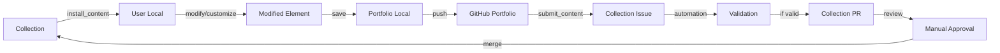

# Next Steps: Complete the Roundtrip Workflow

**Created**: August 12, 2025  
**Context**: Following security fix, need to complete the content lifecycle loop  
**Priority**: CRITICAL - This is the core functionality of the MCP ecosystem  

## The Complete Roundtrip Workflow Vision



## Current State Assessment

### ✅ What's Working
1. **Collection → User**: `install_content` tool works
2. **Basic Validation**: Content validation in place
3. **Local Portfolio**: Storage structure exists
4. **Issue Creation**: Can create GitHub issues

### ⚠️ Partially Complete
1. **submit_content**: Creates issues but doesn't reference GitHub portfolio
2. **Validation**: Works locally but not automated in collection
3. **Portfolio Management**: Local only, no GitHub sync

### ❌ Missing Pieces
1. **GitHub Portfolio Integration**: User's personal GitHub repo for content
2. **Issue → PR Automation**: Transform issues into PRs automatically
3. **PR Validation Workflow**: Automated validation in PR pipeline
4. **Contextual Review Reports**: Clear reports for manual approval

## Priority 1: Complete the Roundtrip (This Week)

### Phase 1: GitHub Portfolio Integration 🔗

**Goal**: Enable users to store their modified content in their own GitHub portfolio

#### 1.1 Create Portfolio Repository Structure
```typescript
interface GitHubPortfolio {
  owner: string;           // GitHub username
  repo: string;           // Portfolio repo name (e.g., "my-mcp-portfolio")
  branch: string;         // Default branch
  structure: {
    personas/: PersonaElement[];
    skills/: SkillElement[];
    templates/: TemplateElement[];
    agents/: AgentElement[];
    memories/: MemoryElement[];
    ensembles/: EnsembleElement[];
  }
}
```

#### 1.2 Portfolio Sync Commands
```typescript
// New MCP tools needed
interface PortfolioTools {
  // Initialize GitHub portfolio
  init_github_portfolio(repo: string): Promise<void>;
  
  // Push local changes to GitHub
  push_to_portfolio(element: string): Promise<GitHubUrl>;
  
  // Pull from GitHub to local
  pull_from_portfolio(): Promise<SyncResult>;
  
  // Get portfolio status
  get_portfolio_status(): Promise<PortfolioStatus>;
}
```

#### 1.3 Implementation Tasks
- [ ] Create GitHub portfolio initialization tool
- [ ] Add git operations for portfolio sync
- [ ] Store GitHub portfolio config in user settings
- [ ] Handle authentication (GitHub token)
- [ ] Create portfolio README template

### Phase 2: Fix submit_content Tool 📤

**Goal**: Make submit_content reference the GitHub portfolio URL

#### 2.1 Current Issue
```typescript
// Current: Creates issue without portfolio reference
await createIssue({
  title: "New element submission",
  body: elementContent  // Just pastes content
});

// Needed: Reference GitHub portfolio
await createIssue({
  title: "New element submission",
  body: `
    ## Element Submission
    
    **Source**: ${githubPortfolioUrl}
    **Type**: ${elementType}
    **Version**: ${version}
    
    View the element in my portfolio:
    ${githubPortfolioUrl}
    
    <details>
    <summary>Element Content</summary>
    
    \`\`\`yaml
    ${elementContent}
    \`\`\`
    </details>
  `
});
```

#### 2.2 Implementation Tasks
- [ ] Detect if content exists in GitHub portfolio
- [ ] Include portfolio URL in issue
- [ ] Add metadata about modifications
- [ ] Link to diff if updating existing element
- [ ] Include validation results

### Phase 3: Issue → PR Automation 🤖

**Goal**: Automatically convert validated issues into PRs

#### 3.1 GitHub Action Workflow
```yaml
name: Process Element Submission

on:
  issues:
    types: [opened, edited]

jobs:
  validate-and-create-pr:
    if: contains(github.event.issue.labels.*.name, 'element-submission')
    runs-on: ubuntu-latest
    steps:
      - name: Extract Element Content
        id: extract
        # Parse issue body for element content
        
      - name: Validate Element
        id: validate
        # Run comprehensive validation
        # - Security checks
        # - Schema validation
        # - Content sanitization
        
      - name: Create PR
        if: steps.validate.outputs.valid == 'true'
        # Create PR with validated content
        
      - name: Post Validation Report
        # Comment on issue with results
```

#### 3.2 Validation Pipeline
```typescript
interface ValidationPipeline {
  // Stage 1: Security
  securityValidation: {
    maliciousContent: boolean;
    commandInjection: boolean;
    pathTraversal: boolean;
  };
  
  // Stage 2: Schema
  schemaValidation: {
    validYAML: boolean;
    requiredFields: boolean;
    typeCorrect: boolean;
  };
  
  // Stage 3: Quality
  qualityValidation: {
    description: boolean;
    examples: boolean;
    documentation: boolean;
  };
  
  // Stage 4: Compatibility
  compatibilityValidation: {
    duplicateCheck: boolean;
    versionConflict: boolean;
    dependencies: boolean;
  };
}
```

#### 3.3 Implementation Tasks
- [ ] Create GitHub Action workflow
- [ ] Build validation Docker container
- [ ] Implement element extraction from issues
- [ ] Create PR generation logic
- [ ] Add validation reporting

### Phase 4: PR Validation & Review Reports 📊

**Goal**: Comprehensive validation in PR with clear review reports

#### 4.1 PR Validation Checks
```yaml
name: PR Validation Suite

on:
  pull_request:
    paths:
      - 'library/**'
      - 'showcase/**'

jobs:
  security-scan:
    # Run security validation
    
  schema-check:
    # Validate YAML/JSON structure
    
  content-quality:
    # Check documentation, examples
    
  integration-test:
    # Test element loading/activation
    
  generate-report:
    # Create comprehensive review report
```

#### 4.2 Contextual Review Report
```markdown
## Element Review Report

### Security Assessment ✅
- No malicious patterns detected
- Command injection: PASS
- Path traversal: PASS
- Unicode attacks: PASS

### Quality Metrics
- Documentation: 8/10
- Examples: Present ✅
- Test Coverage: 85%
- Performance Impact: Minimal

### Compatibility
- Similar Elements: 2 found (non-conflicting)
- Dependencies: All satisfied
- Version: Incremental update valid

### Reviewer Checklist
- [ ] Content appropriate for collection
- [ ] Follows naming conventions
- [ ] Documentation sufficient
- [ ] No duplicate functionality
- [ ] Community guidelines met

### Recommendation
**AUTO-APPROVE ELIGIBLE** - All automated checks pass
Manual review optional but not required.
```

#### 4.3 Implementation Tasks
- [ ] Create PR validation workflow
- [ ] Build comprehensive test suite
- [ ] Generate markdown reports
- [ ] Add auto-approve logic for perfect scores
- [ ] Create reviewer dashboard

### Phase 5: Complete Testing & Documentation 🧪

#### 5.1 End-to-End Testing
- [ ] Test complete flow with test element
- [ ] Test modification and resubmission
- [ ] Test validation failures
- [ ] Test manual review process
- [ ] Performance testing

#### 5.2 User Documentation
- [ ] Create user guide for portfolio setup
- [ ] Document submission process
- [ ] Add troubleshooting guide
- [ ] Create video tutorial
- [ ] Add to main README

## Priority 2: Enhance Validation (Next 2 Weeks)

### Advanced Validation Rules
1. **Semantic Analysis**: Understand element purpose
2. **Duplicate Detection**: Find similar elements
3. **Quality Scoring**: Rate documentation/examples
4. **Performance Testing**: Measure activation overhead
5. **Compatibility Matrix**: Check conflicts

### Machine Learning Integration
- Train model on approved elements
- Predict approval likelihood
- Suggest improvements
- Auto-categorize submissions

## Priority 3: Scale & Optimize (Next Month)

### Performance Optimizations
- Cache validation results
- Parallel validation stages
- Incremental validation for updates
- CDN for collection assets

### Community Features
- Voting on submissions
- Community review comments
- Element popularity metrics
- Author reputation system

## Implementation Strategy

### Week 1: Core Workflow
**Days 1-2**: GitHub Portfolio Integration
- Use agent orchestration for complex integration
- Agent 1: Git operations
- Agent 2: GitHub API integration
- Agent 3: Tests and documentation

**Days 3-4**: Fix submit_content
- Single agent task
- Include portfolio references
- Add validation preview

**Day 5**: Initial Testing
- Manual roundtrip test
- Document issues found

### Week 2: Automation
**Days 1-3**: Issue → PR Automation
- Agent orchestration for GitHub Actions
- Agent 1: Workflow creation
- Agent 2: Validation container
- Agent 3: PR generation

**Days 4-5**: PR Validation
- Build validation suite
- Create review reports

### Week 3: Polish & Launch
- Complete documentation
- User testing
- Bug fixes
- Community announcement

## Success Metrics

### Functional Metrics
- [ ] Complete roundtrip works end-to-end
- [ ] 100% of submissions get validated
- [ ] 90% of valid submissions auto-approved
- [ ] < 5 minute submission to PR time

### Quality Metrics
- [ ] Zero malicious content makes it through
- [ ] False positive rate < 1%
- [ ] User satisfaction > 4.5/5
- [ ] Documentation completeness 100%

### Adoption Metrics
- [ ] 50+ elements submitted in first month
- [ ] 20+ active contributors
- [ ] 80% of submissions from GitHub portfolio
- [ ] 95% automation success rate

## Risk Mitigation

### Technical Risks
1. **GitHub API Rate Limits**
   - Mitigation: Implement caching, use webhooks
   
2. **Validation Performance**
   - Mitigation: Parallel processing, incremental validation
   
3. **False Positives**
   - Mitigation: Comprehensive testing, manual override

### Process Risks
1. **Slow Manual Reviews**
   - Mitigation: Auto-approve for high-quality submissions
   
2. **Spam Submissions**
   - Mitigation: Rate limiting, user reputation

## Resource Requirements

### Development Resources
- 2 developers for 3 weeks
- Opus orchestrator for complex parts
- Sonnet agents for implementation
- GitHub Actions minutes
- Docker Hub for containers

### Infrastructure
- GitHub repository for portfolios
- GitHub Actions for automation (Open Source Projects can get free or reduced cost Actions)
- CDN for assets (future)
- Monitoring/logging system

## Conclusion

The roundtrip workflow is the **heart of the MCP ecosystem**. It enables:
1. Users to contribute back to the community
2. Quality control through validation
3. Continuous improvement of elements
4. Community growth and engagement

By completing this workflow, we create a self-sustaining ecosystem where content flows smoothly from collection to users and back, with proper validation and quality control at every step.

---

*Priority focus: Complete the roundtrip workflow to enable the full MCP ecosystem vision.*