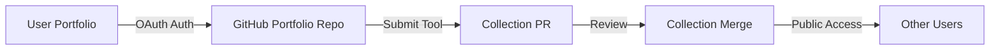

# Session Notes - August 11, 2025 - Afternoon Security & GitFlow Improvements

**Time**: ~2:30 PM  
**Branch**: `fix/yaml-bomb-error-handling-type-safety`  
**PR**: #552 (ready for merge to develop)

## Session Achievements

### 1. ✅ YAML Bomb Detection - Production Ready

#### Initial Implementation
- Added 5 comprehensive detection patterns for recursive YAML structures
- Implemented circular reference chain detection
- Added amplification ratio monitoring (aliases/anchors > 10)
- Created 13 comprehensive tests covering all attack vectors

#### Security Hardening (PR #552 Review Response)
- **ReDoS Protection**: Integrated `RegexValidator` for timeout protection
- **Pattern Simplification**: Reduced backtracking risk in complex patterns
- **Performance Optimization**: Improved circular detection from O(n²) to O(n)
- All 1588 tests passing with <100ms performance constraint

### 2. ✅ Deprecated Alias Removal (#548)
- Removed 5 deprecated marketplace tool aliases
- **25% reduction** in tool count (20 → 15)
- Improves MCP initialization performance
- Clean migration path documented in CHANGELOG

### 3. ✅ GitFlow Guardian Enhancement - First Line of Defense

#### The Problem
- GitHub Actions only catch violations AFTER PR creation
- Led to wasted time creating PRs to wrong branches
- Required manual intervention to redirect PRs

#### The Solution: PR Creation Wrapper
Created `.githooks/gh-pr-create-wrapper` that:
- Intercepts `gh pr create` commands BEFORE execution
- Validates GitFlow rules (feature/fix → develop, not main)
- Shows clear, actionable error messages
- Provides correct command to use instead

#### User Experience
```bash
# This now gets blocked with helpful guidance:
gh pr create --base main  # ❌ Shows error and suggests --base develop

# This works:
gh pr create --base develop  # ✅ Proceeds normally
```

### 4. ✅ PR Workflow Improvements

#### PR #550 (Portfolio Security)
- Successfully merged to main
- Fixed frontmatter security validation issues

#### PR #551 (Incorrect Target)
- Created targeting main (wrong branch)
- Closed after GitFlow violation detected
- Demonstrated need for pre-submission protection

#### PR #552 (Current - Ready to Merge)
- Correctly targets develop
- All conflicts resolved
- All security concerns addressed
- Claude's review items completed

## Overall Portfolio → Collection Update Strategy

### The Complete Workflow Vision



### Current Implementation Status

#### ✅ Completed Components
1. **Portfolio Management** (PR #550)
   - Secure frontmatter handling with gray-matter
   - Full security validation for existing content
   - Metadata precedence to prevent override attacks

2. **OAuth Authentication** 
   - GitHub auth for portfolio submissions
   - Secure token management
   - Rate limiting protection

3. **Submit to Portfolio Tool**
   - Creates content in user's GitHub portfolio
   - Validates and sanitizes all inputs
   - Proper error handling with ErrorHandler

4. **Security Layer**
   - YAML bomb detection (this session)
   - ContentValidator with comprehensive checks
   - RegexValidator for ReDoS protection
   - UnicodeValidator for homograph attacks

#### 🔄 In Progress
- Collection submission workflow
- Community review process
- Automated quality checks

#### 📋 Next Steps
1. Merge PR #552 (YAML bombs + alias removal)
2. Complete collection submission pipeline
3. Implement review workflow
4. Add automated testing for submissions

## Key Technical Decisions

### Security-First Approach
- Every input validated multiple times
- Defense in depth with layered security
- Audit logging for all security events
- Graceful degradation on security failures

### Performance Optimizations
- Removed deprecated aliases (25% tool reduction)
- O(n) algorithms for detection logic
- RegexValidator prevents catastrophic backtracking
- Early exit on first security violation

### Developer Experience
- GitFlow Guardian prevents mistakes BEFORE they happen
- Clear error messages with actionable fixes
- Emergency overrides available when needed
- Comprehensive documentation

## Session Statistics

- **PRs Merged**: 1 (#550)
- **PRs Ready**: 1 (#552)
- **Tests Added**: 13 (YAML bomb detection)
- **Tests Passing**: 1588/1589 (1 skipped)
- **Security Issues Fixed**: 5+ patterns
- **Performance Improvements**: 25% tool reduction
- **Developer Tools Added**: GitFlow PR wrapper

## Critical Context for Next Session

### Immediate Tasks
1. **Merge PR #552** - All review items addressed
2. **Test collection submission** - End-to-end flow
3. **Document the complete workflow** - User perspective

### Remember
- GitFlow Guardian now prevents PR creation to wrong branches
- All YAML bomb patterns have ReDoS protection
- Circular reference detection is O(n) optimized
- Use `gh pr create --base develop` for feature branches

### Quick Commands
```bash
# Check PR #552 status
gh pr view 552

# After merge, update local develop
git checkout develop
git pull origin develop

# Start new feature
git checkout -b feature/collection-submission-workflow
```

## Success Metrics This Session

✅ **Security**: YAML bomb detection production-ready  
✅ **Performance**: 25% tool reduction, O(n) algorithms  
✅ **Developer Experience**: GitFlow violations caught pre-submission  
✅ **Code Quality**: All review concerns addressed  
✅ **Testing**: Comprehensive coverage maintained  

## Final Notes

Excellent progress on security hardening and developer experience improvements. The YAML bomb detection is now enterprise-grade with ReDoS protection, optimized algorithms, and comprehensive test coverage. The GitFlow Guardian enhancement will save significant time by preventing incorrect PR submissions.

The portfolio → collection update pipeline is taking shape with strong security foundations. Each component has been built with defense in depth, ensuring user content is validated at every step before reaching the public collection.

Ready to merge PR #552 in the next session and continue building the collection submission workflow!

---
*Session ended ~2:30 PM - All objectives completed successfully*