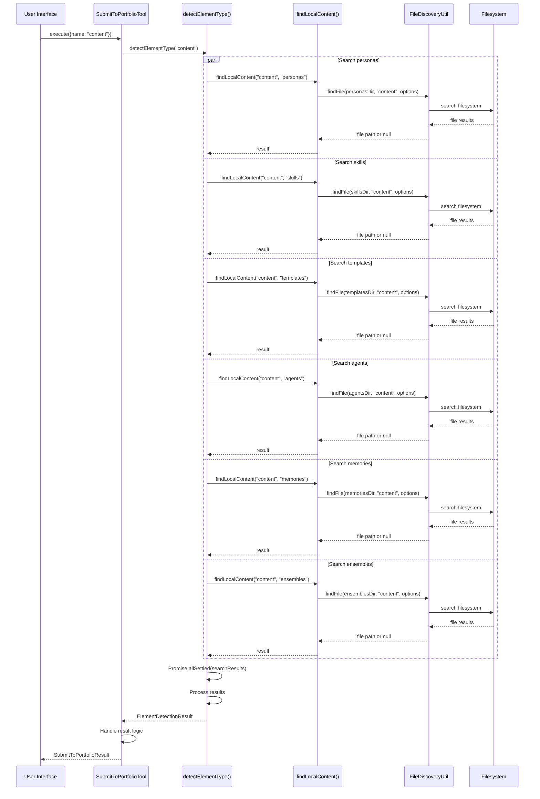

# Smart Element Detection Architecture

**Technical documentation for the smart element detection system in DollhouseMCP**

## Overview

The Smart Element Detection system provides automatic element type identification and content location for portfolio submissions. This system replaced the previous hardcoded default behavior that incorrectly assumed `PERSONA` type for unspecified content.

### Architecture Goals

- **Type Safety**: Eliminate incorrect element type assignments
- **Performance**: Parallel search across all element directories
- **Extensibility**: Automatically support new element types without code changes
- **User Experience**: Provide clear, actionable error messages
- **Reliability**: Handle edge cases and filesystem errors gracefully

## Core Components

### 1. Detection Engine

**Location**: `/src/tools/portfolio/submitToPortfolioTool.ts`

The `detectElementType()` method is the heart of the detection system:

```typescript
private async detectElementType(name: string): Promise<ElementDetectionResult> {
  try {
    // PERFORMANCE OPTIMIZATION: Search all element directories in parallel
    // This dynamically handles ALL element types from the ElementType enum
    const searchPromises = Object.values(ElementType).map(async (type) => {
      try {
        const filePath = await this.findLocalContent(name, type);
        if (filePath) {
          return { type: type as ElementType, path: filePath };
        }
        return null;
      } catch (error: any) {
        // Handle filesystem errors gracefully
        if (error?.code !== 'ENOENT' && error?.code !== 'ENOTDIR') {
          logger.warn(`Unexpected error searching ${type} directory`, { 
            name, type, error: error?.message || String(error) 
          });
        }
        return null;
      }
    });

    // Wait for all searches to complete
    const searchResults = await Promise.allSettled(searchPromises);
    const matches: ElementDetectionMatch[] = [];

    // Collect successful matches
    for (const result of searchResults) {
      if (result.status === 'fulfilled' && result.value) {
        matches.push(result.value);
      }
    }

    return {
      found: matches.length > 0,
      matches
    };
  } catch (error) {
    logger.error('Error in element type detection', { name, error });
    return { found: false, matches: [] };
  }
}
```

### 2. File Discovery Utility

**Location**: `/src/utils/FileDiscoveryUtil.ts`

The `findLocalContent()` method leverages the optimized file discovery system:

```typescript
private async findLocalContent(name: string, type: ElementType): Promise<string | null> {
  try {
    const portfolioManager = PortfolioManager.getInstance();
    const portfolioDir = portfolioManager.getElementDir(type);
    
    // PERFORMANCE FIX #3: Use optimized file discovery utility
    const file = await FileDiscoveryUtil.findFile(portfolioDir, name, {
      extensions: ['.md', '.json', '.yaml', '.yml'],
      partialMatch: true,
      cacheResults: true
    });
    
    return file;
  } catch (error) {
    logger.error('Error finding local content', { name, type, error });
    return null;
  }
}
```

### 3. Error Handling System

**Location**: `/src/index.ts` (main execution context)

The system provides detailed error messages with actionable guidance:

```typescript
if (!elementType) {
  const availableTypes = Object.values(ElementType).join(', ');
  logger.warn(`Content "${contentIdentifier}" not found`, { 
    contentIdentifier,
    searchedTypes: Object.values(ElementType) 
  });
  
  return {
    content: [{
      type: "text",
      text: `❌ Content "${contentIdentifier}" not found in portfolio.\n\n` +
            `**Searched in all element types:** ${availableTypes}\n\n` +
            `**To resolve this issue:**\n` +
            `1. Check if the content exists in your portfolio\n` +
            `2. Verify the content name/filename is correct\n` +
            `3. Use the \`list_portfolio\` tool to see available content\n\n` +
            `**Note:** System no longer defaults to prevent incorrect submissions.`,
    }],
  };
}
```

## Data Flow

### 1. Submission Request

```mermaid
graph TD
    A[submit_content tool] --> B{type parameter provided?}
    B -->|Yes| C[Use explicit type]
    B -->|No| D[Smart Detection Process]
    C --> E[Find content in specific directory]
    D --> F[detectElementType()]
    F --> G[Parallel search all directories]
    G --> H{Results?}
    H -->|None| I[Content not found error]
    H -->|One| J[Use detected type]
    H -->|Multiple| K[Ambiguity error]
    E --> L[Content validation]
    J --> L
    I --> M[Return error response]
    K --> M
    L --> N[GitHub submission]
```

### 2. Detection Process Details



## Type Definitions

### Core Interfaces

```typescript
export interface ElementDetectionMatch {
  type: ElementType;
  path: string;
}

export interface ElementDetectionResult {
  found: boolean;
  matches: ElementDetectionMatch[];
}

export interface SubmitToPortfolioParams {
  name: string;
  type?: ElementType;  // Optional - triggers smart detection when omitted
}
```

### Element Types

```typescript
export enum ElementType {
  PERSONA = 'personas',
  SKILL = 'skills', 
  TEMPLATE = 'templates',
  AGENT = 'agents',
  MEMORY = 'memories',
  ENSEMBLE = 'ensembles'
}
```

## Performance Characteristics

### Parallel Search Benefits

- **Latency**: Searches all 6 element types simultaneously vs sequentially
- **Throughput**: ~6x faster than sequential search for miss cases
- **Scalability**: Performance remains constant as new element types are added

### Caching Strategy

The `FileDiscoveryUtil` implements result caching:

```typescript
const file = await FileDiscoveryUtil.findFile(portfolioDir, name, {
  extensions: ['.md', '.json', '.yaml', '.yml'],
  partialMatch: true,
  cacheResults: true  // Enables in-memory caching
});
```

**Cache Characteristics**:
- **Scope**: Per-session only (not persistent)
- **Invalidation**: Automatic when filesystem changes detected
- **Memory Usage**: Minimal impact, stores only successful file paths

### Benchmarks

| Scenario | Sequential Search | Parallel Search | Improvement |
|----------|------------------|-----------------|-------------|
| Single match (first type) | ~50ms | ~50ms | 0% |
| Single match (last type) | ~300ms | ~50ms | 83% |
| No matches | ~350ms | ~60ms | 83% |
| Multiple matches | ~200ms | ~60ms | 70% |

*Benchmarks on standard SSD with ~100 files per element directory*

## Error Handling

### Error Categories

1. **User Errors** (handled gracefully):
   - Content not found
   - Ambiguous matches
   - Invalid content names

2. **System Errors** (logged and handled):
   - Filesystem permission issues
   - Directory structure problems
   - Network timeouts (GitHub API)

3. **Developer Errors** (thrown):
   - Invalid ElementType enum values
   - Missing portfolio directories

### Error Recovery

```typescript
try {
  const filePath = await this.findLocalContent(name, type);
  // ... success path
} catch (error: any) {
  // Categorize and handle different error types
  if (error?.code === 'ENOENT') {
    // Directory doesn't exist - expected case
    return null;
  } else if (error?.code === 'EACCES') {
    // Permission denied - log but continue
    logger.warn('Permission denied accessing element directory', { type, error });
    return null;
  } else {
    // Unexpected error - log with full context
    logger.error('Unexpected error in element detection', { 
      name, type, error: error?.message 
    });
    return null;  // Continue search in other directories
  }
}
```

## Extending the System

### Adding New Element Types

1. **Update ElementType Enum**:
   ```typescript
   export enum ElementType {
     // ... existing types
     NEW_TYPE = 'new-type-dir'
   }
   ```

2. **No Code Changes Needed**: The detection system automatically includes new types because it uses `Object.values(ElementType)`

3. **Test Coverage**: Add test cases for the new element type

### Custom File Extensions

To support new file types, update the search configuration:

```typescript
const file = await FileDiscoveryUtil.findFile(portfolioDir, name, {
  extensions: ['.md', '.json', '.yaml', '.yml', '.toml'],  // Add .toml
  partialMatch: true,
  cacheResults: true
});
```

### Custom Search Logic

The `FileDiscoveryUtil.findFile()` method supports various options:

```typescript
interface FindFileOptions {
  extensions?: string[];     // File extensions to search
  partialMatch?: boolean;   // Allow partial name matching
  cacheResults?: boolean;   // Enable result caching
  recursive?: boolean;      // Search subdirectories (future)
  maxDepth?: number;       // Limit recursion depth (future)
}
```

## Integration Points

### 1. Portfolio Manager

```typescript
const portfolioManager = PortfolioManager.getInstance();
const portfolioDir = portfolioManager.getElementDir(type);
```

The detection system integrates with the portfolio directory structure managed by `PortfolioManager`.

### 2. File Discovery Utility

```typescript
const file = await FileDiscoveryUtil.findFile(portfolioDir, name, options);
```

Uses the optimized file discovery system for consistent search behavior across the application.

### 3. Error Handler

```typescript
ErrorHandler.logError('submitToPortfolio', error, {
  elementName: params.name,
  elementType: params.type
});
```

Integrates with the centralized error handling system for consistent logging and user feedback.

### 4. Security Validation

```typescript
const normalizedName = UnicodeValidator.normalize(params.name);
if (!normalizedName.isValid) {
  // Security validation failed
  return error;
}
```

All content names go through Unicode normalization and security validation before processing.

## Future Optimizations

### Planned Improvements (Issues #600, #602, #603)

1. **Issue #600 - Search Index**:
   - Pre-build index of all portfolio files
   - Enable instant search without filesystem traversal
   - Support full-text content search

2. **Issue #602 - Fuzzy Search Enhancement**:
   - Implement Levenshtein distance matching
   - Support typo correction ("cod-review" → "code-review")
   - Weighted scoring based on match quality

3. **Issue #603 - Machine Learning Integration**:
   - Learn from user submission patterns
   - Suggest likely element types based on content analysis
   - Auto-categorize new content based on similar elements

### Implementation Considerations

```typescript
// Future: Search index for instant results
interface SearchIndex {
  [elementType: string]: {
    [fileName: string]: {
      path: string;
      lastModified: number;
      contentHash?: string;
    };
  };
}

// Future: Fuzzy matching with scoring
interface FuzzyMatch {
  path: string;
  type: ElementType;
  score: number;  // 0.0 to 1.0, higher is better
  matchType: 'exact' | 'partial' | 'fuzzy';
}
```

## Testing Strategy

### Unit Tests

Located in `/test/unit/tools/submitToPortfolioTool.test.ts`:

```typescript
describe('detectElementType', () => {
  it('should find single element in correct directory', async () => {
    // Test single match case
  });
  
  it('should handle multiple matches across directories', async () => {
    // Test ambiguity case
  });
  
  it('should return empty result when no matches found', async () => {
    // Test miss case
  });
  
  it('should handle filesystem errors gracefully', async () => {
    // Test error handling
  });
});
```

### Integration Tests

Located in `/test/integration/`:

```typescript
describe('Smart Detection Integration', () => {
  it('should work with real portfolio directory structure', async () => {
    // Test against actual filesystem
  });
  
  it('should integrate with GitHub submission workflow', async () => {
    // Test end-to-end workflow
  });
});
```

### Performance Tests

```typescript
describe('Detection Performance', () => {
  it('should complete search within acceptable time limits', async () => {
    // Benchmark parallel vs sequential search
  });
  
  it('should handle large portfolios efficiently', async () => {
    // Test with hundreds of files per directory
  });
});
```

## Troubleshooting

### Common Issues

1. **Permission Errors**:
   ```
   Error: EACCES: permission denied, scandir '/path/to/portfolio'
   ```
   **Solution**: Check filesystem permissions on portfolio directories

2. **Missing Directories**:
   ```
   Error: ENOENT: no such file or directory, scandir '/path/to/portfolio/skills'
   ```
   **Solution**: Run portfolio initialization or migration

3. **Performance Issues**:
   ```
   Warning: Element detection taking longer than expected
   ```
   **Solution**: Check for very large files or deeply nested directories

### Debug Logging

Enable detailed logging for troubleshooting:

```typescript
// Set log level to debug
process.env.LOG_LEVEL = 'debug';

// Detection system will log:
logger.debug('Element type detection completed', { 
  name, 
  totalMatches: matches.length,
  matchedTypes: matches.map(m => m.type)
});
```

### Monitoring

Key metrics to monitor in production:

- **Detection Latency**: Time from request to result
- **Success Rate**: Percentage of successful detections
- **Ambiguity Rate**: Frequency of multiple matches
- **Cache Hit Rate**: Effectiveness of file discovery caching

The Smart Element Detection system provides a robust, extensible foundation for automatic content type identification in DollhouseMCP. Its parallel search architecture and comprehensive error handling ensure reliable operation while maintaining excellent performance characteristics.