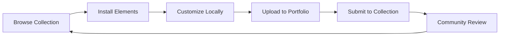

# Roundtrip Workflow User Guide

**Complete workflow for discovering, customizing, and sharing DollhouseMCP elements**

## Overview

The DollhouseMCP roundtrip workflow enables you to:
- **Discover**: Browse and search the community collection for AI elements
- **Install**: Download elements from collection to your local portfolio  
- **Customize**: Edit and modify elements to fit your needs
- **Share**: Upload to your GitHub portfolio and submit to collection
- **Collaborate**: Contribute to the community ecosystem

This guide walks you through each step with clear examples and best practices.

## Workflow Phases



### Phase 1: Discovery - Browse & Search
Find elements that match your needs from the community collection.

### Phase 2: Installation - Download Elements
Install interesting elements to your local portfolio for use and customization.

### Phase 3: Customization - Local Development
Edit and enhance elements to better suit your specific use cases.

### Phase 4: Portfolio Management - GitHub Integration
Upload your customized elements to your GitHub portfolio repository.

### Phase 5: Community Sharing - Collection Submission
Submit your best elements back to the community collection for others to discover.

---

## Phase 1: Discovery - Browse & Search

### Browse the Collection

Start by exploring what's available in the community collection:

```
browse_collection
```

This shows all available elements organized by type:
- **Personas**: AI personality and behavior profiles
- **Skills**: Specific capabilities like code review or data analysis
- **Templates**: Reusable content structures for emails, reports, etc.
- **Agents**: Autonomous assistants for goal-oriented tasks
- **Memory**: Persistent context storage systems
- **Ensembles**: Orchestrated combinations of multiple elements

### Browse by Element Type

Focus on specific types of elements:

```
browse_collection type="skills"
browse_collection type="personas" 
browse_collection type="templates"
```

### Search for Specific Topics

Find elements related to your interests:

```
search_collection "creative writing"
search_collection "code review"
search_collection "data analysis"
search_collection "project management"
```

### Example: Finding Writing Skills

```
# Search for writing-related elements
search_collection "writing"

# Results might include:
# - Creative Writer persona
# - Technical Writing skill
# - Blog Post template
# - Content Strategy ensemble
```

**💡 Tips for Discovery:**
- Use broad search terms initially, then narrow down
- Browse different element types to understand what's available
- Look at element descriptions and metadata for context
- Note version numbers for elements you find interesting

---

## Phase 2: Installation - Download Elements

### Install Specific Elements

When you find elements you want to use, install them to your local portfolio:

```
install_element "library/skills/creative-writing.md"
install_element "library/personas/technical-analyst.md"
install_element "library/templates/project-update.md"
```

### Verify Installation

Check that elements were installed correctly:

```
list_elements type="skills"
list_elements type="personas"
list_elements type="templates"
```

### Test Installed Elements

Try using your newly installed elements:

```
# Activate a persona
activate_element "technical-analyst" type="personas"

# Use a skill
activate_element "creative-writing" type="skills"

# Render a template
render_template "project-update" variables='{"project": "My Project", "status": "In Progress"}'
```

### Example: Installing a Complete Workflow

```
# Install a complete writing workflow
install_element "library/personas/creative-writer.md"
install_element "library/skills/grammar-checker.md"  
install_element "library/templates/blog-post.md"
install_element "library/agents/content-strategist.md"

# Verify installation
list_elements

# Test the workflow
activate_element "creative-writer" type="personas"
render_template "blog-post" variables='{"topic": "AI in Education", "audience": "teachers"}'
```

**💡 Installation Best Practices:**
- Install elements one at a time to verify each works
- Test elements before customizing them
- Keep track of which elements you've installed
- Review element documentation and metadata

---

## Phase 3: Customization - Local Development

### List Your Elements

See what you have available for customization:

```
list_elements
list_elements type="personas"
get_element_details "creative-writer" type="personas"
```

### Edit Element Content

Customize elements to better fit your needs:

```
# Edit a persona to change its behavior
edit_element "creative-writer" type="personas" version="1.1.0"

# This opens the element for editing where you can modify:
# - Instructions and behavior
# - Response style and tone
# - Specialized knowledge areas
# - Interaction patterns
```

### Version Management

Each time you edit an element, the version is automatically updated:

```
# Check current version
get_element_details "creative-writer" type="personas"

# After editing, version automatically increments (e.g., 1.0.0 → 1.1.0)
```

### Validate Your Changes

Ensure your customizations are valid:

```
validate_element "creative-writer" type="personas"
```

### Test Your Customizations

Activate and test your modified elements:

```
# Test the customized persona
activate_element "creative-writer" type="personas"

# Ask it to demonstrate the changes you made
# "Please introduce yourself and explain your approach to creative writing"
```

### Example: Customizing a Code Review Skill

```
# Start with an existing skill
install_element "library/skills/code-reviewer.md"

# Review what we have
get_element_details "code-reviewer" type="skills"

# Customize it for your specific tech stack
edit_element "code-reviewer" type="skills" version="1.1.0"

# In the editor, modify the skill to focus on:
# - Your programming languages (Python, TypeScript, etc.)
# - Your coding standards and style guides
# - Security practices specific to your domain
# - Performance considerations for your use cases

# Validate the changes
validate_element "code-reviewer" type="skills"

# Test with a sample code review
activate_element "code-reviewer" type="skills"
```

**💡 Customization Best Practices:**
- Start with small changes and test incrementally
- Keep track of what you've modified
- Use meaningful version numbers
- Document your changes in commit messages
- Test thoroughly before sharing

---

## Phase 4: Portfolio Management - GitHub Integration

### Check Portfolio Status

First, check if you have a portfolio set up:

```
portfolio_status
```

If you don't have a portfolio yet, you'll see instructions to create one.

### Initialize Your Portfolio (First Time Only)

Create your GitHub portfolio repository:

```
init_portfolio repository_name="dollhouse-portfolio" private=false
```

This creates:
- A new GitHub repository under your account
- Proper directory structure for different element types
- README with portfolio information
- Initial configuration files

### Configure Portfolio Settings

Set up your preferences for portfolio management:

```
portfolio_config auto_sync=true auto_submit=false default_visibility="public"
```

Settings explained:
- **auto_sync**: Automatically push changes to GitHub when you modify elements
- **auto_submit**: Automatically create collection submission issues when you add elements
- **default_visibility**: Whether new repositories are public or private

### Upload Elements to Portfolio

Submit your customized elements to your GitHub portfolio:

```
submit_content "creative-writer"
submit_content "code-reviewer" 
submit_content "project-update-template"
```

This process:
1. Uploads the element to your GitHub repository
2. Creates a commit with metadata and changes
3. Updates the repository's element index
4. Optionally creates a collection submission (if auto_submit=true)

### Sync Your Portfolio

Keep your local portfolio synchronized with GitHub:

```
# Push local changes to GitHub
sync_portfolio direction="push"

# Pull remote changes to local
sync_portfolio direction="pull"

# Two-way synchronization
sync_portfolio direction="both"

# Preview what would be synced without making changes
sync_portfolio direction="push" dry_run=true
```

### Example: Complete Portfolio Workflow

```
# Check current status
portfolio_status

# Configure for collaborative workflow
portfolio_config auto_sync=true auto_submit=false default_visibility="public"

# Upload your customized elements
submit_content "my-creative-writer"
submit_content "my-code-reviewer"
submit_content "my-project-template"

# Check what was uploaded
portfolio_status

# Your elements are now available at:
# https://github.com/yourusername/dollhouse-portfolio
```

**💡 Portfolio Best Practices:**
- Use descriptive repository names
- Keep auto_sync enabled for seamless updates
- Review elements before submitting to portfolio
- Use dry_run to preview sync operations
- Regular sync to keep local and remote in harmony

---

## Phase 5: Community Sharing - Collection Submission

### Prepare Elements for Submission

Before submitting to the collection, ensure your elements are ready:

```
# Validate your element
validate_element "my-creative-writer" type="personas"

# Check it's in your portfolio
portfolio_status

# Review the element details
get_element_details "my-creative-writer" type="personas"
```

### Manual Submission Process

Submit elements individually with control over the process:

```
# Submit with manual approval
portfolio_config auto_submit=false
submit_content "my-creative-writer"
```

This gives you a link to manually create the collection issue, allowing you to:
- Review the submission details
- Add additional context or notes
- Choose the timing of submission

### Automated Submission Process

For streamlined workflow, enable automatic submission:

```
# Enable automatic submissions
portfolio_config auto_submit=true

# Now submissions automatically create collection issues
submit_content "my-code-reviewer"
```

This automatically:
1. Uploads element to your portfolio
2. Creates a collection submission issue
3. Adds appropriate labels and metadata
4. Links to your portfolio repository

### Monitor Your Submissions

Track the status of your submitted elements:

1. **Check GitHub Issues**: Visit the [collection issues page](https://github.com/DollhouseMCP/collection/issues)
2. **Look for your submissions**: Issues titled like "[skills] Add My Code Reviewer by @yourusername"
3. **Respond to feedback**: Community members may suggest improvements
4. **Follow the review process**: Elements go through quality review before inclusion

### Example: Complete Submission Workflow

```
# Prepare a high-quality element
validate_element "my-data-analyst" type="personas"

# Configure for manual submission to control timing
portfolio_config auto_submit=false

# Submit to portfolio
submit_content "my-data-analyst"

# You'll receive:
# - Link to your portfolio element
# - Manual submission link for collection
# - Instructions for creating the issue

# Create the collection issue when you're ready
# Visit the provided link and fill in any additional details
```

**💡 Submission Best Practices:**
- Validate elements thoroughly before submission
- Use descriptive names and clear descriptions
- Include helpful examples in element documentation
- Respond promptly to community feedback
- Consider starting with manual submissions to learn the process

---

## Complete Workflow Example

Here's a full example of the entire roundtrip workflow:

### Scenario: Finding and Customizing a Project Manager Agent

```
# Phase 1: Discovery
search_collection "project management"
browse_collection type="agents"

# Phase 2: Installation  
install_element "library/agents/basic-project-manager.md"
list_elements type="agents"

# Phase 3: Customization
get_element_details "basic-project-manager" type="agents"
edit_element "basic-project-manager" type="agents" version="1.1.0"
# Customize for your team's methodology (Scrum, Kanban, etc.)
validate_element "basic-project-manager" type="agents"

# Test the customization
execute_agent "basic-project-manager" goal="Create a sprint plan for next week"

# Phase 4: Portfolio Management
portfolio_status
init_portfolio repository_name="my-dollhouse-portfolio" 
portfolio_config auto_sync=true auto_submit=false
submit_content "basic-project-manager"

# Phase 5: Community Sharing
# Review element is ready for sharing
portfolio_config auto_submit=true
submit_content "basic-project-manager"

# Monitor the collection issue that was created
# Respond to any feedback from the community
```

---

## Advanced Workflows

### Collaborative Development

Work with team members on shared elements:

```
# Clone a team member's portfolio
sync_portfolio direction="pull"

# Make improvements  
edit_element "team-coding-standards" type="skills"

# Share back with team
sync_portfolio direction="push"
```

### Element Versioning

Manage different versions of elements:

```
# Create a major update
edit_element "my-reviewer" type="skills" version="2.0.0"

# Keep the old version available
# The system maintains version history
```

### Bulk Operations

Work with multiple elements efficiently:

```
# Install multiple related elements
install_element "library/ensembles/full-stack-developer.md"
# This ensemble might automatically install its component elements

# Submit multiple elements
submit_content "skill-1"
submit_content "skill-2" 
submit_content "template-1"
```

---

## Workflow Optimization Tips

### Discovery Optimization
- **Use specific keywords**: Search for exact technologies or domains
- **Explore categories**: Browse systematically through different element types
- **Check versions**: Newer versions often have improvements
- **Read descriptions carefully**: Understanding element purpose saves time

### Customization Optimization  
- **Start small**: Make incremental changes and test frequently
- **Document changes**: Good commit messages help track modifications
- **Version meaningfully**: Use semantic versioning (major.minor.patch)
- **Test thoroughly**: Validate both functionality and integration

### Portfolio Optimization
- **Organize clearly**: Use meaningful names and descriptions
- **Sync regularly**: Keep local and remote portfolios aligned
- **Configure wisely**: Choose settings that match your workflow
- **Monitor regularly**: Check portfolio status periodically

### Submission Optimization
- **Quality first**: Ensure elements are polished before sharing
- **Engage actively**: Respond to community feedback promptly
- **Learn from others**: Study successful submissions for patterns
- **Contribute regularly**: Consistent contributions build reputation

---

## Integration with Development Tools

### Git Workflow Integration

The portfolio system integrates with standard Git workflows:

```bash
# Your portfolio is a real Git repository
cd ~/.dollhouse/portfolio
git log --oneline  # See history of your changes
git branch feature/new-skill  # Create branches for major changes
```

### IDE Integration

Work on elements in your favorite editor:

```bash
# Edit elements directly
code ~/.dollhouse/portfolio/skills/my-skill.md
vim ~/.dollhouse/portfolio/personas/my-persona.md
```

### Automation Integration

Integrate with CI/CD and automation tools:

```bash
# Example: Auto-sync as part of your daily workflow
echo "sync_portfolio" | npx @dollhousemcp/mcp-server --batch
```

---

## Troubleshooting Common Workflow Issues

For detailed troubleshooting, see the [Troubleshooting Guide](TROUBLESHOOTING_ROUNDTRIP.md).

### Quick Fixes

**Elements not syncing**: Check `portfolio_config` settings and GitHub authentication
**Installation failures**: Verify network connection and element availability
**Validation errors**: Review element format and required metadata fields
**Submission issues**: Ensure GitHub authentication and repository permissions

---

## Next Steps

After mastering the roundtrip workflow:

1. **Explore Advanced Features**: Try ensembles, agents, and memory elements
2. **Join the Community**: Participate in discussions and provide feedback
3. **Contribute Improvements**: Submit bug reports and feature suggestions
4. **Share Knowledge**: Help other users learn the workflow
5. **Build Expertise**: Specialize in specific types of elements

## Resources

- **[Portfolio Setup Guide](PORTFOLIO_SETUP_GUIDE.md)**: Detailed GitHub setup instructions
- **[Troubleshooting Guide](TROUBLESHOOTING_ROUNDTRIP.md)**: Solutions for common issues  
- **[Element Types Reference](../ELEMENT_TYPES.md)**: Complete guide to all element types
- **[API Reference](../API_REFERENCE.md)**: Full tool documentation
- **[Community Collection](https://github.com/DollhouseMCP/collection)**: Browse available elements

---

**🎯 Ready to start your roundtrip workflow?** Begin with `browse_collection` to discover what's available, then follow this guide step by step to become a power user of the DollhouseMCP ecosystem!