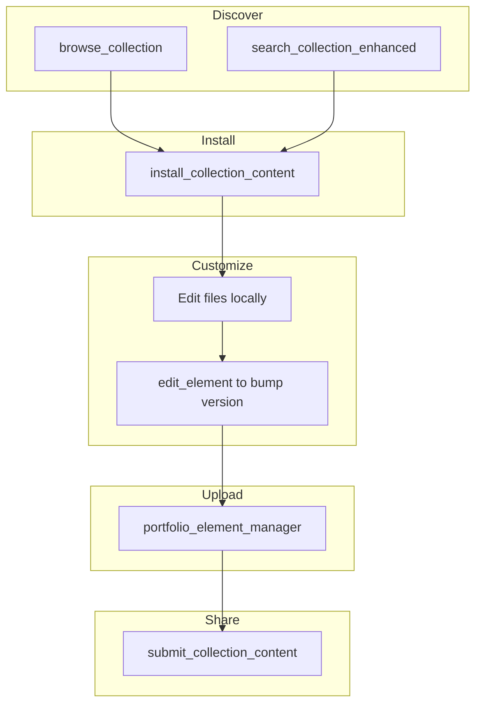

# Roundtrip Workflow User Guide

This guide walks through the full “discover → customize → publish” loop for DollhouseMCP elements using the current tooling.

---

## 1. High-Level Flow

1. **Discover** interesting community elements.  
2. **Install** them into your local portfolio.  
3. **Customize** (edit metadata, content, tests).  
4. **Upload** changes to your GitHub portfolio.  
5. **Share** back with the Dollhouse community.



Each step below mirrors that flow with the recommended commands.

---

## 2. Discover

### Browse Categories
```bash
browse_collection section="library"
```

### Filter by Type
```bash
browse_collection type="skills"
```

### Search with Filters
```bash
search_collection_enhanced \
  query="creative writing" \
  elementType="personas" \
  sortBy="relevance"
```

Once you find a candidate, note its `library/...` path for installation.

---

## 3. Install Locally

```bash
install_collection_content "library/personas/creative-writer.md"
```

The installer:
- Copies the file into `~/.dollhouse/portfolio/<type>/`.
- Reloads personas automatically when needed.

You can confirm the element is available:
```bash
list_elements type="personas"
get_element_details "creative-writer" type="personas"
```

---

## 4. Customize

Typical steps:

1. **Edit content** using your editor of choice (files live in `~/.dollhouse/portfolio/...`).  
2. **Bump the version** to reflect changes:  
   ```bash
   edit_element "creative-writer" type="personas" input='{"metadata":{"version":"1.1.0"}}'
   ```
3. **Validate** before uploading:  
   ```bash
   validate_element "creative-writer" type="personas"
   ```

If you create tests or additional assets, keep them in your project repository—not the portfolio folder—so they can be versioned and reviewed normally.

---

## 5. Upload to GitHub Portfolio

Use the element manager for precise control:

```bash
portfolio_element_manager \
  operation="upload" \
  element_name="creative-writer" \
  element_type="personas"
```

The command:
- Serializes the element.
- Commits it to `personas/creative-writer.md` in your `dollhouse-portfolio` repo.
- Preserves metadata and versioning.

Verify the commit:
```bash
portfolio_status
# or open https://github.com/<username>/dollhouse-portfolio
```

Bulk updates can be handled later with `sync_portfolio`, but individual uploads give you more review control during iteration.

---

## 6. Share with the Community

When you are ready to publish:

```bash
submit_collection_content "creative-writer"
```

The submission workflow:
- Ensures the element exists in your GitHub portfolio (uploads if needed).
- Detects duplicates across local/GitHub/collection and warns you.
- Opens or updates a GitHub issue in the community collection repository.

If you only want to update your own portfolio, skip this step and stick with `portfolio_element_manager`.

---

## 7. Recommended Checks

- **Duplicate warning** – If the response warns about existing versions, review the versions and bump your `metadata.version` if appropriate.
- **Collection status** – After running `submit_collection_content`, follow the issue link to add release notes or context screenshots.
- **Local cleanup** – Remove temporary files or notes from `~/.dollhouse/portfolio/archive/` or other scratch space so future uploads remain clean.

---

## 8. Automating Repeats

When you repeat the workflow regularly:

- Use `search_all` to cross-reference local, GitHub, and collection copies before editing:
  ```bash
  search_all query="creative writer"
  ```
- Enable auto-submit if you trust your process:
  ```bash
  portfolio_config auto_submit=true
  ```
  (Remember that this will create community submissions automatically whenever you upload.)
- Script repeated uploads with force flags:
  ```bash
  portfolio_element_manager \
    operation="upload" \
    element_name="creative-writer" \
    element_type="personas" \
    options.force=true
  ```

---

## 9. Troubleshooting Snapshot

| Issue | Fix |
|-------|-----|
| Element not found during submission | `list_elements`, check spelling, confirm `metadata.name`. |
| Wrong version uploaded | Bump `metadata.version` and re-run the upload. |
| Authentication errors | `check_github_auth` → `setup_github_auth`. |
| Want to revert a mistake | Use GitHub’s web interface to revert the commit, then sync locally. |

More details are available in the [Troubleshooting guide](troubleshooting.md).

---

With these commands you can iterate quickly while keeping your portfolio and the community collection in sync. Happy publishing!
