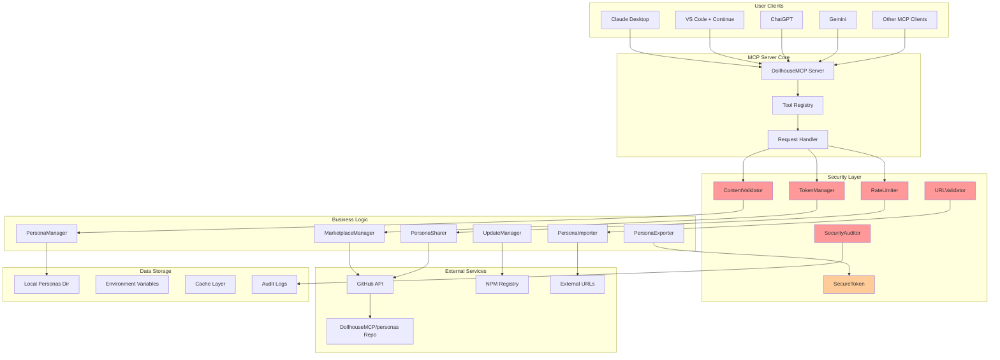
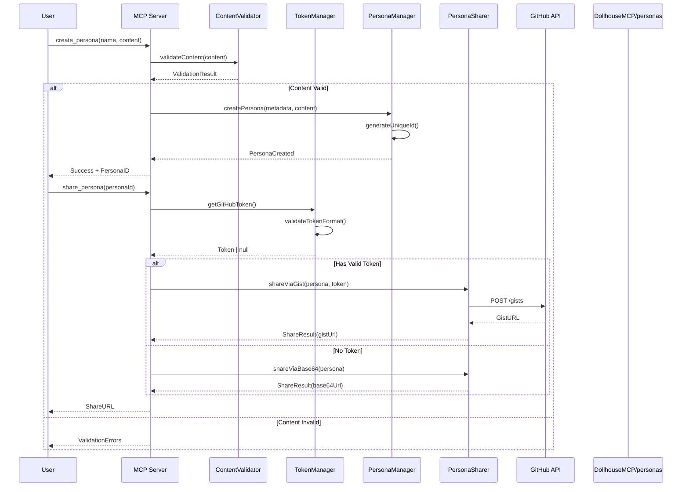
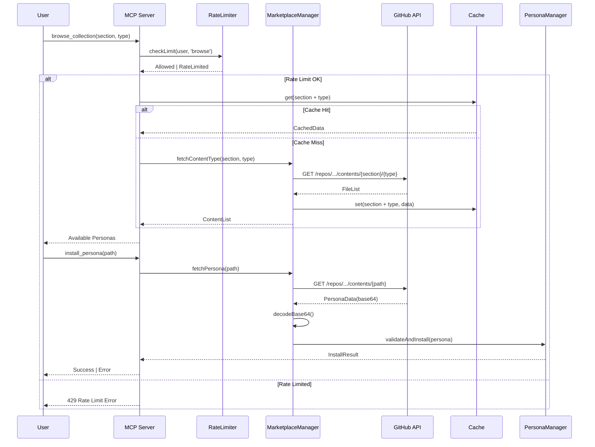
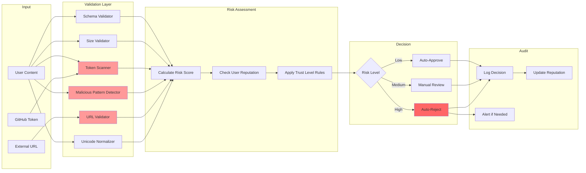
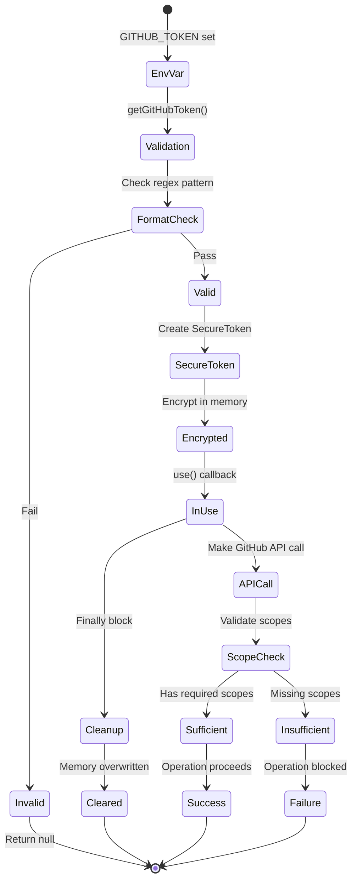
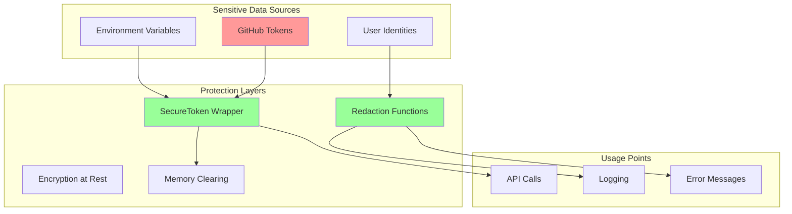

# DollhouseMCP API Workflow Architecture

## Complete System Architecture



## Detailed API Flow Diagrams

### 1. Persona Creation and Sharing Flow



### 2. Marketplace Browse and Install Flow



### 3. Security Validation Pipeline



### 4. Token Lifecycle Management



## API Endpoints and Security Controls

### MCP Tool APIs

| Tool | Security Controls | Rate Limit | Auth Required |
|------|------------------|------------|---------------|
| `list_personas` | None | 100/min | No |
| `activate_persona` | Content validation | 50/min | No |
| `create_persona` | Full validation pipeline | 10/min | No |
| `edit_persona` | Schema validation | 20/min | No |
| `share_persona` | Token validation, content scan | 5/min | Optional |
| `import_persona` | URL validation, content scan | 10/min | No |
| `browse_marketplace` | Cache layer | 30/min | No |
| `search_marketplace` | Input sanitization | 20/min | No |
| `install_persona` | Full validation pipeline | 10/min | No |
| `submit_persona` | Full security gates | 2/min | Yes |

### External API Interactions

#### GitHub API

- **Endpoints Used**:
  - `GET /user` - Token validation
  - `POST /gists` - Share personas
  - `GET /gists/{id}` - Import shared personas
  - `GET /repos/{owner}/{repo}/contents` - Browse marketplace
  - `POST /repos/{owner}/{repo}/issues` - Submit personas

- **Security Measures**:
  - Bearer token authentication
  - Rate limit tracking
  - Error message sanitization
  - Timeout protection (10s)

#### NPM Registry

- **Endpoints Used**:
  - `GET /-/package/@mickdarling/dollhousemcp/dist-tags` - Check versions

- **Security Measures**:
  - Read-only access
  - Version validation
  - No authentication required

## Data Flow Security

### Sensitive Data Handling



## Security Monitoring Dashboard

### Real-time Metrics

- API calls per minute by endpoint
- Rejection rate by security gate
- Token validation failures
- Rate limit violations
- Suspicious pattern detections

### Alerts Configuration

```yaml
alerts:
  - name: "High Rejection Rate"
    condition: "rejection_rate > 0.3"
    window: "5m"
    severity: "warning"
    
  - name: "Token Brute Force"
    condition: "token_validation_failures > 10"
    window: "1h"
    severity: "critical"
    
  - name: "Malicious Content Detected"
    condition: "malicious_patterns > 0"
    window: "immediate"
    severity: "critical"
```

## Integration Points

### Future Integrations

1. **Webhook System**
   - Real-time notifications
   - Third-party integrations
   - Security event streaming

2. **API Gateway**
   - Additional rate limiting
   - Geographic restrictions
   - DDoS protection

3. **CDN Integration**
   - Cached marketplace content
   - Geographic distribution
   - Additional security layer

## Conclusion

This architecture provides comprehensive security coverage across all API touchpoints while maintaining the frictionless user experience that's core to DollhouseMCP's value proposition. The layered security approach ensures defense-in-depth, and the monitoring systems provide early warning of potential threats.
