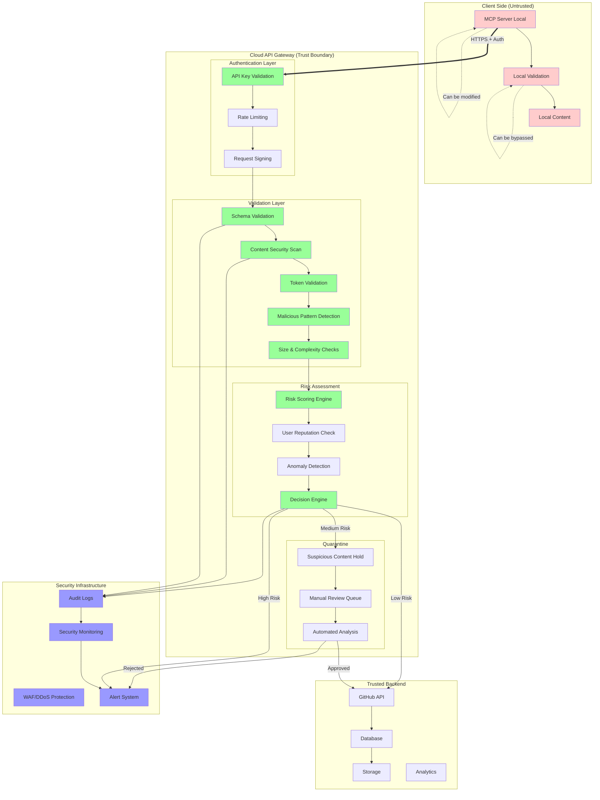
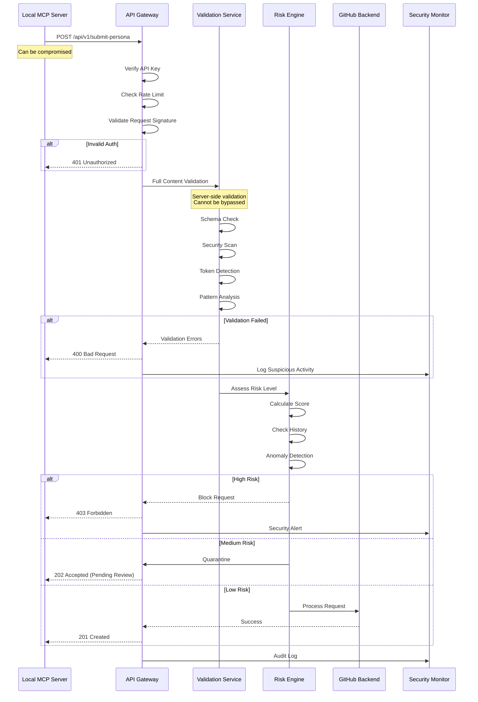
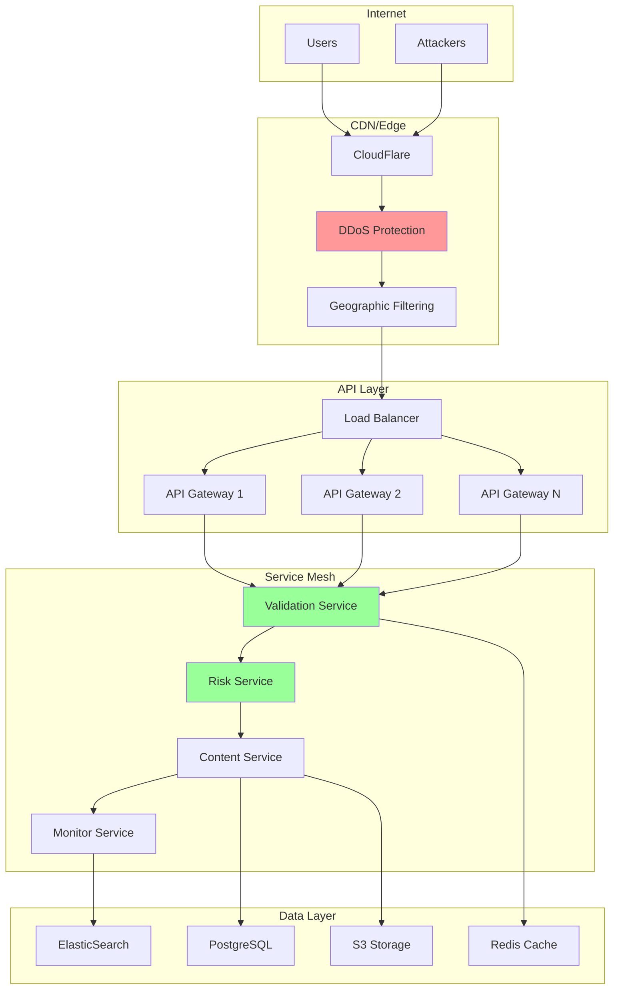

# Cloud API Security Architecture - Revised

## Critical Issue Identified

**Problem**: Current architecture performs all security validation on the client side (local MCP server), which can be bypassed by malicious actors modifying their local installation.

**Solution**: Implement mandatory server-side validation through a cloud API gateway that acts as the security enforcement point.

## Revised Architecture with Server-Side Validation



## Cloud API Endpoints with Mandatory Validation

### 1. Content Submission API



### 2. API Security Layers

```yaml
# API Gateway Configuration
security:
  authentication:
    - api_key: required
    - request_signing: HMAC-SHA256
    - tls: 1.3_minimum
    
  rate_limiting:
    - global: 1000/hour
    - per_user: 100/hour
    - per_endpoint: varies
    
  validation:
    - schema: strict_mode
    - size_limit: 100KB
    - timeout: 30s
    
  monitoring:
    - all_requests: logged
    - suspicious: alerted
    - metrics: real_time
```

## Security Enforcement Points

### What Happens Client-Side (Untrusted)
```typescript
// Client-side validation is for UX only
// Cannot be trusted for security
class LocalValidator {
  validate(content: any): ValidationResult {
    // Quick checks for user feedback
    // But server will re-validate everything
    return { isValid: true, warnings: [] };
  }
}
```

### What Happens Server-Side (Trusted)
```typescript
// Server-side validation is mandatory
// This is where real security happens
class CloudValidator {
  async validateSubmission(request: Request): Promise<ValidationResult> {
    // Cannot be bypassed by client modifications
    const checks = await Promise.all([
      this.validateAuthentication(request),
      this.validateSchema(request.body),
      this.scanForMaliciousContent(request.body),
      this.checkRateLimit(request.userId),
      this.assessRisk(request)
    ]);
    
    if (checks.some(c => !c.passed)) {
      // Log attempt and block
      await this.securityLog.record(request, checks);
      throw new SecurityException('Validation failed');
    }
    
    return { isValid: true, riskScore: calculateRisk(checks) };
  }
}
```

## Comparison: Client vs Server Validation

| Aspect | Client-Side (Current) | Server-Side (Required) |
|--------|----------------------|------------------------|
| **Can be bypassed** | ✅ Yes | ❌ No |
| **Trust level** | ❌ Untrusted | ✅ Trusted |
| **Purpose** | UX feedback | Security enforcement |
| **Performance** | Fast | Slightly slower |
| **Security value** | None | Critical |

## Implementation Requirements

### 1. Cloud API Service
- **Technology**: Node.js + Express or AWS API Gateway
- **Authentication**: API keys + request signing
- **Validation**: Mandatory for all write operations
- **Monitoring**: CloudWatch, Datadog, or similar

### 2. Security Services

```mermaid
graph LR
    subgraph "API Gateway Services"
        A[Load Balancer]
        B[WAF]
        C[Rate Limiter]
        D[Auth Service]
    end
    
    subgraph "Validation Services"
        E[Schema Validator]
        F[Security Scanner]
        G[Risk Analyzer]
        H[ML Anomaly Detection]
    end
    
    subgraph "Backend Services"
        I[Content Service]
        J[User Service]
        K[Analytics Service]
        L[Notification Service]
    end
    
    A --> B
    B --> C
    C --> D
    D --> E
    E --> F
    F --> G
    G --> H
    H --> I
    I --> J
    J --> K
    K --> L
    
    style E fill:#99ff99
    style F fill:#99ff99
    style G fill:#99ff99
    style H fill:#99ff99
```


### 3. Deployment Architecture


## Migration Path

### Phase 1: API Gateway (Week 1)
1. Deploy basic API gateway
2. Implement authentication
3. Add rate limiting
4. Enable monitoring

### Phase 2: Validation Services (Week 2)
1. Port validation logic to cloud
2. Implement schema validation
3. Add security scanning
4. Enable risk scoring

### Phase 3: Full Migration (Week 3-4)
1. Update MCP clients to use API
2. Deprecate direct GitHub access
3. Monitor and tune
4. Security audit

## Security Benefits

### Before (Current Architecture)
- ❌ Client-side validation only
- ❌ Can be bypassed
- ❌ No central monitoring
- ❌ No rate limiting
- ❌ Direct GitHub access

### After (Cloud API Architecture)
- ✅ Mandatory server validation
- ✅ Cannot be bypassed
- ✅ Central security monitoring
- ✅ Rate limiting enforced
- ✅ Controlled GitHub access

## Cost Considerations

### Estimated Monthly Costs
- API Gateway: $50-200
- Compute (validation): $100-500
- Monitoring: $50-100
- Storage: $20-50
- **Total**: $220-850/month

### Cost Optimization
- Use serverless for validation
- Cache validation results
- Batch processing where possible
- Auto-scale based on demand

## Conclusion

The current architecture's reliance on client-side validation is a critical security flaw. By implementing a cloud API gateway with mandatory server-side validation, we create a true security boundary that cannot be bypassed by malicious actors.

This is not optional for a production system handling user-generated content. The cloud API gateway must be implemented before public launch to ensure security.

**Key Principle**: Never trust the client. Always validate on the server.