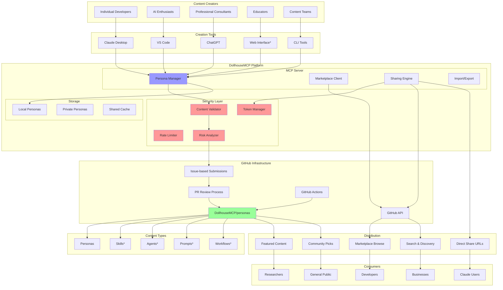
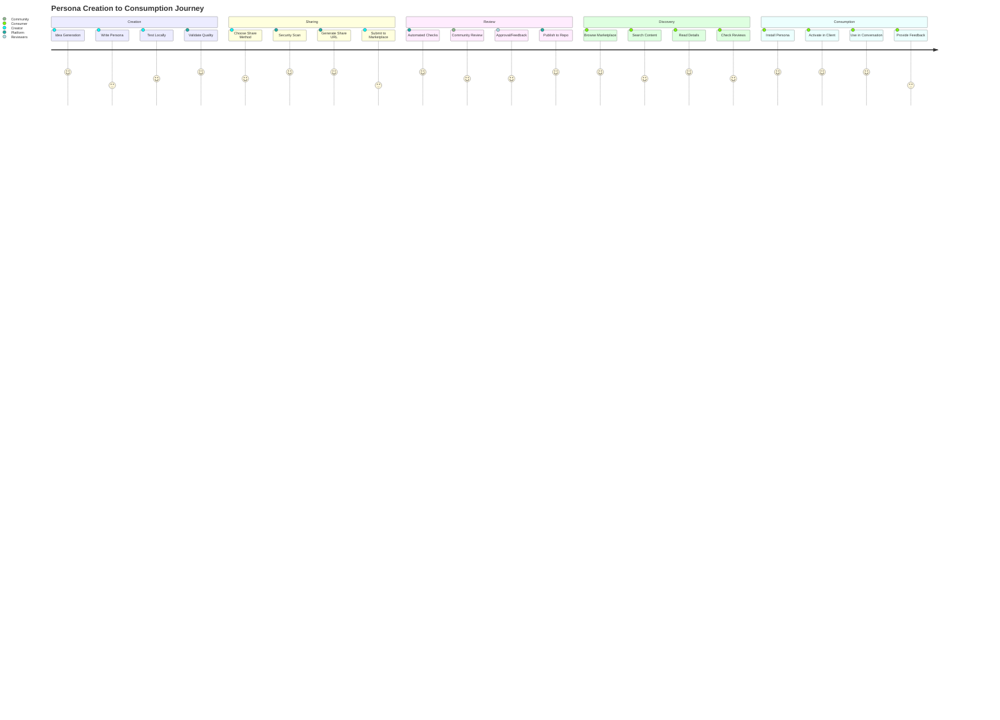
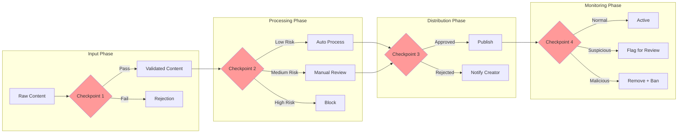
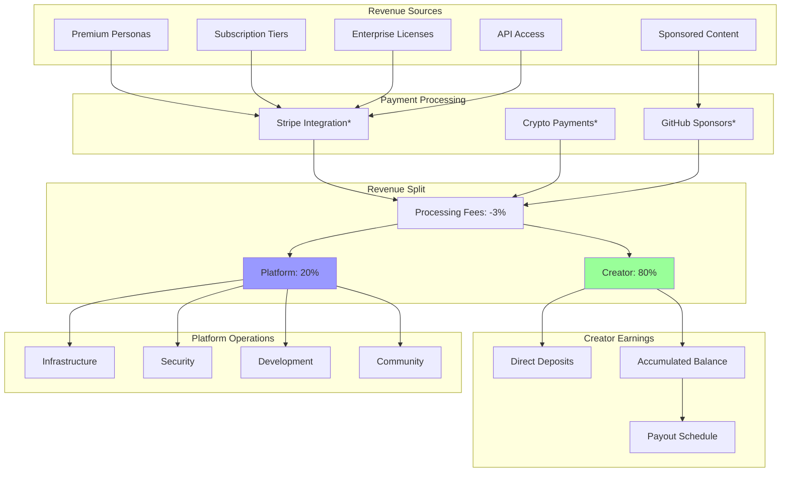
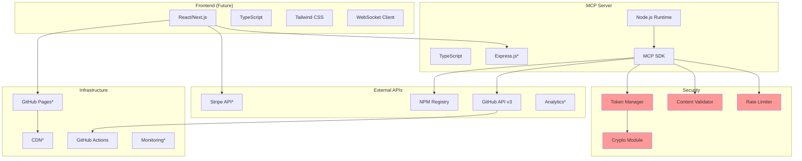
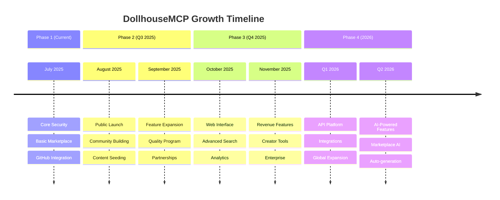
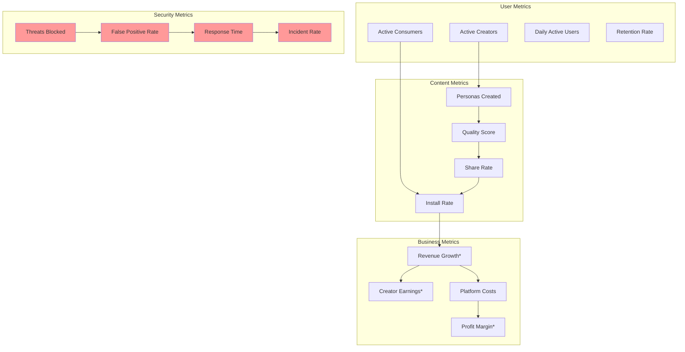

# DollhouseMCP Persona Marketplace Ecosystem

## Complete Ecosystem Overview

*Note: Items marked with * are planned future features

## Persona Lifecycle Flow

## Security Checkpoints

## Revenue Flow (Future)

*Note: Revenue features are planned for future implementation

## Data Flow Architecture

```mermaid
graph LR
    subgraph "Create"
        A[User Input] --> B[Local Validation]
        B --> C[Generate Metadata]
        C --> D[Create Unique ID]
    end
    
    subgraph "Share"
        D --> E{Share Method}
        E -->|GitHub| F[Create Gist]
        E -->|Direct| G[Base64 URL]
        F --> H[Share URL]
        G --> H
    end
    
    subgraph "Submit"
        H --> I[Prepare Submission]
        I --> J[Security Gates]
        J --> K[GitHub Issue]
        K --> L[Review Queue]
    end
    
    subgraph "Publish"
        L --> M{Review Result}
        M -->|Approved| N[Merge PR]
        M -->|Rejected| O[Feedback]
        N --> P[Live in Marketplace]
    end
    
    subgraph "Consume"
        P --> Q[Browse/Search]
        Q --> R[View Details]
        R --> S[Install]
        S --> T[Local Storage]
        T --> U[Activate]
    end
```

## Technology Stack

*Note: Items marked with * are planned future features

## Growth Strategy

## Success Metrics

## Conclusion

This ecosystem is designed to create a thriving marketplace for AI personas and related content while maintaining security, quality, and user trust. The architecture supports growth from a simple sharing platform to a comprehensive marketplace with revenue features, all while keeping security at the forefront.

Key success factors:
1. **Frictionless sharing** - Easy for creators to share
2. **Strong security** - Protected against malicious content
3. **Quality control** - Community and automated review
4. **Fair economics** - 80/20 creator-friendly split
5. **Scalable architecture** - Ready for growth

The platform is positioned to become the primary marketplace for AI personas across all major AI platforms.