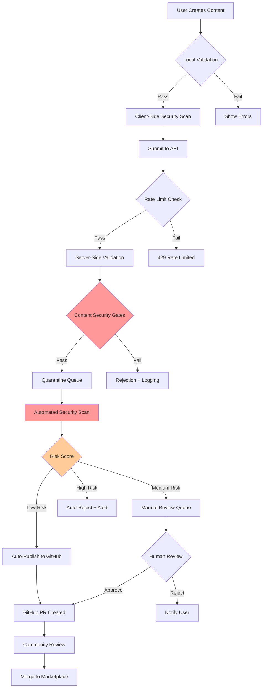
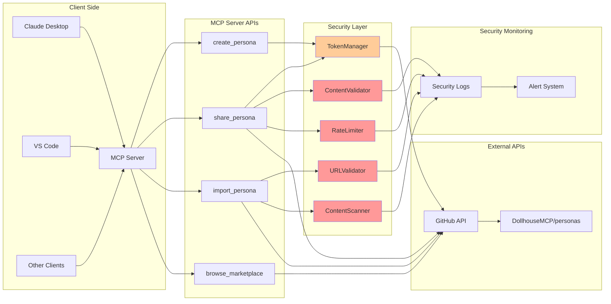

# DollhouseMCP Security Architecture

## Overview

This document outlines the security architecture for DollhouseMCP's persona sharing ecosystem, designed to enable frictionless content sharing while maintaining robust security controls.

## Security Documentation Strategy

### Dual Documentation System

#### 1. Internal Security Documentation (Private)
- **Location**: Private repository or encrypted docs
- **Contains**: 
  - Detailed vulnerability descriptions
  - Attack vectors and exploit methods
  - Proof of concept code
  - Remediation timelines
  - Security incident reports
- **Access**: Core team only
- **Format**: SECURITY-INTERNAL-YYYY-MM-DD.md

#### 2. Public Security Documentation
- **Location**: Public repository `/docs/security/`
- **Contains**:
  - Security features implemented
  - General security practices
  - Responsible disclosure policy
  - Security contact information
- **Format**: SECURITY.md, SECURITY_MEASURES.md

### Version Control for Security Docs

```
/docs/security/
  ├── SECURITY.md                    # Public security policy
  ├── SECURITY_MEASURES.md           # Public list of protections
  └── audits/                        # Public audit summaries
      └── 2025-07-audit-summary.md   # Sanitized results

/private-security/ (separate repo)
  ├── vulnerabilities/
  │   ├── VULN-2025-001.md          # Full details
  │   └── VULN-2025-002.md
  ├── incidents/
  │   └── INCIDENT-2025-001.md
  └── remediation/
      └── REMEDIATION-PLAN-2025-Q3.md
```

## Content Sharing Security Architecture

### Security Gates Pipeline



### Complete API Workflow



## Security Components

### 1. Content Security Gates

```typescript
interface SecurityGate {
  name: string;
  priority: number;
  validate(content: any, context: SecurityContext): Promise<ValidationResult>;
}

const securityGates: SecurityGate[] = [
  { name: 'TokenScanner', priority: 1 },      // Highest priority
  { name: 'MaliciousCodeDetector', priority: 2 },
  { name: 'PromptInjectionScanner', priority: 3 },
  { name: 'URLValidator', priority: 4 },
  { name: 'SizeValidator', priority: 5 },
  { name: 'SchemaValidator', priority: 6 },   // Lowest priority
];
```

### 2. Risk Scoring System

```typescript
interface RiskFactors {
  userReputation: number;      // 0-100
  contentComplexity: number;   // 0-100  
  externalResources: number;   // Count
  suspiciousPatterns: number;  // Count
  previousRejections: number;  // Count
}

function calculateRiskScore(factors: RiskFactors): RiskLevel {
  const score = 
    (factors.userReputation * -0.3) +     // Good reputation reduces risk
    (factors.contentComplexity * 0.2) +
    (factors.externalResources * 10) +
    (factors.suspiciousPatterns * 25) +
    (factors.previousRejections * 15);
    
  if (score < 20) return 'LOW';
  if (score < 50) return 'MEDIUM';
  return 'HIGH';
}
```

### 3. Reputation System

```typescript
interface UserReputation {
  userId: string;
  successfulSubmissions: number;
  rejectedSubmissions: number;
  communityFlags: number;
  accountAge: number;
  verifiedEmail: boolean;
  githubStars: number;
}

function getUserTrustLevel(rep: UserReputation): TrustLevel {
  if (rep.rejectedSubmissions > 5) return 'UNTRUSTED';
  if (rep.successfulSubmissions < 3) return 'NEW';
  if (rep.successfulSubmissions > 10 && rep.communityFlags === 0) return 'TRUSTED';
  return 'STANDARD';
}
```

## Implementation Timeline

### Phase 1: Pre-Launch (Critical)
1. **SecureToken Implementation** (2 hours)
   - Memory encryption for tokens
   - Automatic cleanup
   - Secure access patterns

2. **Basic Content Security Gates** (3 hours)
   - Token/secret scanning
   - Size validation
   - Schema validation
   - Basic malicious pattern detection

3. **Security Monitoring** (1 hour)
   - Audit logging
   - Alert system setup
   - Basic anomaly detection

### Phase 2: Launch Week
1. **Advanced Content Analysis** (4 hours)
   - Prompt injection detection
   - Obfuscated code detection
   - External resource validation

2. **Reputation System** (3 hours)
   - User scoring
   - Trust levels
   - Rate limit adjustments

3. **Community Moderation Tools** (2 hours)
   - Flagging system
   - Review queue
   - Trusted reviewer program

### Phase 3: Post-Launch
1. **Machine Learning Integration**
   - Pattern learning from rejections
   - Automated threat detection
   - Behavioral analysis

2. **Advanced Monitoring**
   - Real-time dashboards
   - Predictive alerts
   - Trend analysis

## Security Incident Response Plan

### Detection
- Automated alerts for suspicious patterns
- Community reporting system
- Regular security audits

### Response
1. **Immediate**: Block malicious content/user
2. **Short-term**: Patch vulnerability
3. **Long-term**: Update security gates

### Communication
- Security advisory (public)
- Detailed report (internal)
- User notifications if affected

## Maintaining Open Source Security

### Public Repository
- Security features documented generally
- No specific attack vectors mentioned
- Regular security.md updates
- Clear responsible disclosure policy

### Private Security Repo
- Full vulnerability database
- Incident response logs
- Detailed remediation plans
- Security test cases

### Best Practices
1. Never commit:
   - Real tokens or secrets
   - Vulnerability POCs
   - Security bypass methods
   - User PII

2. Always commit:
   - Security feature additions
   - General security improvements
   - Sanitized audit results
   - Security contact info

## Monitoring and Metrics

### Key Security Metrics
- Rejection rate by category
- Time to detection
- False positive rate
- User reputation distribution
- API abuse attempts

### Alerting Thresholds
- \>10 rejections/hour from single user
- \>50 rejections/hour globally  
- Any critical security gate bypass
- Unusual API patterns

## Conclusion

This architecture provides defense-in-depth while maintaining usability. The multi-layered approach ensures that even if one security gate fails, others will catch malicious content. The reputation system rewards good actors while quickly identifying bad ones.

Regular reviews and updates of this architecture are essential as the threat landscape evolves.