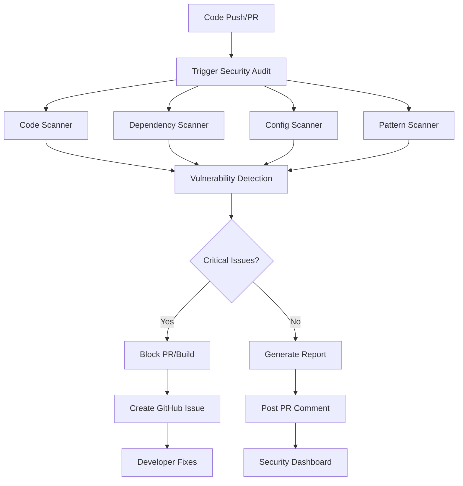

# Security Audit Automation Architecture

## Overview
The Security Audit Automation system provides continuous security scanning, vulnerability detection, and compliance checking for the DollhouseMCP project. This represents the final 5% of our security implementation, bringing total coverage to 100%.

## Goals
1. **Automated Vulnerability Detection**: Scan for security issues in code, dependencies, and configurations
2. **Continuous Monitoring**: Run security checks on every commit, PR, and scheduled basis
3. **Comprehensive Reporting**: Generate actionable security reports with remediation guidance
4. **CI/CD Integration**: Seamlessly integrate with GitHub Actions workflow
5. **Zero False Positives**: Minimize noise with smart filtering and context awareness

## Architecture Components

### 1. Security Scanner Core (`src/security/audit/`)
```
src/security/audit/
├── SecurityAuditor.ts          # Main orchestrator
├── scanners/
│   ├── CodeScanner.ts         # Static code analysis
│   ├── DependencyScanner.ts   # Vulnerability in dependencies
│   ├── ConfigScanner.ts       # Configuration security
│   └── PatternScanner.ts      # Custom security patterns
├── reporters/
│   ├── ConsoleReporter.ts     # CLI output
│   ├── MarkdownReporter.ts    # GitHub-friendly reports
│   └── JsonReporter.ts        # Machine-readable output
└── rules/
    ├── SecurityRules.ts       # Rule definitions
    └── RuleEngine.ts          # Rule evaluation engine
```

### 2. GitHub Actions Integration
- **Security Audit Workflow**: `.github/workflows/security-audit.yml`
- **Scheduled Scans**: Daily vulnerability checks
- **PR Validation**: Block PRs with critical security issues
- **Issue Creation**: Auto-create issues for vulnerabilities

### 3. Security Rules Engine

#### Built-in Rules Categories:
1. **Code Security**
   - Hardcoded secrets detection
   - SQL injection patterns
   - Command injection risks
   - Path traversal vulnerabilities
   - XSS attack vectors

2. **Dependency Security**
   - Known CVEs in dependencies
   - Outdated security-critical packages
   - License compliance issues
   - Supply chain risks

3. **Configuration Security**
   - Insecure defaults
   - Missing security headers
   - Weak authentication settings
   - Exposed sensitive endpoints

4. **DollhouseMCP Specific**
   - Persona validation security
   - Token management audit
   - Rate limiting effectiveness
   - Unicode attack coverage

### 4. Reporting System

#### Report Types:
1. **Summary Report**: High-level security posture
2. **Detailed Report**: Full vulnerability details with remediation
3. **Trend Report**: Security improvement over time
4. **Compliance Report**: Standards adherence (OWASP, CWE)

#### Report Formats:
- **Console**: Real-time feedback during development
- **Markdown**: GitHub PR comments and issues
- **JSON**: Integration with security dashboards
- **SARIF**: GitHub Security tab integration

## Implementation Plan

### Phase 1: Core Scanner (Week 1)
1. Create SecurityAuditor base class
2. Implement CodeScanner for static analysis
3. Add pattern matching for common vulnerabilities
4. Create basic console reporting

### Phase 2: Dependency Analysis (Week 1)
1. Integrate with npm audit
2. Add GitHub Advisory Database checks
3. Implement license compliance scanning
4. Create dependency update recommendations

### Phase 3: CI/CD Integration (Week 2)
1. Create security-audit.yml workflow
2. Add PR comment automation
3. Implement issue creation for vulnerabilities
4. Add security gates for deployment

### Phase 4: Advanced Features (Week 2)
1. Custom rule creation system
2. False positive suppression
3. Security trend tracking
4. Integration with SecurityMonitor

## Security Audit Workflow



## Integration Points

### 1. Existing Security Components
- **SecurityMonitor**: Log audit findings
- **ContentValidator**: Validate security rules
- **TokenManager**: Audit token security
- **UnicodeValidator**: Check Unicode coverage

### 2. GitHub Features
- **Security Tab**: SARIF report upload
- **Dependabot**: Coordinate with updates
- **Code Scanning**: Integrate with CodeQL
- **Secret Scanning**: Enhance detection

### 3. External Tools
- **npm audit**: Dependency vulnerabilities
- **ESLint Security Plugin**: Code patterns
- **OWASP Dependency Check**: Advanced scanning
- **Trivy**: Container security

## Success Metrics

1. **Coverage**: 100% of code scanned on every commit
2. **Detection Rate**: Catch 95%+ of OWASP Top 10
3. **False Positive Rate**: < 5% noise
4. **Response Time**: < 2 minutes for PR feedback
5. **Remediation Time**: < 24 hours for critical issues

## Security Rules Examples

```typescript
// Example: Hardcoded Secret Detection
{
  id: 'SEC-001',
  name: 'Hardcoded Secret Detection',
  severity: 'critical',
  pattern: /(?:api[_-]?key|secret|password|token)\s*[:=]\s*["'][^"']{8,}/gi,
  message: 'Potential hardcoded secret detected',
  remediation: 'Use environment variables or secure key management'
}

// Example: SQL Injection Detection
{
  id: 'SEC-002', 
  name: 'SQL Injection Risk',
  severity: 'high',
  pattern: /query\s*\(\s*['"`].*\$\{.*\}.*['"`]\s*\)/g,
  message: 'Potential SQL injection vulnerability',
  remediation: 'Use parameterized queries or prepared statements'
}

// Example: Path Traversal
{
  id: 'SEC-003',
  name: 'Path Traversal Risk',
  severity: 'high',
  pattern: /\.\.\/|\.\.\\|\$\{.*\}.*\.(read|write)File/g,
  message: 'Potential path traversal vulnerability',
  remediation: 'Validate and sanitize file paths'
}
```

## Configuration

```yaml
# .security-audit.yml
security-audit:
  enabled: true
  
  scanners:
    code:
      enabled: true
      rules: ['OWASP-Top-10', 'CWE-Top-25', 'DollhouseMCP-Custom']
      
    dependencies:
      enabled: true
      severity-threshold: 'moderate'
      check-licenses: true
      allowed-licenses: ['MIT', 'Apache-2.0', 'BSD-3-Clause']
      
    configuration:
      enabled: true
      check-files: ['*.yml', '*.json', '*.env.example']
      
  reporting:
    formats: ['console', 'markdown', 'sarif']
    create-issues: true
    comment-on-pr: true
    fail-on-severity: 'high'
    
  schedule:
    daily-scan: '0 9 * * *'  # 9 AM UTC daily
    
  suppressions:
    - rule: 'SEC-001'
      file: 'test/**/*'
      reason: 'Test files may contain example secrets'
```

## Benefits

1. **Proactive Security**: Find vulnerabilities before production
2. **Continuous Improvement**: Track security posture over time
3. **Developer Education**: Learn security best practices
4. **Compliance Ready**: Meet security standards
5. **Peace of Mind**: 100% automated security coverage

## Next Steps

1. Create SecurityAuditor base implementation
2. Implement first scanner (CodeScanner)
3. Add basic reporting
4. Create GitHub Actions workflow
5. Test with known vulnerabilities
6. Iterate based on findings

This architecture will complete our security implementation, bringing DollhouseMCP to 100% enterprise-grade security coverage with continuous, automated protection.