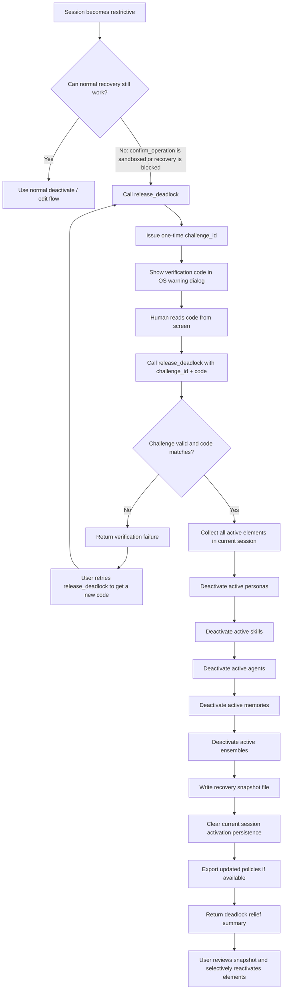

# Deadlock Relief Flow

This document describes the new `release_deadlock` recovery path for sessions that have been locked down too aggressively by active element policies.

## Purpose

The goal is to provide a safe, human-confirmed escape hatch when:

- an active element denies `confirm_operation`
- the session can no longer approve normal recovery steps
- the user needs to deactivate everything and recover control of the session

## High-Level Behavior

- The user or model calls `release_deadlock`.
- Dollhouse creates a one-time verification challenge.
- The verification code is shown only to the human via the existing OS-level warning dialog.
- The caller must invoke `release_deadlock` again with `challenge_id` and `code`.
- On success, Dollhouse:
  - records a recovery snapshot file with the pre-reset session state
  - deactivates all active personas, skills, agents, memories, and ensembles for the current session
  - clears the current session's persisted activation state
  - returns a summary of what was active, what was deactivated, likely deadlock causes, and any failures

## Mermaid Flow



## Detailed Decision Notes

### 1. Why this does not use `confirm_operation`

The whole point of this flow is that `confirm_operation` may already be blocked by an active element's gatekeeper policy. So the reset path must stay reachable even in that state.

To make that work:

- `release_deadlock` is treated as a gatekeeper-essential recovery operation
- it is exempted from normal element-policy gating loops
- it still requires a real human verification step before any reset happens

### 2. Why the human code is out-of-band

The recovery code is shown through the existing OS-level dialog so the model never receives the code directly in the normal tool response.

That keeps the flow aligned with the existing danger-zone verification posture:

- human present at machine
- visible warning
- one-time code
- limited validity window

### 3. Why `verify_challenge` does not complete this reset

Deadlock relief challenges are reserved for `release_deadlock` itself.

If someone tries to pass that code into `verify_challenge`, Dollhouse rejects it and tells them to complete the reset through the dedicated `release_deadlock` flow. This prevents accidental consumption of the code without actually performing the recovery.

### 4. What gets reset

Successful deadlock relief currently targets all active session-scoped element types that can affect behavior:

- personas
- skills
- agents
- memories
- ensembles

Templates are not part of the active session reset because they are not part of the activation persistence / active policy surface in the same way.

### 5. What gets preserved for recovery

Before the reset completes, Dollhouse writes a recovery snapshot file that includes:

- the session id
- all active elements before reset
- the elements successfully deactivated
- any deactivation failures
- the likely deadlock cause
  - sandboxing element if one denied `confirm_operation`
  - advisory elements that requested extra scrutiny

This gives the user a concrete checklist for rebuilding the session intentionally instead of losing track of what had been active.

## Recovery Contract

### Initial call

```json
{ "operation": "release_deadlock" }
```

Expected result shape:

```json
{
  "pending": true,
  "challenge_id": "...",
  "message": "Deadlock relief requires human confirmation..."
}
```

### Completion call

```json
{
  "operation": "release_deadlock",
  "params": {
    "challenge_id": "...",
    "code": "ABC123"
  }
}
```

Expected result shape:

```json
{
  "released": true,
  "challenge_id": "...",
  "activeBeforeReset": [
    { "element_name": "Locked Persona", "type": "persona" }
  ],
  "deactivated": [
    { "element_name": "Locked Persona", "type": "persona" }
  ],
  "failed": [],
  "likelyDeadlockCause": {
    "sandboxingElement": { "element_name": "Locked Persona", "type": "persona" },
    "advisoryElements": []
  },
  "persistedStateCleared": true,
  "snapshotFile": "/Users/.../.dollhouse/state/deadlock-relief/deadlock-relief-session-....json",
  "message": "Deadlock relief completed..."
}
```

## What to sanity-check

When reviewing this flow, the main questions are:

1. Is the human verification step strong enough for this kind of reset?
2. Are we resetting the right set of active element types?
3. Is clearing current-session activation persistence the right scope?
4. Should any additional audit metadata be returned or logged?
5. Is the separation between `release_deadlock` and `verify_challenge` the right UX boundary?
